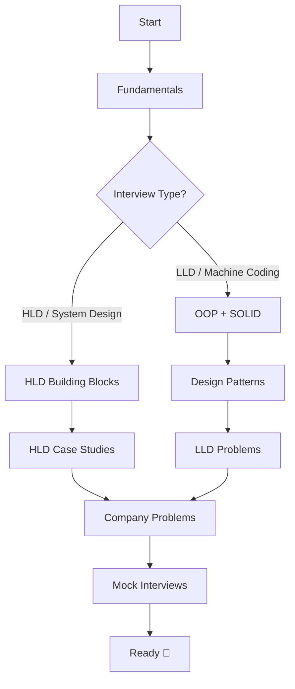

# 🧠 System Design Knowledge Hub — HLD & LLD

> A complete, detailed, and practical resource for mastering **High-Level Design (HLD)** and **Low-Level Design (LLD)** for interviews at top companies (Amazon, Google, Qualcomm, Microsoft, Meta, Uber, Netflix, and more).

Every topic is explained from first principles with **diagrams**, **trade-offs**, **real-world example problems**, and **company-tagged questions** curated from GeeksforGeeks, LeetCode, and industry interview experiences.

---

## 📌 What is this hub?

This repository is a structured, self-paced curriculum. It is split into four pillars:

| Pillar | What you learn | Folder |
|--------|----------------|--------|
| **Fundamentals** | Core concepts every design rests on (scalability, CAP, consistency, latency) | [`/fundamentals`](./fundamentals) |
| **HLD** | Distributed-system building blocks + full case studies (Twitter, Uber, etc.) | [`/hld`](./hld) |
| **LLD** | OOP, SOLID, design patterns + object-oriented machine-coding problems | [`/lld`](./lld) |
| **Company Problems** | Real interview questions grouped by company | [`/company-problems`](./company-problems) |

---

## 🗺️ Learning Roadmap

### Suggested order
1. **Week 1–2:** [Fundamentals](./fundamentals) — understand the vocabulary and trade-offs.
2. **Week 3–4:** [HLD Building Blocks](./hld/building-blocks) — load balancers, caching, databases, queues.
3. **Week 5–6:** [HLD Case Studies](./hld/case-studies) — apply blocks to real systems.
4. **Week 7:** [LLD: OOP & SOLID](./lld) + [Design Patterns](./lld/design-patterns).
5. **Week 8:** [LLD Problems](./lld/problems) — parking lot, elevator, etc.
6. **Ongoing:** [Company Problems](./company-problems) + mock interviews.

---

## 📚 Table of Contents

### 1. Fundamentals — [`/fundamentals`](./fundamentals)
- [01 · Introduction to System Design](./fundamentals/01-introduction.md)
- [02 · Scalability (Vertical vs Horizontal)](./fundamentals/02-scalability.md)
- [03 · Latency, Throughput & Performance](./fundamentals/03-latency-throughput.md)
- [04 · CAP Theorem & PACELC](./fundamentals/04-cap-theorem.md)
- [05 · Consistency Models & Patterns](./fundamentals/05-consistency.md)
- [06 · Availability & Reliability (SLA/SLO/SLI)](./fundamentals/06-availability.md)
- [07 · Networking Basics (DNS, TCP/IP, HTTP)](./fundamentals/07-networking.md)
- [08 · Back-of-the-Envelope Estimation](./fundamentals/08-estimation.md)
- [09 · The Interview Framework (How to approach any problem)](./fundamentals/09-interview-framework.md)

### 2. High-Level Design — [`/hld`](./hld)
**Building Blocks** — [`/hld/building-blocks`](./hld/building-blocks)
- [Load Balancing](./hld/building-blocks/load-balancing.md)
- [Caching](./hld/building-blocks/caching.md)
- [Databases: SQL vs NoSQL](./hld/building-blocks/databases.md)
- [Database Indexing](./hld/building-blocks/indexing.md)
- [Sharding & Partitioning](./hld/building-blocks/sharding.md)
- [Replication](./hld/building-blocks/replication.md)
- [Consistent Hashing](./hld/building-blocks/consistent-hashing.md)
- [Message Queues & Kafka](./hld/building-blocks/message-queues.md)
- [CDN](./hld/building-blocks/cdn.md)
- [API Gateway & Reverse Proxy](./hld/building-blocks/api-gateway.md)
- [Rate Limiting](./hld/building-blocks/rate-limiting.md)
- [Microservices vs Monolith](./hld/building-blocks/microservices.md)

**Case Studies** — [`/hld/case-studies`](./hld/case-studies)
- [Design a URL Shortener (TinyURL)](./hld/case-studies/url-shortener.md)
- [Design Twitter / X](./hld/case-studies/twitter.md)
- [Design a Chat System (WhatsApp / Messenger)](./hld/case-studies/whatsapp.md)
- [Design a Rate Limiter](./hld/case-studies/rate-limiter.md)
- [Design Instagram / Photo Sharing](./hld/case-studies/instagram.md)
- [Design YouTube / Netflix (Video Streaming)](./hld/case-studies/youtube.md)
- [Design Uber / Lyft (Ride Hailing)](./hld/case-studies/uber.md)
- [Design a Notification System](./hld/case-studies/notification-system.md)
- [Design a Web Crawler](./hld/case-studies/web-crawler.md)
- [Design a Key-Value Store](./hld/case-studies/key-value-store.md)

### 3. Low-Level Design — [`/lld`](./lld)
- [LLD Overview & How to Approach](./lld/README.md)
- [OOP Principles (Encapsulation, Abstraction, Inheritance, Polymorphism)](./lld/oop-principles.md)
- [SOLID Principles](./lld/solid-principles.md)
- [UML Diagrams Cheat Sheet](./lld/uml-diagrams.md)
- **Design Patterns** — [`/lld/design-patterns`](./lld/design-patterns)
  - [Creational (Singleton, Factory, Builder, Prototype)](./lld/design-patterns/creational.md)
  - [Structural (Adapter, Decorator, Facade, Proxy, Composite)](./lld/design-patterns/structural.md)
  - [Behavioral (Strategy, Observer, State, Command)](./lld/design-patterns/behavioral.md)
- **Problems** — [`/lld/problems`](./lld/problems)
  - [Parking Lot](./lld/problems/parking-lot.md)
  - [Elevator System](./lld/problems/elevator-system.md)
  - [Tic-Tac-Toe](./lld/problems/tic-tac-toe.md)
  - [Library Management System](./lld/problems/library-management.md)
  - [Splitwise](./lld/problems/splitwise.md)
  - [Vending Machine](./lld/problems/vending-machine.md)

### 4. Company-Specific Problems — [`/company-problems`](./company-problems)
- [Amazon](./company-problems/amazon.md)
- [Google](./company-problems/google.md)
- [Microsoft](./company-problems/microsoft.md)
- [Qualcomm](./company-problems/qualcomm.md)
- [Meta (Facebook)](./company-problems/meta.md)
- [Uber](./company-problems/uber.md)
- [Netflix](./company-problems/netflix.md)

---

## 🎯 How to Use This Hub

- **Studying for an interview?** Follow the roadmap top-to-bottom.
- **Have an interview tomorrow?** Jump to [Interview Framework](./fundamentals/09-interview-framework.md) → relevant case study → [company page](./company-problems).
- **Brushing up?** Use each file's "Key Takeaways" section at the bottom.

Every case study follows the same repeatable template so you build muscle memory:
1. Requirements (Functional + Non-Functional)
2. Capacity Estimation
3. API Design
4. Data Model
5. High-Level Architecture (with diagram)
6. Deep Dives & Bottlenecks
7. Trade-offs & Follow-up Questions

---

## 🤝 Contributing

This is a living document. To add a topic:
1. Follow the existing file template.
2. Include at least one diagram (Mermaid or ASCII).
3. Add trade-offs and a "Key Takeaways" section.
4. Tag any company-specific questions.

## 📖 References
- *Designing Data-Intensive Applications* — Martin Kleppmann
- *System Design Interview Vol 1 & 2* — Alex Xu
- GeeksforGeeks System Design articles
- LeetCode Discuss & Interview experiences
- High Scalability blog, AWS / Google Cloud architecture docs

---

> ⭐ Star this repo and work through it consistently. System design is a skill built by reps, not by reading alone.
