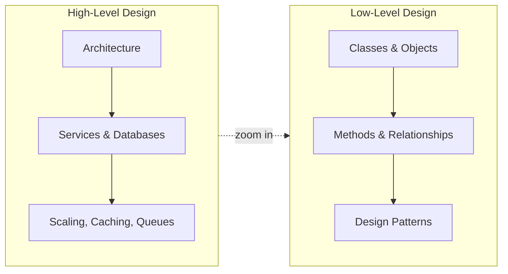
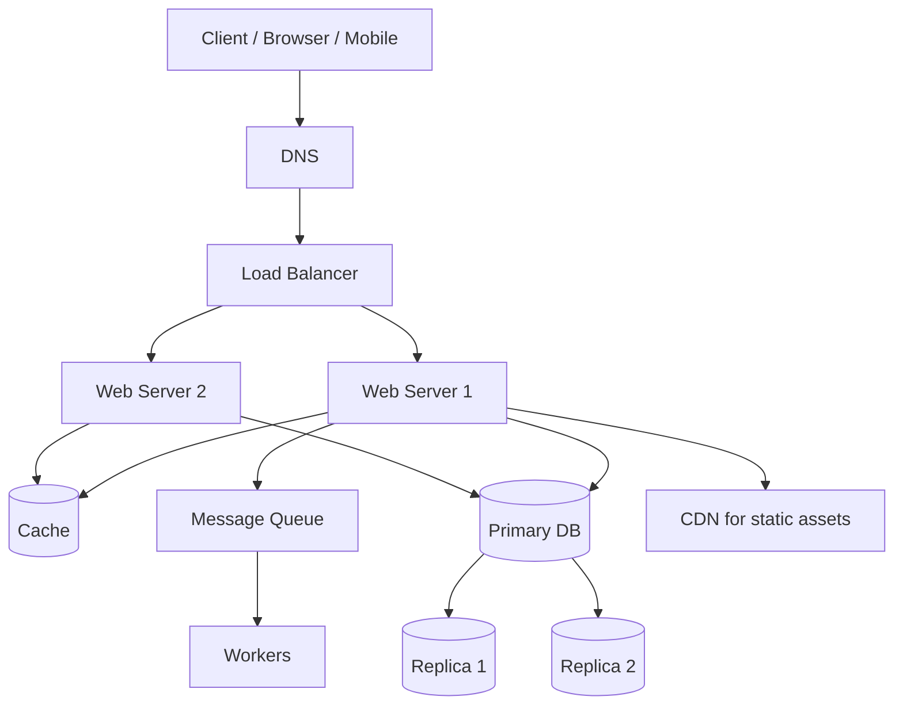

# 01 · Introduction to System Design

[← Back to Hub](../README.md) | [Next: Scalability →](./02-scalability.md)

---

## What is System Design?

**System design** is the process of defining the architecture, components, modules, interfaces, and data flow of a system to satisfy a specified set of requirements. In an interview, it tests your ability to take an ambiguous, open-ended problem ("Design Twitter") and turn it into a concrete, scalable, and reliable architecture while reasoning about **trade-offs**.

There is rarely a single "correct" answer. The interviewer evaluates *how you think*: how you gather requirements, estimate scale, make decisions, and defend them.

---

## HLD vs LLD — The Two Halves

| Aspect | High-Level Design (HLD) | Low-Level Design (LLD) |
|--------|-------------------------|------------------------|
| **Focus** | The "big picture" — how services, databases, and components interact | The "internals" — classes, objects, methods of one component |
| **Output** | Architecture diagram, data flow, technology choices | UML class diagrams, code, design patterns |
| **Question style** | "Design Instagram" | "Design the parking-lot module of a garage" |
| **Concerns** | Scalability, availability, latency, consistency | Extensibility, maintainability, SOLID, clean code |
| **Audience** | Architects, senior engineers | Developers implementing the feature |
| **Asked at** | Senior / staff system-design rounds | SDE-1/2 machine-coding rounds |

> **Analogy:** HLD is the blueprint of a city (roads, water, power grids). LLD is the detailed architecture of a single building (rooms, wiring, plumbing).

---

## Why Companies Ask System Design

1. **Real work mirrors it.** Production systems serve millions of users; engineers must reason about scale daily.
2. **It reveals seniority.** Junior engineers code features; senior engineers design systems and weigh trade-offs.
3. **It is unstructured.** Unlike DSA, there is no single answer — it tests communication, judgment, and depth.
4. **It surfaces breadth.** Databases, networking, concurrency, caching, distributed systems — all in one conversation.

---

## The Core Tensions (Trade-offs)

Almost every system-design decision is a trade-off along these axes. Memorize them — they are the language of the interview.

| Tension | One side | Other side |
|---------|----------|------------|
| **Consistency vs Availability** | Always correct data | Always responsive |
| **Latency vs Throughput** | Fast single request | High total volume |
| **Read-optimized vs Write-optimized** | Fast queries | Fast inserts |
| **Normalization vs Denormalization** | No duplication, integrity | Fast reads, fewer joins |
| **Strong vs Eventual consistency** | Simpler reasoning | Higher availability/perf |
| **Cost vs Performance** | Cheap | Fast |
| **Simplicity vs Flexibility** | Easy to build/operate | Handles future needs |

> 🔑 **Golden rule:** There is no perfect design — only the best design *for the given requirements*. Always tie a decision back to a requirement.

---

## Key Building Blocks (Vocabulary Preview)

You will meet these throughout the hub. A one-line definition for now:

- **Load Balancer** — distributes traffic across servers. → [deep dive](../hld/building-blocks/load-balancing.md)
- **Cache** — fast in-memory store for frequent data. → [deep dive](../hld/building-blocks/caching.md)
- **Database** — durable store; SQL (relational) or NoSQL. → [deep dive](../hld/building-blocks/databases.md)
- **Sharding** — splitting data across machines. → [deep dive](../hld/building-blocks/sharding.md)
- **Replication** — copying data for availability. → [deep dive](../hld/building-blocks/replication.md)
- **Message Queue** — async communication buffer. → [deep dive](../hld/building-blocks/message-queues.md)
- **CDN** — geographically distributed content cache. → [deep dive](../hld/building-blocks/cdn.md)

---

## A Typical Web System (Bird's-eye View)

This single diagram contains 80% of the building blocks you will use. The rest of the hub explains *when* and *why* to add each piece.

---

## Key Takeaways
- System design = turning vague requirements into a concrete, scalable architecture.
- **HLD** = architecture & components; **LLD** = classes & code of a component.
- Every decision is a **trade-off** — always justify against a requirement.
- Master the vocabulary first; depth comes from understanding *why*, not memorizing *what*.

---
[← Back to Hub](../README.md) | [Next: Scalability →](./02-scalability.md)
