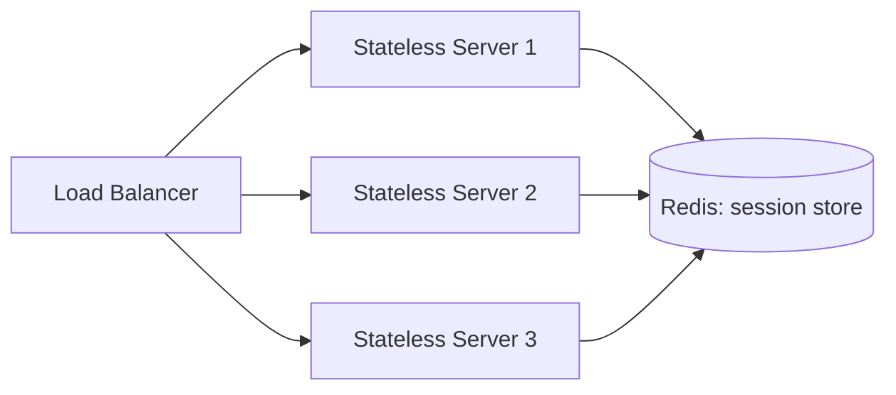
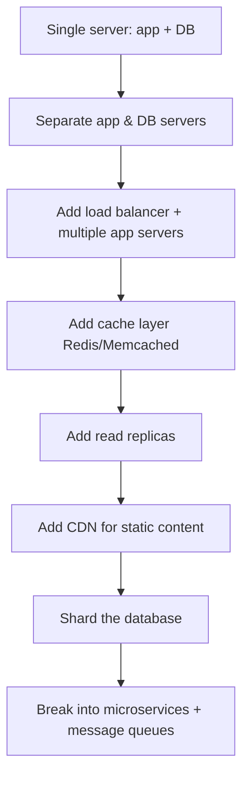

# 02 · Scalability — Vertical vs Horizontal

[← Introduction](./01-introduction.md) | [Back to Hub](../README.md) | [Next: Latency & Throughput →](./03-latency-throughput.md)

---

## What is Scalability?

**Scalability** is a system's ability to handle increased load (more users, more data, more requests) by adding resources, *without* a proportional degradation in performance. A scalable system grows gracefully; an unscalable one falls over a cliff once a threshold is crossed.

> **Load** can be expressed in many ways: requests/second, concurrent users, data volume, read/write ratio.

---

## Vertical Scaling (Scale Up)

Add more power (CPU, RAM, SSD) to a **single** machine.

```
   Before              After
  ┌──────┐           ┌──────────┐
  │ 4 CPU│    ──►    │  32 CPU  │
  │ 8 GB │           │  256 GB  │
  └──────┘           └──────────┘
```

| ✅ Pros | ❌ Cons |
|--------|--------|
| Simple — no code/architecture change | **Hard ceiling** — a machine can only get so big |
| No data distribution complexity | **Single point of failure (SPOF)** |
| Strong consistency is trivial (one node) | Expensive at the high end (diminishing returns) |
| Good for databases that are hard to shard | Downtime often required to upgrade |

**Use when:** early-stage products, monoliths, databases that resist sharding (e.g., a single Postgres primary handling moderate load).

---

## Horizontal Scaling (Scale Out)

Add **more machines** and distribute the load across them.

```
        ┌─────────────┐
        │Load Balancer│
        └──────┬──────┘
       ┌───────┼───────┐
   ┌───▼──┐ ┌──▼───┐ ┌─▼────┐
   │Node 1│ │Node 2│ │Node 3│
   └──────┘ └──────┘ └──────┘
```

| ✅ Pros | ❌ Cons |
|--------|--------|
| **Near-infinite scale** (add more nodes) | Requires a load balancer |
| **Fault tolerant** — one node dies, others serve | Data consistency across nodes is hard |
| Commodity hardware = cost-effective | Application must be **stateless** (or use shared state) |
| Zero-downtime scaling | More operational complexity |

**Use when:** large-scale web apps, microservices, anything serving millions of users. This is the default for modern internet-scale systems.

---

## Side-by-Side

| Dimension | Vertical (Scale Up) | Horizontal (Scale Out) |
|-----------|---------------------|------------------------|
| Method | Bigger machine | More machines |
| Scale limit | Hardware ceiling | Effectively unlimited |
| Fault tolerance | SPOF | Resilient |
| Cost curve | Exponential | Linear-ish |
| Complexity | Low | High |
| Consistency | Easy | Hard |
| Example | Upgrade RAM on DB server | Add app servers behind LB |

---

## The Enabler: Stateless Services

Horizontal scaling only works cleanly if your application servers are **stateless** — any request can go to any server. Session/user state must live in a **shared store** (cache or DB), not in server memory.



> ❌ **Sticky sessions** (pinning a user to one server) hurt scalability and fault tolerance — if that server dies, the user's session is lost. Prefer externalizing state.

---

## Scaling the Database (The Hard Part)

App servers scale easily; **databases are the bottleneck**. Strategies (covered in depth later):

1. **Read replicas** — copy data to multiple read-only nodes. → [Replication](../hld/building-blocks/replication.md)
2. **Caching** — serve hot reads from memory. → [Caching](../hld/building-blocks/caching.md)
3. **Sharding / Partitioning** — split data across nodes. → [Sharding](../hld/building-blocks/sharding.md)
4. **CQRS** — separate read and write models.
5. **Denormalization** — trade storage for fewer joins.

---

## Scale Cube (AKF) — Three Axes of Scaling

```
        Z (Data Partition / Sharding)
        ▲
        │
        │
        └───────────► X (Cloning / Replication)
       /
      /
     ▼
    Y (Functional Decomposition / Microservices)
```

- **X-axis:** Clone the whole app behind a load balancer (horizontal duplication).
- **Y-axis:** Split by *function* — break monolith into microservices.
- **Z-axis:** Split by *data* — shard by user ID, region, etc.

Real systems combine all three.

---

## A Practical Scaling Journey



> Don't over-engineer. Each step is taken *when load demands it*, not before. In interviews, start simple and scale on cue.

---

## Key Takeaways
- **Vertical** = bigger box (simple, limited, SPOF). **Horizontal** = more boxes (scalable, resilient, complex).
- Horizontal scaling needs **stateless servers** + a **load balancer** + **externalized state**.
- The **database** is the usual bottleneck — scale it with replicas, caching, and sharding.
- Use the **AKF scale cube** (clone, decompose, partition) as a mental model.
- **Scale incrementally** — match complexity to actual load.

---
[← Introduction](./01-introduction.md) | [Back to Hub](../README.md) | [Next: Latency & Throughput →](./03-latency-throughput.md)
