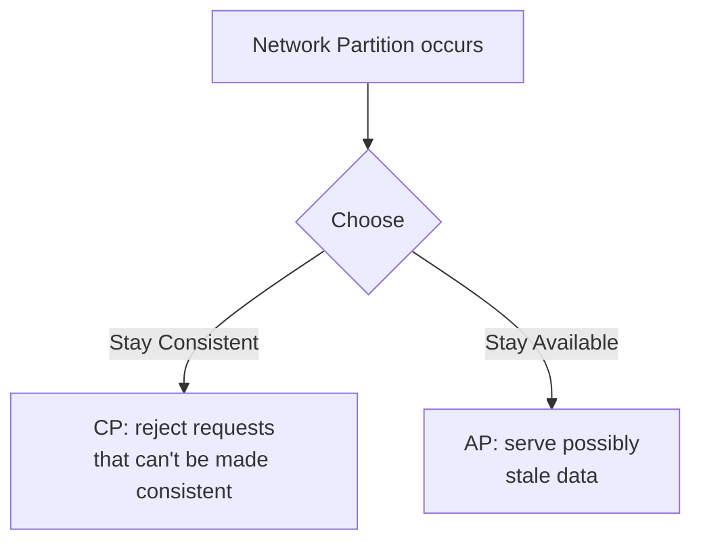

# 04 · CAP Theorem & PACELC

[← Latency & Throughput](./03-latency-throughput.md) | [Back to Hub](../README.md) | [Next: Consistency →](./05-consistency.md)

---

## The CAP Theorem

Formulated by **Eric Brewer**, the CAP theorem states that a distributed data store can provide **at most two** of the following three guarantees simultaneously:

```
            Consistency
                /\
               /  \
              /    \
             / pick \
            /  two   \
           /__________\
   Availability    Partition Tolerance
```

| Letter | Guarantee | Meaning |
|--------|-----------|---------|
| **C — Consistency** | Every read receives the most recent write or an error | All nodes see the same data at the same time |
| **A — Availability** | Every request receives a (non-error) response | The system is always up and answers |
| **P — Partition Tolerance** | The system keeps working despite network partitions (dropped/delayed messages between nodes) | Survives broken communication |

---

## The Key Insight: P is Non-Negotiable

In any real distributed system, **network partitions will happen** (cables fail, switches drop packets, datacenters disconnect). So **P is mandatory**. The real choice is between **C and A** *when a partition occurs*.



> So CAP really means: **"During a partition, do you sacrifice Consistency or Availability?"**

---

## CP vs AP Systems

### CP — Consistency + Partition Tolerance
When a partition happens, the system **refuses to respond** (or returns an error) on nodes that can't guarantee the latest data — preserving correctness over uptime.

- **Behavior:** May become unavailable during a partition.
- **Use when:** correctness is critical — banking, inventory, bookings.
- **Examples:** HBase, MongoDB (default), Redis (single primary), Zookeeper, etcd, traditional RDBMS in a cluster.

### AP — Availability + Partition Tolerance
When a partition happens, the system **keeps serving** requests, possibly returning **stale data**, and reconciles later (eventual consistency).

- **Behavior:** Always responds; data may be temporarily inconsistent.
- **Use when:** uptime matters more than perfect freshness — social feeds, shopping carts, DNS.
- **Examples:** Cassandra, DynamoDB, CouchDB, Riak.

### CA — (Theoretical only)
A CA system gives up partition tolerance — only viable in a **single node / non-distributed** setting. In practice, distributed systems can't be CA because partitions are unavoidable.

---

## Worked Example

Two bank nodes, network between them fails. A user has **$100**. They withdraw $100 from Node A and try $100 from Node B simultaneously.

- **CP choice:** Node B can't verify the balance → **rejects** the request. Money is safe, but B was unavailable. ✅ correctness.
- **AP choice:** Node B **allows** the withdrawal (it still sees $100) → user withdraws **$200**. System stayed available but data was inconsistent (overdraft). ❌ correctness.

This is why **banks lean CP** and **social media leans AP**.

---

## PACELC — The More Complete Model

CAP only describes behavior **during a partition**. **PACELC** (Abadi) extends it:

> **If Partition (P)** → trade off **Availability (A)** vs **Consistency (C)**
> **Else (E)** (normal operation) → trade off **Latency (L)** vs **Consistency (C)**

```
        ┌─ Partition? ─┐
        │              │
       YES            NO (Else)
      A vs C         L vs C
```

This captures a crucial real-world truth: **even without partitions**, stronger consistency costs latency (you must coordinate across nodes before responding).

| System | PACELC classification |
|--------|----------------------|
| DynamoDB / Cassandra | **PA/EL** — favor availability & low latency |
| MongoDB | **PA/EC** (configurable) |
| HBase / BigTable | **PC/EC** — favor consistency |
| Traditional RDBMS | **PC/EC** |

---

## How to Use CAP in an Interview

1. State that **P is required**, so the real trade-off is **C vs A**.
2. Tie the choice to the **requirement**:
   - "Financial transactions → CP, correctness over availability."
   - "Like counts / feeds → AP, availability and low latency over perfect freshness."
3. Mention **PACELC** for bonus points — note the latency cost of strong consistency even without partitions.
4. Note that real systems are often **tunable** (e.g., Cassandra/Dynamo let you pick consistency level per query: ONE, QUORUM, ALL).

---

## Common Misconceptions
- ❌ "CAP means pick 2 of 3 always." → ✅ You only choose between C and A *during a partition*; P is always needed.
- ❌ "Consistency in CAP = ACID consistency." → ✅ CAP's C is **linearizability** (every read sees latest write), not the ACID 'C' (constraints/invariants).
- ❌ "AP systems are never consistent." → ✅ They are *eventually* consistent.

---

## Key Takeaways
- **CAP:** during a network partition, choose **Consistency** or **Availability** (Partition tolerance is mandatory).
- **CP** = correct but may reject requests (banks, inventory). **AP** = always-on but possibly stale (feeds, carts).
- **PACELC** adds: even without partitions, there's a **latency vs consistency** trade-off.
- Always tie the choice to the **business requirement**, and mention **tunable consistency**.

---
[← Latency & Throughput](./03-latency-throughput.md) | [Back to Hub](../README.md) | [Next: Consistency →](./05-consistency.md)
