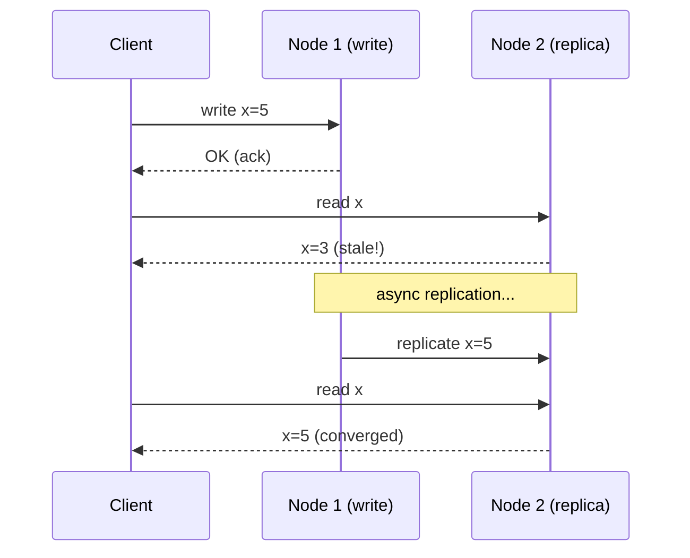
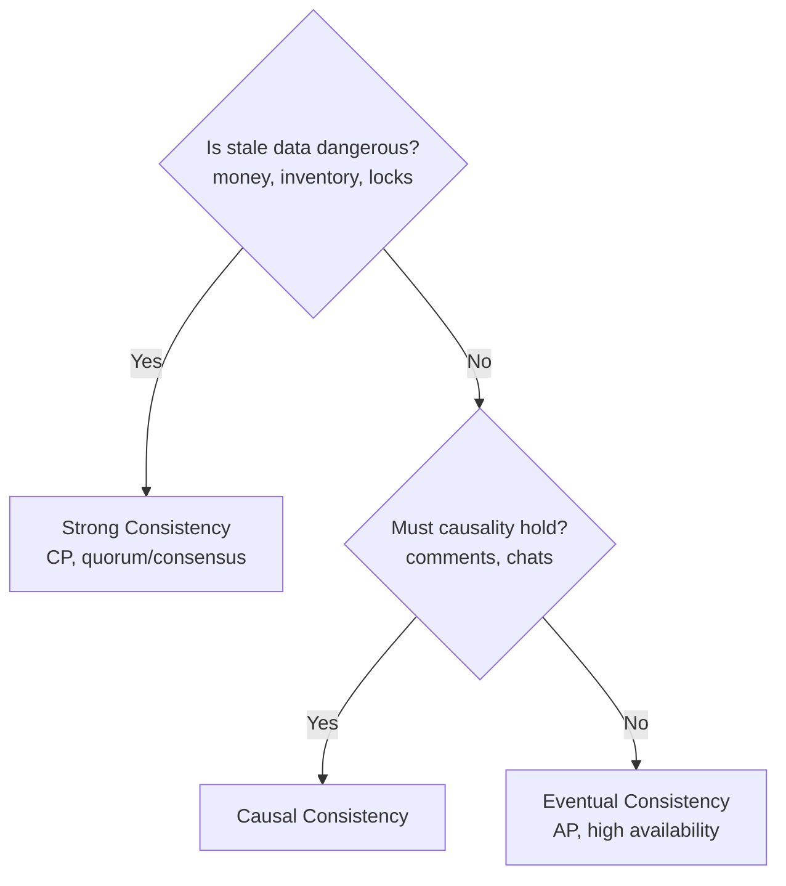

# 05 · Consistency Models & Patterns

[← CAP Theorem](./04-cap-theorem.md) | [Back to Hub](../README.md) | [Next: Availability →](./06-availability.md)

---

## What is Consistency?

**Consistency** describes the guarantees a system makes about **when and how** updates become visible across replicas. In a single-node system this is trivial; in a distributed system with replicas, it becomes one of the hardest problems.

There is a **spectrum** from strong to weak:

```
Strong ◄──────────────────────────────────► Weak
Linearizable → Sequential → Causal → Eventual
(correct, slow)                    (fast, stale)
```

---

## The Consistency Spectrum

### 1. Strong Consistency (Linearizability)
After a write completes, **every** subsequent read (on any node) returns that value. The system behaves as if there's a single copy of the data.

- **Pros:** Simplest mental model; no stale reads.
- **Cons:** High latency (coordination required), lower availability during partitions.
- **Use:** Bank balances, inventory, locks, leader election.
- **How:** Consensus protocols (Paxos, Raft), quorum reads+writes (W + R > N).

### 2. Sequential Consistency
All operations appear in **some** total order, and each process's operations appear in program order — but the global order need not match real-time.

### 3. Causal Consistency
Operations that are **causally related** are seen by everyone in the same order; concurrent (unrelated) operations may be seen in different orders.

- **Example:** A comment must appear *after* the post it replies to (causal), but two unrelated posts can appear in any order.
- **Use:** Comment threads, collaborative apps. Implemented with vector clocks / logical timestamps.

### 4. Eventual Consistency
If no new writes occur, **eventually** all replicas converge to the same value. Reads may be stale in the meantime.

- **Pros:** High availability, low latency, partition-tolerant (AP).
- **Cons:** Clients may read stale data; needs conflict resolution.
- **Use:** DNS, social feeds, like counts, shopping carts.
- **Examples:** Cassandra, DynamoDB, Riak.



---

## Read-Your-Own-Writes & Related Guarantees

These are **client-centric** consistency guarantees often layered on eventual consistency:

| Guarantee | Promise |
|-----------|---------|
| **Read-your-writes** | A user always sees their *own* updates immediately (e.g., your tweet appears for you instantly) |
| **Monotonic reads** | If you've seen a value, you won't later see an older one (no going back in time) |
| **Monotonic writes** | Your writes are applied in the order you made them |
| **Writes-follow-reads** | A write that depends on a read happens after that read's value is visible |

> **Trick:** "Read-your-writes" is often faked by routing a user's reads to the **primary** (or same replica) right after they write.

---

## Quorum Consensus (N, W, R)

A common tunable-consistency mechanism (Dynamo-style):

- **N** = number of replicas
- **W** = nodes that must acknowledge a **write**
- **R** = nodes that must respond to a **read**

> **Rule:** If **W + R > N**, read and write sets overlap → you're guaranteed to read the latest write → **strong consistency**.

| Config | Behavior |
|--------|----------|
| `W=N, R=1` | Fast reads, slow writes; strong consistency |
| `W=1, R=N` | Fast writes, slow reads; strong consistency |
| `W=R=⌈(N+1)/2⌉` (quorum) | Balanced; strong consistency |
| `W + R ≤ N` | Eventual consistency, fastest, may read stale |

Example: `N=3, W=2, R=2` → `2+2=4 > 3` → strong. Tolerates 1 node failure for both reads and writes.

---

## Consistency Patterns (Application-Level)

### Write-side patterns
- **Synchronous replication** — write returns only after replicas confirm (strong, slower).
- **Asynchronous replication** — write returns immediately, replicas catch up (eventual, faster).

### Conflict resolution (for AP systems)
- **Last-Write-Wins (LWW)** — keep the write with the highest timestamp (simple, can lose data).
- **Vector clocks** — track causality; surface conflicts to the app to merge.
- **CRDTs (Conflict-free Replicated Data Types)** — data structures that merge automatically (counters, sets) without coordination.

---

## ACID vs BASE

| ACID (SQL / strong) | BASE (NoSQL / eventual) |
|---------------------|--------------------------|
| **A**tomicity | **B**asically **A**vailable |
| **C**onsistency | **S**oft state |
| **I**solation | **E**ventually consistent |
| **D**urability | |
| Correctness-first | Availability-first |
| RDBMS, banking | Cassandra, Dynamo, web scale |

---

## Choosing a Consistency Model



---

## Key Takeaways
- Consistency is a **spectrum**: linearizable → sequential → causal → eventual.
- **Strong** = always fresh but slower/less available; **eventual** = fast/available but stale.
- **W + R > N** gives strong consistency via quorum overlap.
- Layer **client-centric guarantees** (read-your-writes, monotonic reads) on eventual systems for good UX.
- **ACID** (strong, SQL) vs **BASE** (eventual, NoSQL) — pick by how dangerous stale data is.

---
[← CAP Theorem](./04-cap-theorem.md) | [Back to Hub](../README.md) | [Next: Availability →](./06-availability.md)
