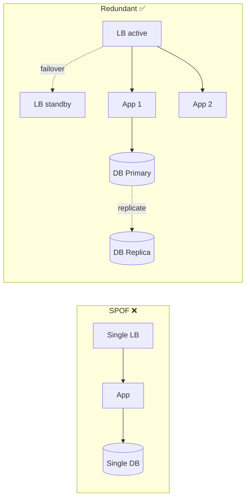

# 06 · Availability & Reliability (SLA / SLO / SLI)

[← Consistency](./05-consistency.md) | [Back to Hub](../README.md) | [Next: Networking →](./07-networking.md)

---

## Availability

**Availability** = the percentage of time a system is operational and able to respond to requests.

```
Availability = Uptime / (Uptime + Downtime)
```

It's commonly expressed in **"nines"**:

| Availability | "Nines" | Downtime / year | Downtime / day |
|--------------|---------|------------------|----------------|
| 90% | one nine | 36.5 days | 2.4 hours |
| 99% | two nines | 3.65 days | 14.4 min |
| 99.9% | three nines | 8.77 hours | 1.44 min |
| 99.99% | four nines | 52.6 min | 8.6 sec |
| 99.999% | five nines | 5.26 min | 0.86 sec |
| 99.9999% | six nines | 31.5 sec | 86 ms |

> Each extra nine is **~10× harder and more expensive**. Most web services target **99.9–99.99%**. "Five nines" is reserved for telecom/critical infra.

### Availability of Components in Series vs Parallel

**In series** (request must pass through all), availabilities **multiply**:
```
A_total = A1 × A2 × A3
e.g., 0.99 × 0.99 × 0.99 = 0.970 (97%)  ← worse than any single component!
```

**In parallel** (redundant, any one suffices), unavailabilities multiply:
```
A_total = 1 − (1−A1) × (1−A2)
e.g., 1 − (0.01 × 0.01) = 0.9999 (99.99%)  ← redundancy boosts availability
```

> 🔑 **Lesson:** Long dependency chains *reduce* availability; **redundancy** *increases* it. Minimize critical-path dependencies and add redundancy where it matters.

---

## SLA vs SLO vs SLI

These three are often confused. Hierarchy: **SLI** (measured) → **SLO** (target) → **SLA** (contract).

| Term | Stands for | What it is | Example |
|------|-----------|------------|---------|
| **SLI** | Service Level **Indicator** | A *measured* metric | "p99 latency = 180ms"; "99.95% of requests succeeded" |
| **SLO** | Service Level **Objective** | An *internal target* for an SLI | "p99 latency < 200ms"; "availability ≥ 99.95%" |
| **SLA** | Service Level **Agreement** | A *contract* with consequences (refunds/credits) if breached | "99.9% uptime or we credit 10% of your bill" |

```
SLI  = what you measure
SLO  = what you aim for  (SLO is usually stricter than SLA)
SLA  = what you promise customers (with penalties)
```

> **Error budget** = 1 − SLO. If your SLO is 99.9%, you have a 0.1% budget for downtime/errors. Teams "spend" this budget on risky deploys; when it's exhausted, they freeze features and focus on reliability.

---

## Reliability vs Availability

- **Availability:** Is it up *right now*? (% of time operational)
- **Reliability:** Does it work *correctly* over time, without failures? (MTBF — mean time between failures)

A system can be *available* (responding) but *unreliable* (returning wrong results). You want both.

| Metric | Meaning |
|--------|---------|
| **MTBF** (Mean Time Between Failures) | Average time the system runs before failing |
| **MTTR** (Mean Time To Repair/Recover) | Average time to recover after a failure |
| **MTTF** (Mean Time To Failure) | For non-repairable components |

```
Availability = MTBF / (MTBF + MTTR)
```
→ Improve availability by **increasing MTBF** (fewer failures) or **decreasing MTTR** (faster recovery — automated failover, good monitoring).

---

## Techniques to Achieve High Availability

| Technique | How it helps |
|-----------|--------------|
| **Redundancy** (N+1, active-active, active-passive) | No single point of failure |
| **Load balancing + health checks** | Route around dead nodes |
| **Replication** | Data survives node loss → [Replication](../hld/building-blocks/replication.md) |
| **Failover** (automatic) | Promote a standby when primary dies |
| **Multi-AZ / Multi-region** | Survive datacenter/region outages |
| **Graceful degradation** | Serve reduced functionality vs full outage |
| **Circuit breakers** | Stop calling a failing dependency to avoid cascading failure |
| **Retries with backoff + jitter** | Survive transient failures without thundering herd |
| **Bulkheads** | Isolate failures to one partition |
| **Auto-scaling** | Absorb load spikes |

---

## Eliminating Single Points of Failure (SPOF)

A **SPOF** is any component whose failure takes down the whole system. Find and remove them:



Checklist: single LB? single DB primary? single region? single cache node? single message broker? Add redundancy/failover for each.

---

## Active-Active vs Active-Passive

| | Active-Active | Active-Passive |
|---|---------------|----------------|
| Standby role | All nodes serve traffic | Standby idle until failover |
| Utilization | High (no idle hardware) | Lower (standby idle) |
| Failover time | Instant (already serving) | Promotion delay |
| Complexity | Higher (conflict handling) | Lower |
| Cost efficiency | Better | Worse |

---

## The Availability vs Consistency Trade-off (link to CAP)

Recall from [CAP](./04-cap-theorem.md): during a partition you choose **availability** or **consistency**. High-availability (AP) systems accept stale reads; consistency-first (CP) systems may reject requests. Your availability target directly shapes this choice.

---

## Key Takeaways
- Availability is measured in **"nines"**; each nine is ~10× harder. Aim **99.9–99.99%** for most services.
- **SLI** (measured) → **SLO** (internal target) → **SLA** (customer contract with penalties). **Error budget = 1 − SLO**.
- Series dependencies *reduce* availability; **redundancy** *increases* it.
- Improve availability via **redundancy, failover, replication, health checks, graceful degradation, circuit breakers**.
- **Hunt down SPOFs** — every critical component needs a backup.

---
[← Consistency](./05-consistency.md) | [Back to Hub](../README.md) | [Next: Networking →](./07-networking.md)
