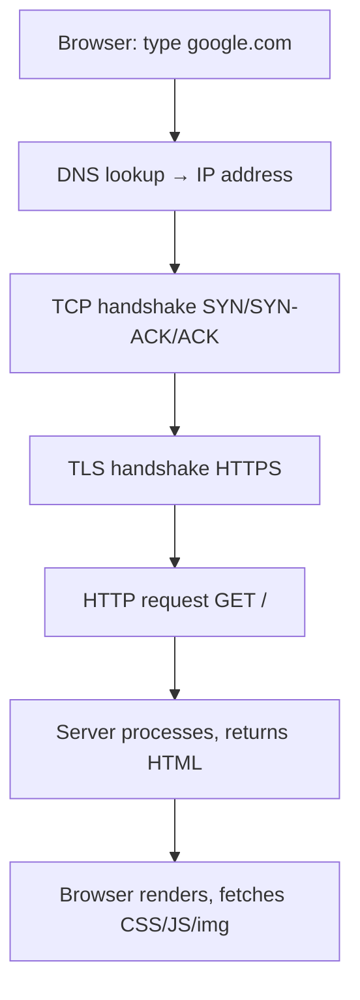
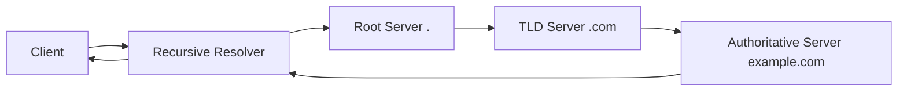

# 07 · Networking Basics (DNS, TCP/IP, HTTP)

[← Availability](./06-availability.md) | [Back to Hub](../README.md) | [Next: Estimation →](./08-estimation.md)

---

## Why Networking Matters in System Design

Every distributed system communicates over a network. Understanding how a request travels from a browser to a server — and the costs at each hop — lets you reason about latency, caching, and failure modes.

---

## What Happens When You Type a URL (End-to-End)



---

## The Network Stack (OSI / TCP-IP)

| Layer | TCP/IP | Examples | Role |
|-------|--------|----------|------|
| 7 Application | Application | HTTP, DNS, FTP, SMTP, WebSocket | App-level protocols |
| 4 Transport | Transport | **TCP, UDP** | End-to-end delivery |
| 3 Network | Internet | **IP**, ICMP | Routing/addressing |
| 2 Data Link | Link | Ethernet, MAC | Local delivery |

You'll mostly reason at the **Application** and **Transport** layers.

---

## DNS — Domain Name System

DNS translates human-readable names (`amazon.com`) into IP addresses (`52.94.236.248`). It's a distributed, hierarchical, heavily cached system.



- **Recursive resolver** (usually your ISP / 8.8.8.8) does the legwork and caches results (TTL).
- **Record types:** `A` (IPv4), `AAAA` (IPv6), `CNAME` (alias), `MX` (mail), `NS` (nameserver), `TXT`.
- **DNS-based load balancing & geo-routing:** return different IPs based on load or client location (used by CDNs).
- **TTL** controls cache duration — low TTL = faster failover, more DNS traffic.

---

## TCP vs UDP

| | TCP | UDP |
|---|-----|-----|
| Connection | Connection-oriented (handshake) | Connectionless |
| Reliability | Guaranteed, ordered, retransmits | Best-effort, no guarantees |
| Speed | Slower (overhead) | Faster (minimal overhead) |
| Flow/congestion control | Yes | No |
| Use cases | Web (HTTP), email, file transfer, DB | Video/voice streaming, gaming, DNS, QUIC |
| Header size | 20+ bytes | 8 bytes |

> **Rule of thumb:** Need correctness & order → **TCP**. Need speed & can tolerate loss → **UDP**.

### TCP 3-Way Handshake
```
Client            Server
  │── SYN ────────►│
  │◄── SYN-ACK ────│
  │── ACK ────────►│
  │  (connected)   │
```
Each handshake is a round trip — why **connection pooling** and **keep-alive** matter.

---

## HTTP & HTTPS

**HTTP** is a stateless request/response protocol over TCP.

### Common Methods
| Method | Purpose | Idempotent? | Safe? |
|--------|---------|-------------|-------|
| GET | Read | ✅ | ✅ |
| POST | Create | ❌ | ❌ |
| PUT | Replace/Upsert | ✅ | ❌ |
| PATCH | Partial update | ❌ (usually) | ❌ |
| DELETE | Remove | ✅ | ❌ |

> **Idempotent** = repeating the request has the same effect as doing it once (critical for safe retries).

### Status Codes
| Range | Meaning | Examples |
|-------|---------|----------|
| 1xx | Informational | 100 Continue |
| 2xx | Success | 200 OK, 201 Created, 204 No Content |
| 3xx | Redirection | 301 Moved Permanently, 302 Found, 304 Not Modified |
| 4xx | Client error | 400 Bad Request, 401 Unauthorized, 403 Forbidden, 404 Not Found, 429 Too Many Requests |
| 5xx | Server error | 500 Internal Error, 502 Bad Gateway, 503 Unavailable, 504 Gateway Timeout |

### HTTP versions
- **HTTP/1.1** — one request per connection at a time (head-of-line blocking); keep-alive reuses connections.
- **HTTP/2** — multiplexing (many streams over one connection), header compression, server push.
- **HTTP/3 (QUIC)** — runs over **UDP**, removes TCP head-of-line blocking, faster handshakes.

### HTTPS / TLS
HTTPS = HTTP over **TLS**, providing encryption, integrity, and authentication. TLS handshake adds round trips (mitigated by TLS 1.3, session resumption).

---

## Communication Styles

| Style | Description | Use case |
|-------|-------------|----------|
| **REST** | Resource-based over HTTP, stateless, JSON | Public/web APIs |
| **GraphQL** | Client specifies exact data shape; one endpoint | Avoid over/under-fetching, mobile |
| **gRPC** | Binary (Protobuf) over HTTP/2, fast, typed | Internal microservice-to-microservice |
| **WebSocket** | Full-duplex persistent connection | Chat, live updates, gaming |
| **Webhooks** | Server calls *you* on an event | Async notifications (payments) |
| **SSE** | Server-Sent Events, one-way server→client stream | Live feeds, notifications |

### Polling vs Long-Polling vs WebSocket vs SSE
```
Short polling:  client asks repeatedly "any update?" (wasteful)
Long polling:   server holds request open until data is ready
WebSocket:      persistent two-way channel (real-time)
SSE:            persistent one-way server→client stream
```

---

## Forward Proxy vs Reverse Proxy

- **Forward proxy:** sits in front of **clients**, hides them from servers (VPN, corporate filter).
- **Reverse proxy:** sits in front of **servers**, hides them from clients (Nginx, load balancing, TLS termination, caching). → [API Gateway / Reverse Proxy](../hld/building-blocks/api-gateway.md)

```
Client → [Forward Proxy] → Internet → [Reverse Proxy] → Servers
```

---

## Key Takeaways
- A request flows: **DNS → TCP → TLS → HTTP**. Each hop adds latency — cache and pool connections.
- **DNS** maps names → IPs, is heavily cached (TTL), and enables geo/load routing.
- **TCP** = reliable/ordered (web, DB); **UDP** = fast/lossy (streaming, gaming, DNS, QUIC).
- Know **HTTP methods, status codes, idempotency**, and **HTTP/2 vs HTTP/3**.
- Pick the right comms style: **REST/GraphQL/gRPC/WebSocket/SSE** by use case.

---
[← Availability](./06-availability.md) | [Back to Hub](../README.md) | [Next: Estimation →](./08-estimation.md)
