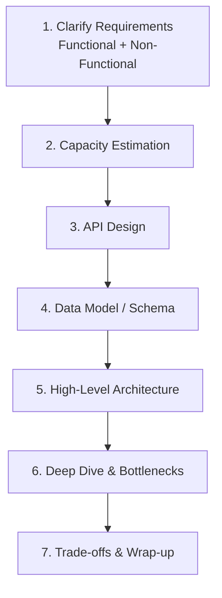
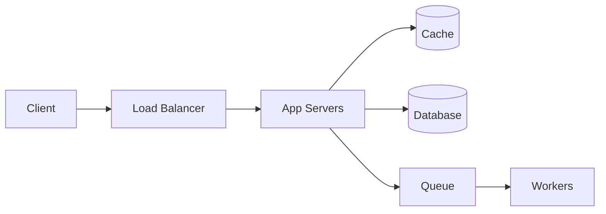

# 09 · The Interview Framework — How to Approach Any Problem

[← Estimation](./08-estimation.md) | [Back to Hub](../README.md)

---

## The Problem with Unstructured Answers

System-design interviews are open-ended. Without a framework, candidates jump straight to "I'll use Kafka and Cassandra" without understanding the problem. A repeatable framework keeps you organized and signals seniority.

> **The single biggest mistake:** jumping to a solution before clarifying requirements.

---

## The 7-Step Framework (RESHADED-style)



Budget for a **45-minute** interview:

| Step | Time | Goal |
|------|------|------|
| 1. Requirements | 5 min | Scope the problem, agree on what to build |
| 2. Estimation | 5 min | Numbers that justify decisions |
| 3. API Design | 5 min | Contract between client & server |
| 4. Data Model | 5 min | What to store, SQL vs NoSQL |
| 5. High-Level Architecture | 10 min | The boxes-and-arrows diagram |
| 6. Deep Dive | 10 min | Drill into 1–2 hard parts |
| 7. Trade-offs | 5 min | Justify, discuss alternatives, scale |

---

## Step 1 — Clarify Requirements (most important!)

Split into two:

### Functional Requirements (what it does)
The features. For a URL shortener: *shorten a URL, redirect, custom alias, analytics, expiry*.
- Ask: "Should we support X? Is Y in scope?"
- **Narrow the scope** — you can't design everything in 45 min. Pick the **core 2–3 features**.

### Non-Functional Requirements (how well it does it)
The qualities. Ask about:
- **Scale:** How many users/requests? (drives estimation)
- **Availability vs Consistency:** Which matters more? (CAP)
- **Latency:** Real-time? p99 target?
- **Read vs write heavy?**
- **Durability:** Can we lose data?
- **Security/privacy** needs.

> Write these on the board. Every later decision references back to them.

### Sample clarifying questions
- "What's the expected DAU?"
- "Is this read-heavy or write-heavy?"
- "Do we need strong consistency or is eventual OK?"
- "What's the acceptable latency?"
- "Global or single-region?"

---

## Step 2 — Capacity Estimation
Use the [estimation cheat card](./08-estimation.md): DAU → QPS (avg & peak) → storage → bandwidth → cache size. These numbers tell you whether you need sharding, CDN, caching, etc.

---

## Step 3 — API Design
Define the key endpoints (the contract). Keep it concise:
```
POST /urls            { longUrl, customAlias? } → { shortUrl }
GET  /{shortCode}     → 301 redirect to longUrl
GET  /urls/{id}/stats → { clicks, ... }
```
Mention: REST vs gRPC, auth (API key/JWT), pagination, rate limiting.

---

## Step 4 — Data Model
- Identify entities & relationships.
- Choose **SQL vs NoSQL** and *justify* (structured + transactions → SQL; massive scale + flexible schema → NoSQL). → [Databases](../hld/building-blocks/databases.md)
- Show a quick schema/table sketch.
- Note indexing and access patterns.

---

## Step 5 — High-Level Architecture
Draw boxes and arrows. Start **simple**, then evolve:



Walk the interviewer through the **request flow** (read path and write path separately).

---

## Step 6 — Deep Dive & Bottlenecks
Pick the **hardest 1–2 parts** and go deep. Examples:
- How to generate unique IDs at scale? ([Snowflake](../hld/building-blocks/sharding.md))
- Feed fan-out: push vs pull? ([Twitter](../hld/case-studies/twitter.md))
- How to shard? Hot partitions? ([Consistent hashing](../hld/building-blocks/consistent-hashing.md))
- Caching strategy & invalidation? ([Caching](../hld/building-blocks/caching.md))
- Handling failures, SPOFs, retries.

Proactively identify **bottlenecks** and propose fixes (cache, replica, shard, queue).

---

## Step 7 — Trade-offs & Wrap-up
- Summarize key decisions and **why** (tie to requirements).
- Discuss alternatives you rejected and the trade-off.
- Mention: monitoring, logging, security, future scaling.
- Invite follow-ups.

---

## Golden Rules / Dos & Don'ts

| ✅ Do | ❌ Don't |
|------|---------|
| Clarify before designing | Jump straight to tech names |
| Think out loud | Go silent |
| Start simple, then scale | Over-engineer from minute 1 |
| Justify with trade-offs | State decisions without "why" |
| Drive the conversation | Wait passively for hints |
| Use the whiteboard/diagram | Keep it all verbal |
| Admit unknowns honestly | Bluff |
| Tie decisions to requirements | Add tech because it's trendy |

---

## Universal Checklist (mental cue card)

```
☐ Functional requirements (core 2-3 features)
☐ Non-functional (scale, latency, C vs A, durability)
☐ Estimation (QPS, storage, bandwidth, cache)
☐ API endpoints
☐ Data model + SQL/NoSQL choice
☐ High-level diagram (read path + write path)
☐ Scaling: LB, cache, replicas, shards, CDN, queue
☐ Deep dive on 1-2 hard problems
☐ Bottlenecks & SPOFs addressed
☐ Trade-offs summarized
☐ Bonus: monitoring, security, cost
```

---

## Key Takeaways
- Follow the **7 steps**: Requirements → Estimation → API → Data Model → Architecture → Deep Dive → Trade-offs.
- **Clarify first** — never design before scoping functional + non-functional requirements.
- **Start simple, scale on demand.** Don't over-engineer.
- **Think out loud, justify everything with trade-offs, drive the conversation.**
- Use the [case studies](../hld/case-studies) to practice this exact flow end-to-end.

---
[← Estimation](./08-estimation.md) | [Back to Hub](../README.md)
