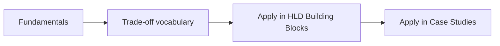

# 📐 Fundamentals

[← Back to Hub](../README.md)

The core concepts every system design rests on. Read these first — they are the **vocabulary and trade-off language** used throughout the HLD and LLD sections.

| # | Topic | What you'll learn |
|---|-------|-------------------|
| 01 | [Introduction to System Design](./01-introduction.md) | What HLD vs LLD is; the core trade-offs |
| 02 | [Scalability](./02-scalability.md) | Vertical vs horizontal scaling, AKF scale cube |
| 03 | [Latency & Throughput](./03-latency-throughput.md) | Performance, percentiles (p99), latency numbers |
| 04 | [CAP Theorem & PACELC](./04-cap-theorem.md) | Consistency vs Availability during partitions |
| 05 | [Consistency Models](./05-consistency.md) | Strong → eventual, quorums, ACID vs BASE |
| 06 | [Availability & Reliability](./06-availability.md) | Nines, SLA/SLO/SLI, redundancy, SPOFs |
| 07 | [Networking Basics](./07-networking.md) | DNS, TCP/UDP, HTTP, WebSockets, proxies |
| 08 | [Back-of-the-Envelope Estimation](./08-estimation.md) | QPS, storage, bandwidth, cache sizing |
| 09 | [The Interview Framework](./09-interview-framework.md) | A repeatable 7-step approach to any problem |

---

## The mental model

Every later decision — "use a cache", "shard by user ID", "go eventual consistency" — is justified using ideas from this section. Master the **trade-offs**, not just definitions.

[← Back to Hub](../README.md) | [Start: Introduction →](./01-introduction.md)
