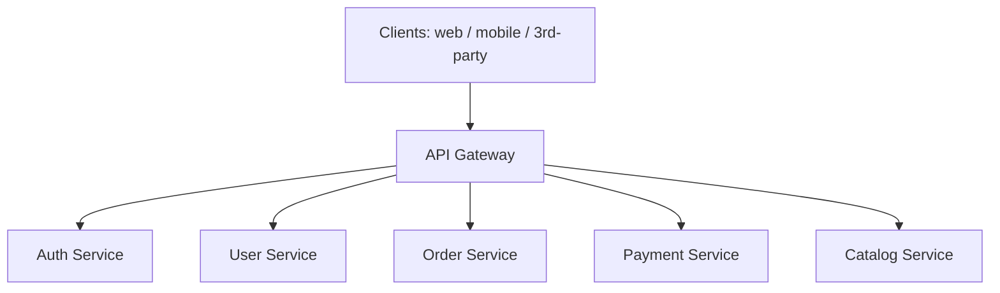
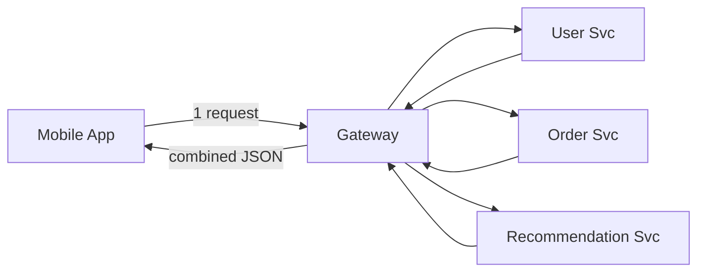
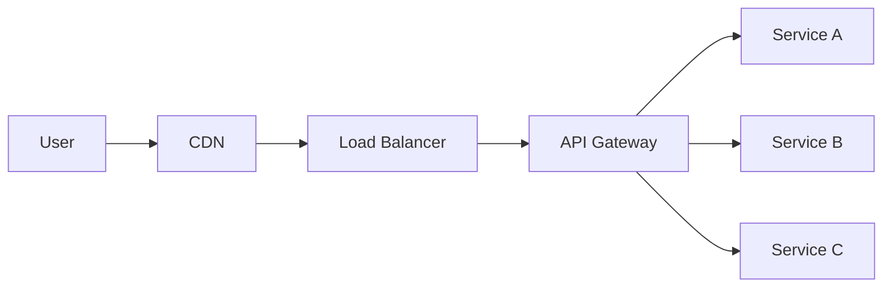

# API Gateway & Reverse Proxy

[← HLD Index](../README.md) | [Back to Hub](../../README.md)

---

## Reverse Proxy

A **reverse proxy** sits in front of your servers and forwards client requests to them, hiding the backend topology. (Contrast: a **forward proxy** sits in front of clients — see [Networking](../../fundamentals/07-networking.md).)

```
Client → [Reverse Proxy] → Backend Servers
```

**Responsibilities:**
- **Load balancing** across servers → [Load Balancing](./load-balancing.md)
- **SSL/TLS termination** (decrypt once at the edge)
- **Caching** static responses
- **Compression** (gzip/brotli)
- **Security** — hide server IPs, filter requests, WAF
- **Request routing** by path/host

**Examples:** Nginx, HAProxy, Envoy, Apache, Traefik.

---

## API Gateway

An **API Gateway** is a specialized reverse proxy that is the **single entry point** for all client requests to a system of (micro)services. It handles **cross-cutting concerns** so individual services don't have to.



### Responsibilities (cross-cutting concerns)
| Concern | What the gateway does |
|---------|----------------------|
| **Routing** | Map `/users/*` → User Service, `/orders/*` → Order Service |
| **Authentication & Authorization** | Validate JWT/API keys before forwarding |
| **Rate limiting / throttling** | Protect backends from abuse → [Rate Limiting](./rate-limiting.md) |
| **Request/response transformation** | Rewrite headers, aggregate, version |
| **Protocol translation** | REST ↔ gRPC, HTTP ↔ WebSocket |
| **Caching** | Cache common responses |
| **Load balancing** | Distribute to service instances |
| **SSL termination** | Centralize TLS |
| **Logging / monitoring / tracing** | Central observability point |
| **Aggregation** | Combine multiple service calls into one response |

> **Why it matters:** Without a gateway, every microservice re-implements auth, rate limiting, logging, TLS — duplicated and error-prone. The gateway centralizes them.

---

## Reverse Proxy vs API Gateway vs Load Balancer

| | Load Balancer | Reverse Proxy | API Gateway |
|---|--------------|---------------|-------------|
| Primary job | Distribute traffic | Forward + protect + cache | Manage APIs + cross-cutting concerns |
| Layer | L4/L7 | L7 | L7 (app/API aware) |
| Auth/rate-limit | No | Sometimes | **Yes (core feature)** |
| Service routing | Basic | Path/host | Rich, API-level |
| Aggregation | No | No | Yes |
| Examples | AWS NLB/ALB | Nginx, HAProxy | Kong, AWS API Gateway, Apigee, Zuul |

> They overlap. A gateway *is* a reverse proxy with API-management features; an ALB is a load balancer with some L7 features. In practice you layer them: **CDN → LB → API Gateway → services**.

---

## The "API Composition / Aggregation" Pattern

For a mobile screen needing data from 3 services, the gateway can **fan out** and combine responses, reducing client round trips:

> **BFF (Backend for Frontend):** a gateway variant — a separate gateway per client type (web, iOS, Android) tailored to each client's needs.

---

## Trade-offs

| ✅ Pros | ❌ Cons |
|--------|--------|
| Single entry point, centralizes cross-cutting concerns | **Potential bottleneck / SPOF** (must be HA + scaled) |
| Simplifies clients & services | Adds a network hop (latency) |
| Security & observability in one place | Operational complexity; can become a "god object" |
| Decouples clients from service topology | Risk of tight coupling if it holds business logic |

> ⚠️ Keep the gateway **thin** — routing, auth, rate limiting, aggregation. **Don't put business logic** in it. Make it **stateless & horizontally scalable** to avoid the SPOF.

---

## Where It Fits



---

## Key Takeaways
- A **reverse proxy** fronts servers: load balancing, TLS termination, caching, security (Nginx, Envoy).
- An **API Gateway** is the **single entry point** for microservices, centralizing **auth, rate limiting, routing, aggregation, observability**.
- It prevents every service from re-implementing cross-cutting concerns.
- Keep it **thin, stateless, and horizontally scaled** so it isn't a SPOF or bottleneck.
- Layering: **CDN → LB → API Gateway → services**; consider **BFF** per client type.

---
[← HLD Index](../README.md) | [Back to Hub](../../README.md)
