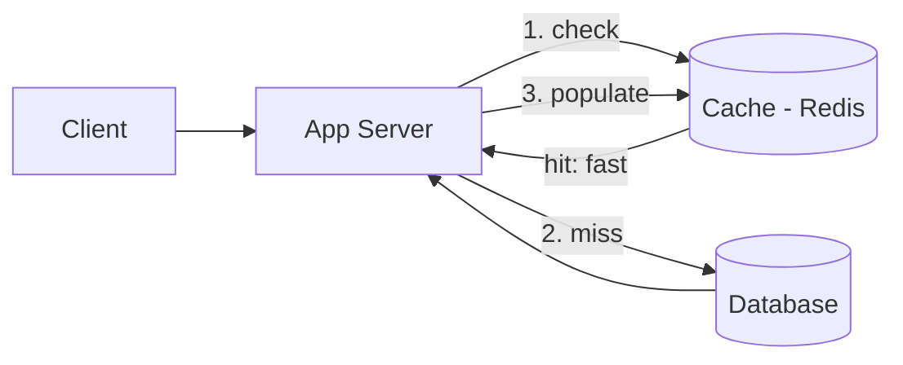
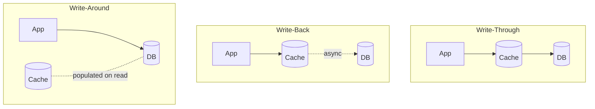
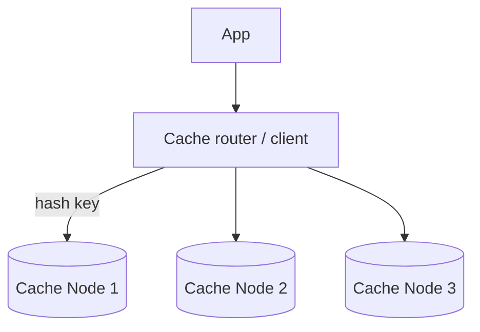

# Caching

[← HLD Index](../README.md) | [Back to Hub](../../README.md)

---

## What is a Cache?

A **cache** is a high-speed storage layer (usually in-memory) that stores a subset of data so future requests are served faster. It trades **memory + potential staleness** for **lower latency + reduced load** on the backing store.

> Core idea: serving from RAM (~100 ns) is **~1000× faster** than a disk/DB query (~10 ms). Cache the **hot 20%** that gets 80% of the traffic ([80/20 rule](../../fundamentals/08-estimation.md)).



---

## Where Can You Cache? (Layers)

```
Browser cache → CDN → Reverse-proxy cache → Application/Distributed cache → DB query cache
   (client)      (edge)     (Nginx)            (Redis/Memcached)              (buffer pool)
```

| Layer | Example | Caches |
|-------|---------|--------|
| **Client/Browser** | HTTP cache, localStorage | Static assets, API responses |
| **CDN** | CloudFront, Akamai | Images, JS/CSS, video → [CDN](./cdn.md) |
| **Reverse proxy** | Nginx, Varnish | Full HTTP responses |
| **Application / Distributed** | Redis, Memcached | DB query results, sessions, objects |
| **Database** | Buffer pool, query cache | Hot pages/rows |

---

## Caching Strategies (Read Patterns)

### 1. Cache-Aside (Lazy Loading) — most common
App checks cache; on miss, loads from DB and populates cache.
```
read(key):
  v = cache.get(key)
  if v is None:           # miss
    v = db.get(key)
    cache.set(key, v)
  return v
```
- ✅ Only requested data is cached; cache failure isn't fatal.
- ❌ First request per key is slow (miss); risk of stale data on updates.

### 2. Read-Through
The **cache library** loads from DB on a miss (app only talks to cache).
- ✅ App code is simpler.
- ❌ Same first-miss penalty; needs cache provider support.

### Cache-Aside vs Read-Through
```
Cache-aside:  App ↔ Cache, App ↔ DB  (app manages population)
Read-through: App ↔ Cache ↔ DB       (cache manages population)
```

---

## Caching Strategies (Write Patterns)

### 1. Write-Through
Write to cache **and** DB synchronously.
- ✅ Cache always consistent with DB.
- ❌ Higher write latency (two writes); caches data that may never be read.

### 2. Write-Back (Write-Behind)
Write to cache, **async** flush to DB later (batched).
- ✅ Very fast writes; absorbs write spikes.
- ❌ **Risk of data loss** if cache dies before flush; complex.

### 3. Write-Around
Write directly to DB, **bypass** cache. Cache populated only on read (cache-aside).
- ✅ Avoids caching write-once-read-never data.
- ❌ Recently written data is a cache miss (read-after-write is slow).



| Strategy | Write latency | Consistency | Data-loss risk | Best for |
|----------|---------------|-------------|----------------|----------|
| Write-through | High | Strong | Low | Read-heavy, consistency-sensitive |
| Write-back | Low | Weak | **High** | Write-heavy, can tolerate loss |
| Write-around | Low | Medium | Low | Write-heavy, rarely re-read |

---

## Eviction Policies

When the cache is full, what to remove?

| Policy | Evicts | Use case |
|--------|--------|----------|
| **LRU** (Least Recently Used) | Item unused longest | General purpose (most common) |
| **LFU** (Least Frequently Used) | Item accessed least often | Stable popularity distributions |
| **FIFO** | Oldest inserted | Simple, order-based |
| **TTL** (Time To Live) | Items past expiry | Time-sensitive data |
| **Random** | A random item | Low overhead |

> **LRU** is the default workhorse. Combine with **TTL** to bound staleness.

---

## Cache Invalidation — "One of the two hard things"

Keeping cache and DB in sync is hard. Approaches:
- **TTL / expiration** — simplest; accept staleness up to TTL.
- **Write-through / write invalidation** — update or delete the cache key on every write.
- **Event-driven** — DB change events (CDC) publish invalidations.
- **Versioning** — embed a version in the key; bump on change.

> ⚠️ A common bug: update DB but forget to invalidate cache → users read stale data. Prefer **delete-on-write** (then repopulate on next read) over update-in-place to avoid races.

---

## The Three Cache Failure Modes

### 1. Cache Stampede / Thundering Herd
A hot key expires → thousands of concurrent requests all miss → all hit the DB at once.
**Fixes:** request coalescing (single-flight/locking so one request repopulates), early/probabilistic expiration, stale-while-revalidate.

### 2. Cache Penetration
Requests for **non-existent** keys always miss and hit the DB (e.g., malicious random IDs).
**Fixes:** cache "null"/negative results with short TTL; use a **Bloom filter** to reject keys that definitely don't exist.

### 3. Cache Avalanche
Many keys expire **at the same time** (or the cache restarts) → DB overload.
**Fixes:** add **random jitter** to TTLs; warm the cache on startup; layered caches.

---

## Distributed Caching at Scale

When one cache node isn't enough, shard keys across many nodes using **[consistent hashing](./consistent-hashing.md)** so adding/removing a node reshuffles minimal keys. Replicate hot shards for HA.



**Redis vs Memcached:**
| | Redis | Memcached |
|---|-------|-----------|
| Data structures | Rich (lists, sets, sorted sets, hashes) | Simple key-value |
| Persistence | Optional (RDB/AOF) | None |
| Replication/HA | Yes (Sentinel/Cluster) | No (client-side) |
| Multithreaded | Mostly single-threaded | Multithreaded |
| Use | Default for most; pub/sub, leaderboards | Pure, simple caching |

---

## Key Takeaways
- Cache the **hot 20%** in memory to cut latency ~1000× and offload the DB.
- **Read patterns:** cache-aside (default), read-through. **Write patterns:** write-through (consistent), write-back (fast, risky), write-around.
- **LRU + TTL** is the standard eviction combo; **invalidation** is the hard part — prefer delete-on-write.
- Defend against **stampede** (coalescing), **penetration** (negative cache/Bloom filter), and **avalanche** (TTL jitter).
- Scale with **distributed caching + consistent hashing**; **Redis** is the versatile default.

---
[← HLD Index](../README.md) | [Back to Hub](../../README.md)
