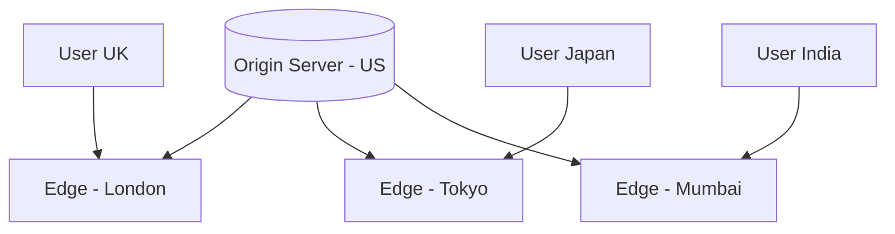
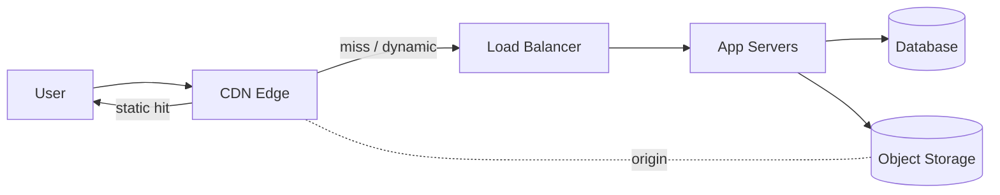

# CDN — Content Delivery Network

[← HLD Index](../README.md) | [Back to Hub](../../README.md)

---

## What is a CDN?

A **CDN** is a geographically distributed network of proxy servers (**edge servers / PoPs**) that cache content **close to users**. Instead of every request traveling to your origin server (maybe across the world), users fetch cached content from a nearby edge — cutting latency dramatically.



> **Core idea:** the speed of light is finite. A round trip CA↔Europe is ~150 ms ([latency table](../../fundamentals/03-latency-throughput.md)). Serving from a local edge (~10 ms) is far faster.

---

## Why Use a CDN?

| Benefit | Explanation |
|---------|-------------|
| **Lower latency** | Content served from a nearby edge |
| **Reduced origin load** | Edges absorb most traffic; origin handles misses only |
| **Higher availability** | Edges serve even if origin is briefly down (stale content) |
| **Bandwidth savings** | Offload terabytes from origin |
| **DDoS protection** | Edges absorb/mitigate attacks before they reach origin |
| **Scalability** | Handle traffic spikes (viral content, launches) |

---

## What to Serve via CDN

**Best for static / cacheable content:**
- Images, videos, audio
- CSS, JavaScript, fonts
- Downloads (software, PDFs)
- Static HTML pages

**Dynamic content** (personalized, per-user) is harder, but modern CDNs help via:
- **Dynamic acceleration** (optimized routing/TCP to origin).
- **Edge computing** (Cloudflare Workers, Lambda@Edge) — run logic at the edge.
- Caching API responses with short TTLs.

---

## Push vs Pull CDN

### Pull CDN (most common)
The CDN fetches content from origin **on the first request (cache miss)**, then caches it for subsequent requests (lazy).
```
User → Edge (miss) → Origin → Edge caches → User
Next user → Edge (hit) → User  (no origin hit)
```
- ✅ Less storage management; origin is source of truth; good for frequently-changing content.
- ❌ First request per region is slow (miss); traffic spike on TTL expiry.

### Push CDN
You **proactively upload** content to the CDN; it serves from there until you update/remove.
- ✅ Full control; good for large files / infrequent changes; no first-request penalty.
- ❌ You manage what's pushed and when; wasted storage for rarely-accessed content.

| | Pull | Push |
|---|------|------|
| Population | On-demand (miss) | Proactive upload |
| Best for | Frequently changing, large catalogs | Large static files, rare updates |
| Management | Low | Higher |

---

## How Cache Freshness Works

CDNs respect HTTP caching headers:
- **`Cache-Control: max-age=3600`** — cache for 1 hour (TTL).
- **`ETag` / `Last-Modified`** — validators; edge revalidates with origin via conditional `GET` → `304 Not Modified` if unchanged.
- **`Cache-Control: no-store / private`** — don't cache (sensitive/personalized).

### Cache invalidation
- **TTL expiry** — content refreshes after max-age.
- **Purge / invalidation API** — explicitly evict (e.g., after deploying new CSS).
- **Cache busting / versioning** — change the URL: `app.v2.js` or `app.js?v=123` forces a fresh fetch (avoids stale assets).

> 🔑 **Versioned URLs** are the cleanest invalidation strategy for static assets — a new build produces new filenames, so users never get stale JS/CSS.

---

## Request Routing — How Users Find the Nearest Edge

1. **DNS-based (GeoDNS):** the CDN's DNS returns the IP of the closest/healthiest edge based on the resolver's location.
2. **Anycast:** the same IP is announced from many locations; BGP routes the user to the nearest one.

```
User → DNS query (cdn.example.com)
     → GeoDNS returns nearest edge IP
     → User connects to that edge
```

---

## CDN in a Full Architecture


Static assets and media live in **object storage (S3)**; the CDN pulls and caches them. Dynamic requests pass through to the application tier.

---

## Real-World CDNs
Cloudflare, Akamai, Amazon CloudFront, Google Cloud CDN, Fastly, Azure CDN.

---

## Interview Talking Points
- "I'll serve all **static assets and media via a CDN** to cut latency and offload the origin — using a **pull CDN** with versioned URLs for cache busting."
- "For a global user base, the CDN routes via **GeoDNS/anycast** to the nearest edge."
- "Video streaming relies heavily on CDNs — segments are cached at the edge." → [YouTube](../case-studies/youtube.md)
- "The CDN also gives us **DDoS protection** and absorbs traffic spikes."

---

## Key Takeaways
- A CDN caches content at **edge servers near users** → lower latency, less origin load, more availability, DDoS protection.
- Best for **static/cacheable** content (images, video, JS/CSS); use **edge compute** for dynamic.
- **Pull CDN** (lazy, on miss) is the common default; **push CDN** for large static files.
- Control freshness with **Cache-Control/TTL, ETags**, and invalidate via **purge or versioned URLs**.
- Users reach the nearest edge via **GeoDNS / anycast**.

---
[← HLD Index](../README.md) | [Back to Hub](../../README.md)
