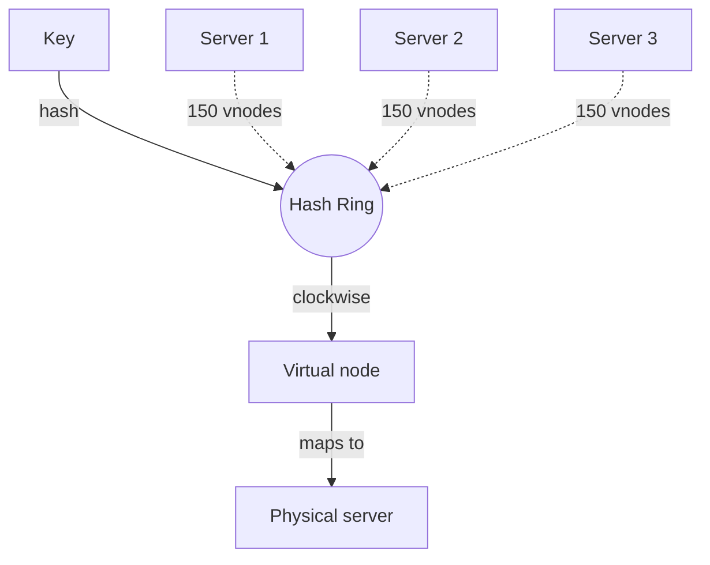

# Consistent Hashing

[← HLD Index](../README.md) | [Back to Hub](../../README.md)

---

## The Problem with `hash(key) % N`

To distribute keys across N servers, the naive approach is `server = hash(key) % N`. It works — until you **add or remove a server**.

When N changes (e.g., 4 → 5), the modulus changes for **almost every key**, so nearly all data must move. In a cache, this causes a **massive cache miss storm**; in a database, a huge data reshuffle.

```
N=4:  hash(key)=100 → 100 % 4 = 0  → Server 0
N=5:  hash(key)=100 → 100 % 5 = 0  → Server 0   (lucky)
       hash(key)=101 → 101%4=1 vs 101%5=1
       ...but statistically ~80% of keys remap when N: 4→5
```

> **Goal:** a scheme where adding/removing a node moves **only ~1/N of the keys**, not all of them.

---

## The Idea: The Hash Ring

Consistent hashing maps **both servers and keys** onto the same circular hash space (e.g., 0 to 2³²−1). A key belongs to the **first server found going clockwise** from the key's position.

```
            0 / 2^32
              │
        S3 ───┼─── S1
        /     │     \
   keyB●      │      ●keyA
       \      │      /
        S2 ───┼─── (clockwise → first server owns the key)
              │
```

- Place servers on the ring via `hash(server_id)`.
- Place each key via `hash(key)`.
- A key is owned by the **next server clockwise**.

---

## Why It Minimizes Movement

When a server is **added**, it sits between two existing servers and only takes over the keys in that arc — **only those keys move**, everything else stays put. When a server is **removed**, only its keys go to the next server clockwise.

```
Add S4 between S1 and S2:
  Before: keys in (S1, S2] arc → owned by S2
  After:  keys in (S1, S4] → now owned by S4   (only these move)
          keys in (S4, S2] → still S2
```

→ Only **K/N keys** move on average (K = total keys, N = nodes), vs nearly all with modulo.

---

## The Hotspot Problem → Virtual Nodes

With few servers placed randomly, the ring can be **uneven** — one server owns a huge arc (overloaded), another a tiny one. Solution: **virtual nodes (vnodes)**.

Each physical server is placed at **many points** on the ring (e.g., 100–200 virtual positions via `hash(server_id + i)`). This smooths the distribution.

```
Without vnodes:   S1 owns 50%, S2 30%, S3 20%   (uneven)
With vnodes:      each server scattered as 150 points → ~33% each (even)
```

Benefits of vnodes:
- **Even load distribution.**
- **Heterogeneous capacity** — give bigger servers more vnodes.
- **Smoother rebalancing** — load from a removed node spreads across many nodes, not just one.



---

## Replication on the Ring

For fault tolerance, store each key on the **next K servers clockwise** (skipping vnodes of the same physical server). This gives N replicas without extra coordination — the basis of **Dynamo/Cassandra** replication.

---

## Where It's Used
- **Distributed caches:** Memcached clients, Redis Cluster (uses 16384 hash slots — a related idea).
- **Databases:** Amazon DynamoDB, Apache Cassandra, Riak.
- **Load balancers:** sticky routing to backends.
- **CDNs:** mapping content to edge cache nodes.
- **Sharding:** minimal-movement resharding → [Sharding](./sharding.md).

---

## Complexity & Trade-offs

| Operation | Cost |
|-----------|------|
| Lookup (key → node) | O(log V) with a sorted structure / TreeMap (V = vnodes) |
| Add/remove node | O(K/N) keys move |
| Memory | O(V) ring positions |

**Trade-offs:**
- ✅ Minimal data movement on scaling; even load with vnodes; supports heterogeneous nodes.
- ❌ More complex than modulo; vnodes add metadata; lookups need a sorted ring structure.

---

## Pseudocode

```python
class ConsistentHash:
    def __init__(self, nodes, vnodes=150):
        self.ring = {}                 # hash position -> physical node
        self.sorted_keys = []          # sorted positions for binary search
        for node in nodes:
            self.add(node, vnodes)

    def add(self, node, vnodes=150):
        for i in range(vnodes):
            h = hash_fn(f"{node}#{i}")
            self.ring[h] = node
            self.sorted_keys.append(h)
        self.sorted_keys.sort()

    def get(self, key):
        h = hash_fn(key)
        # first ring position clockwise >= h (wrap around)
        idx = bisect_left(self.sorted_keys, h) % len(self.sorted_keys)
        return self.ring[self.sorted_keys[idx]]
```

---

## Key Takeaways
- `hash % N` remaps **almost all keys** when N changes — catastrophic for caches/shards.
- **Consistent hashing** places keys & nodes on a **ring**; a key goes to the next node clockwise, so only **~K/N keys move** when scaling.
- **Virtual nodes** fix uneven distribution and enable **heterogeneous capacity** + smooth rebalancing.
- Foundation of **Cassandra, DynamoDB, Riak**, distributed caches, and CDNs.

---
[← HLD Index](../README.md) | [Back to Hub](../../README.md)
