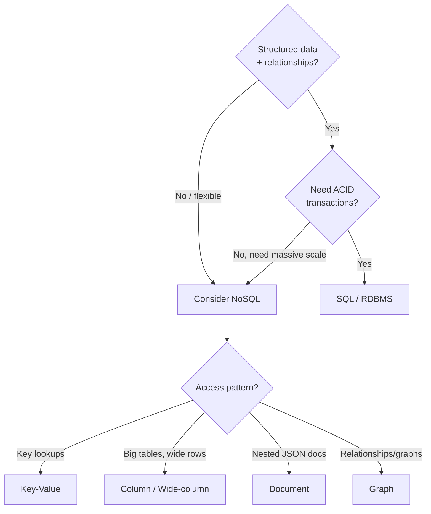

# Databases: SQL vs NoSQL

[← HLD Index](../README.md) | [Back to Hub](../../README.md)

---

## The Big Decision

"SQL or NoSQL?" is one of the most common interview forks. The answer is always **"it depends on the data and access patterns"** — and you must justify it.



---

## SQL (Relational Databases)

Data in **tables** (rows & columns) with a fixed **schema** and **relationships** (foreign keys). Queried with **SQL**.

**Examples:** PostgreSQL, MySQL, Oracle, SQL Server, Amazon Aurora.

### ACID Properties
| Property | Meaning |
|----------|---------|
| **Atomicity** | All-or-nothing transactions |
| **Consistency** | Transactions move DB from one valid state to another (constraints hold) |
| **Isolation** | Concurrent transactions don't interfere |
| **Durability** | Committed data survives crashes |

### Strengths
- Strong consistency & **ACID transactions** (banking, orders).
- Complex queries & **joins** across tables.
- Mature, well-understood, great tooling.
- No data duplication (normalization → integrity).

### Weaknesses
- **Hard to scale horizontally** (sharding is painful).
- Fixed schema → migrations needed for changes.
- Joins get expensive at huge scale.

---

## NoSQL (Non-Relational Databases)

Flexible schema, designed for **horizontal scale** and **high availability** (often BASE / eventual consistency). Four families:

### 1. Key-Value Stores
Simple `key → value` map. Blazing fast lookups.
- **Examples:** Redis, DynamoDB, Riak.
- **Use:** caching, sessions, user preferences, shopping carts.

### 2. Document Stores
Store semi-structured **JSON/BSON** documents; flexible nested schema.
- **Examples:** MongoDB, CouchDB, Firestore.
- **Use:** catalogs, user profiles, content management, evolving schemas.

### 3. Wide-Column (Column-Family) Stores
Rows can have millions of dynamic columns; optimized for huge write/read throughput.
- **Examples:** Cassandra, HBase, Bigtable.
- **Use:** time-series, IoT, messaging, analytics, write-heavy workloads.

### 4. Graph Databases
Nodes + edges; optimized for relationship traversal.
- **Examples:** Neo4j, Amazon Neptune.
- **Use:** social networks, recommendations, fraud detection.

```
Key-Value:   "user:123" → {name, email}
Document:    { _id, name, orders:[{...},{...}] }   (nested)
Wide-column: row_key → {col1:v1, col2:v2, ... colN}
Graph:       (Alice)-[:FOLLOWS]->(Bob)-[:LIKES]->(Post)
```

---

## SQL vs NoSQL — Side by Side

| Dimension | SQL | NoSQL |
|-----------|-----|-------|
| Schema | Fixed, predefined | Flexible / dynamic |
| Scaling | Vertical (hard to shard) | Horizontal (built-in) |
| Consistency | Strong (ACID) | Usually eventual (BASE), tunable |
| Joins | Native, powerful | Limited / app-side |
| Transactions | Full multi-row ACID | Limited (improving) |
| Query language | SQL (standard) | Varies per DB |
| Data model | Normalized tables | KV / doc / column / graph |
| Best for | Complex queries, integrity, $$ | Massive scale, flexible data, high write throughput |

---

## When to Choose Which

**Choose SQL when:**
- Data is structured with clear relationships.
- You need **transactions & strong consistency** (payments, inventory, bookings).
- Complex ad-hoc queries / reporting.
- Scale is moderate or vertical scaling + replicas suffice.

**Choose NoSQL when:**
- Massive scale / very high write throughput.
- Flexible or rapidly evolving schema.
- Simple access patterns (key lookups) or specific shapes (documents, time-series, graphs).
- Availability & partition tolerance > strong consistency.

> **Polyglot persistence:** Real systems use **multiple** databases — e.g., Postgres for orders, Redis for sessions, Cassandra for the activity feed, Elasticsearch for search, S3 for blobs. Pick the right tool per use case.

---

## Normalization vs Denormalization

| | Normalization | Denormalization |
|---|---------------|-----------------|
| Goal | No duplication, integrity | Fast reads, fewer joins |
| Reads | Slower (joins) | Faster (data pre-joined) |
| Writes | Faster, consistent | Slower (update many copies) |
| Storage | Less | More |
| Typical in | SQL / OLTP | NoSQL / read-heavy / analytics |

> NoSQL often **denormalizes** (embed related data) to avoid joins and match access patterns — at the cost of duplication and harder updates.

---

## OLTP vs OLAP

| | OLTP | OLAP |
|---|------|------|
| Purpose | Transactions (day-to-day ops) | Analytics (reporting, BI) |
| Queries | Many small reads/writes | Few large aggregations |
| Schema | Normalized | Star/snowflake (denormalized) |
| Examples | Postgres, MySQL | Redshift, Snowflake, BigQuery |
| Storage | Row-oriented | Column-oriented |

> Data flows OLTP → **ETL/ELT** → data warehouse (OLAP). Don't run heavy analytics on your transactional DB.

---

## Scaling Databases (preview)
- **Read replicas** for read scaling → [Replication](./replication.md)
- **Caching** in front of the DB → [Caching](./caching.md)
- **Sharding** to split data across nodes → [Sharding](./sharding.md)
- **Indexing** to speed up queries → [Indexing](./indexing.md)

---

## NewSQL (bonus)
Databases like **Google Spanner, CockroachDB, TiDB, YugabyteDB** aim for **SQL + ACID + horizontal scale** — the best of both worlds, using distributed consensus (Paxos/Raft) and clever clocks (TrueTime). Mention these for senior-level points.

---

## Key Takeaways
- **SQL** = structured data, relationships, **ACID**, strong consistency, harder to scale horizontally.
- **NoSQL** = flexible schema, horizontal scale, high availability, eventual consistency; four families: **key-value, document, wide-column, graph**.
- Choose by **data shape + access pattern + consistency needs**, and justify it.
- Real systems use **polyglot persistence** (many DBs, each for its strength).
- Know **normalization vs denormalization** and **OLTP vs OLAP**; mention **NewSQL** for bonus.

---
[← HLD Index](../README.md) | [Back to Hub](../../README.md)
