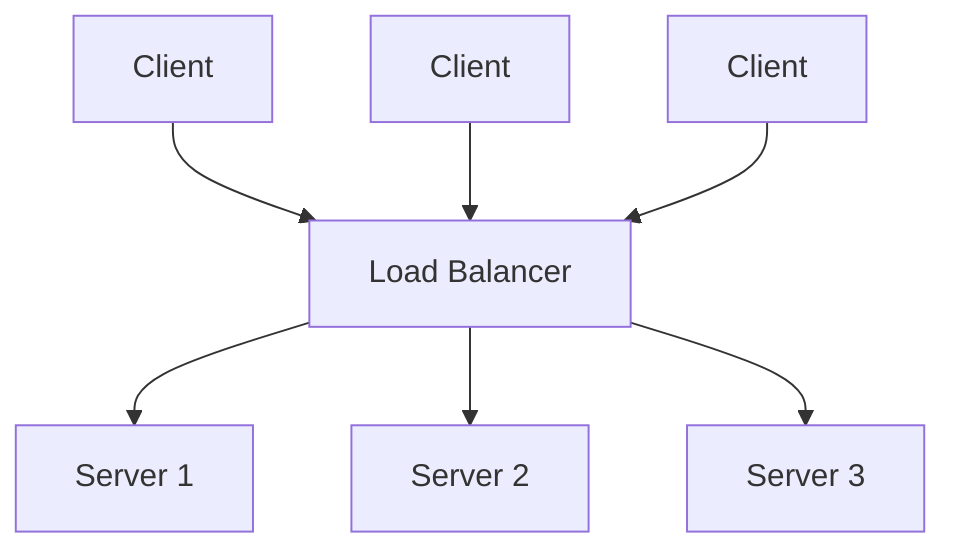
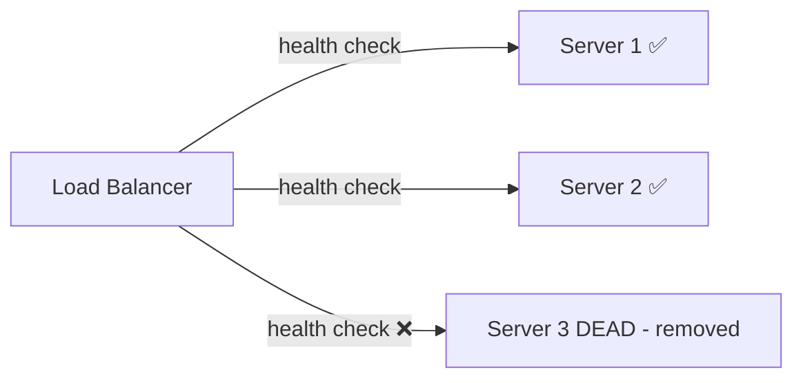
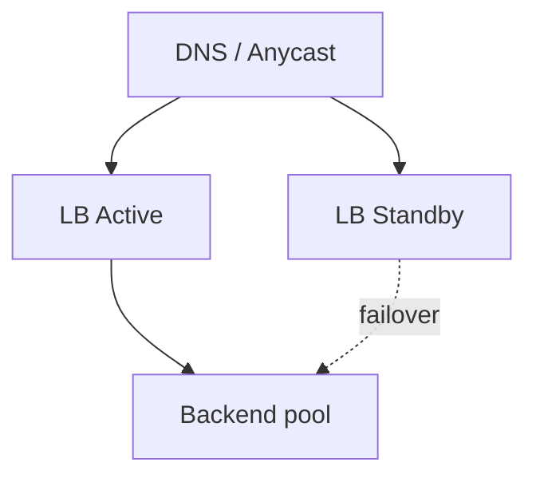
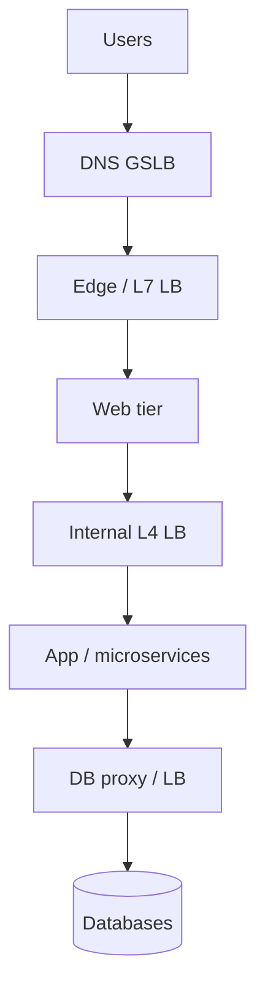

# Load Balancing

[← HLD Index](../README.md) | [Back to Hub](../../README.md)

---

## What is a Load Balancer?

A **load balancer (LB)** distributes incoming traffic across multiple backend servers so that no single server is overwhelmed. It is the cornerstone of **horizontal scaling** and **high availability**.



### Why use one?
- **Scalability** — add servers behind the LB to handle more load.
- **High availability** — route around dead servers (via health checks).
- **No SPOF** (if the LB itself is redundant).
- **Flexibility** — deploy/maintain servers without downtime (drain & rotate).
- **Security** — SSL/TLS termination, hide backend topology, absorb some attacks.

---

## Layer 4 vs Layer 7 Load Balancing

| | **Layer 4 (Transport)** | **Layer 7 (Application)** |
|---|------------------------|---------------------------|
| Operates on | TCP/UDP (IP + port) | HTTP/HTTPS (URL, headers, cookies) |
| Decisions based on | Network info only | Content (path, host, cookies) |
| Speed | Faster (no payload inspection) | Slower (inspects payload) |
| Features | Simple forwarding | Path routing, SSL termination, sticky sessions, compression |
| Example | AWS NLB, IPVS | AWS ALB, Nginx, HAProxy |

> **L4** is fast and protocol-agnostic. **L7** is smarter (route `/api` vs `/images` to different services) but does more work.

---

## Load Balancing Algorithms

### Static
| Algorithm | How it works | When to use |
|-----------|--------------|-------------|
| **Round Robin** | Cycle through servers in order | Servers equal, stateless |
| **Weighted Round Robin** | More requests to higher-capacity servers | Heterogeneous hardware |
| **IP Hash** | Hash client IP → consistent server | Sticky sessions without cookies |

### Dynamic
| Algorithm | How it works | When to use |
|-----------|--------------|-------------|
| **Least Connections** | Send to server with fewest active connections | Long-lived/variable requests |
| **Least Response Time** | Server with lowest latency + fewest connections | Latency-sensitive |
| **Resource-based** | Based on CPU/memory of servers | Uneven workloads |

```
Round Robin:        R1→S1, R2→S2, R3→S3, R4→S1 ...
Least Connections:  send to whichever server has the fewest open connections now
IP Hash:            hash(client_IP) % N → always same server for a client
```

---

## Health Checks

The LB periodically pings backends (`GET /health`). If a server fails N checks, it's removed from rotation; when it recovers, it's added back. This is what gives the LB its fault-tolerance superpower.



---

## Sticky Sessions (Session Affinity)

Pins a client to the same server (via cookie or IP hash) so session state in server memory is preserved.

- ✅ Simple if app stores session locally.
- ❌ Hurts even distribution; if the server dies, the session is lost.
- ✅ **Better:** keep servers **stateless**, store sessions in **Redis** → no stickiness needed. → [Scalability](../../fundamentals/02-scalability.md)

---

## Avoiding the LB as a SPOF

The load balancer itself must not be a single point of failure. Use:
- **Active-passive pair** with a floating/virtual IP + automatic failover (e.g., keepalived/VRRP).
- **Active-active** LBs with DNS round-robin or anycast.
- Cloud-managed LBs (AWS ELB/ALB/NLB) are inherently redundant.



---

## Global Server Load Balancing (GSLB)

For global apps, **DNS-based** or **anycast** routing sends users to the nearest/healthiest **region**, then a regional LB distributes within it.

```
User (EU) → DNS/GeoDNS → EU region LB → EU servers
User (US) → DNS/GeoDNS → US region LB → US servers
```

---

## Hardware vs Software LBs

| | Hardware (F5, Citrix) | Software (Nginx, HAProxy, Envoy) |
|---|----------------------|----------------------------------|
| Cost | Expensive | Cheap / open-source |
| Performance | Very high | High, scalable horizontally |
| Flexibility | Limited | Highly configurable |
| Modern default | Rare | ✅ Common (or cloud-managed) |

---

## Where LBs Sit (Tiers)


LBs appear at multiple tiers: edge, between web↔app, and in front of databases/microservices.

---

## Interview Talking Points
- "I'll put an **L7 load balancer** at the edge for path-based routing and SSL termination, with **health checks** for failover."
- "Servers are **stateless**; sessions live in Redis, so I avoid sticky sessions and can scale freely."
- "The LB is made redundant via an **active-passive pair with a virtual IP**, and **GSLB/GeoDNS** routes users to the nearest region."
- Algorithm choice: "**Least connections** because request durations vary," or "**round robin** since servers are homogeneous and requests are uniform."

---

## Key Takeaways
- LB distributes traffic → enables **horizontal scaling** + **high availability**.
- **L4** = fast, IP/port based; **L7** = smart, content/HTTP based.
- Pick algorithm by workload: **round robin** (uniform), **least connections** (variable), **IP hash** (stickiness).
- **Health checks** route around dead nodes; keep servers **stateless** to avoid sticky sessions.
- Make the **LB itself redundant** (active-passive/active-active) and use **GSLB** for global traffic.

---
[← HLD Index](../README.md) | [Back to Hub](../../README.md)
