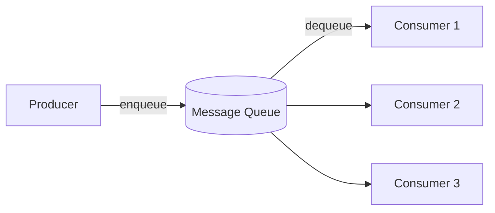
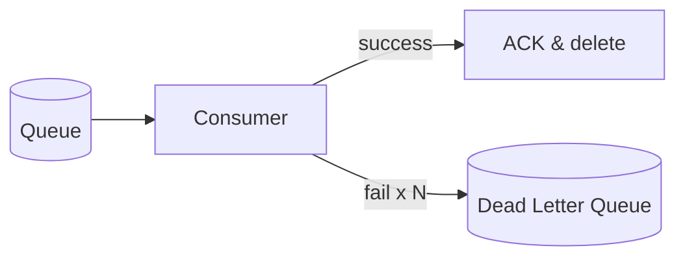
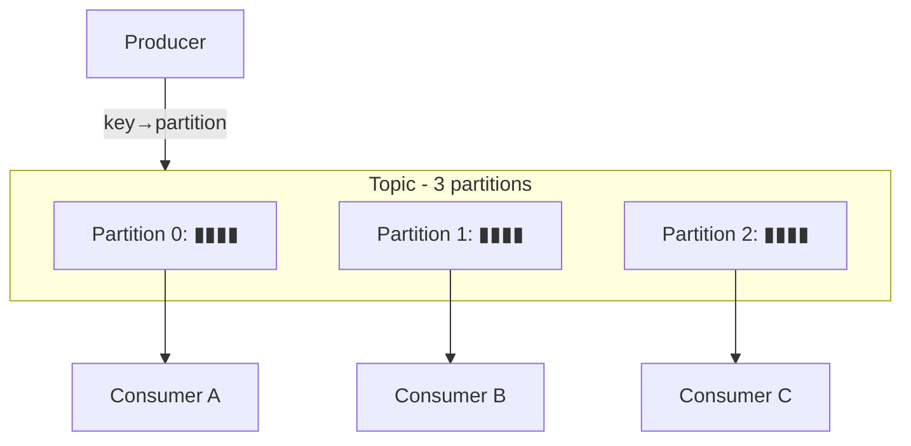

# Message Queues & Kafka

[← HLD Index](../README.md) | [Back to Hub](../../README.md)

---

## Why Asynchronous Messaging?

In a **synchronous** call, the caller waits for the callee to finish. This couples services: if the callee is slow or down, the caller blocks or fails. A **message queue** decouples them — the producer drops a message and moves on; a consumer processes it later.



### Benefits
- **Decoupling** — producer & consumer evolve independently.
- **Buffering / load leveling** — absorb traffic spikes; consumers process at their own pace.
- **Resilience** — if a consumer is down, messages wait (durable queue).
- **Scalability** — add consumers to process faster.
- **Async workflows** — return to the user immediately, do heavy work in background (e.g., send email, transcode video).

### Classic example
On signup, instead of synchronously sending a welcome email (slow, may fail), enqueue an `EmailJob` and return `200 OK` instantly. A worker sends the email asynchronously.

---

## Messaging Models

### 1. Point-to-Point (Queue)
One message → consumed by **exactly one** consumer. Work is distributed among consumers (competing consumers).
```
Producer → [ Queue ] → one of {C1, C2, C3}
```
**Use:** task/job distribution (image processing, order fulfillment).

### 2. Publish-Subscribe (Topic)
One message → delivered to **all** subscribers. Each subscriber gets its own copy.
```
Publisher → [ Topic ] ─┬─► Subscriber A
                       ├─► Subscriber B
                       └─► Subscriber C
```
**Use:** event broadcasting, fan-out (one event → notify many services).

---

## Delivery Guarantees

| Guarantee | Meaning | Trade-off |
|-----------|---------|-----------|
| **At-most-once** | May lose messages, never duplicates | Fast, lossy |
| **At-least-once** | Never lose, may duplicate | Safe; consumers must be **idempotent** |
| **Exactly-once** | Each message processed once | Hardest; needs dedup/transactions (Kafka supports it) |

> **Most systems use at-least-once + idempotent consumers.** Make processing idempotent (e.g., dedupe by message ID) so duplicates are harmless. True exactly-once is expensive.

---

## Message Ordering
- **FIFO queues** preserve order but limit throughput (SQS FIFO, Kafka *within a partition*).
- **Standard queues** may reorder for higher throughput.
- Kafka guarantees order **per partition**, not across partitions — so route related messages (same key) to the same partition.

---

## Handling Failures

| Mechanism | Purpose |
|-----------|---------|
| **Acknowledgements (ACK)** | Consumer confirms processing; un-acked messages are redelivered |
| **Visibility timeout** | Message hidden while being processed; reappears if not acked in time |
| **Retries with backoff** | Retry transient failures (exponential + jitter) |
| **Dead Letter Queue (DLQ)** | After N failed attempts, move "poison" messages aside for inspection |
| **Idempotency** | Safely handle redelivered duplicates |



---

## Message Queue vs Message Broker vs Event Streaming

| | Traditional Queue | Event Streaming Log |
|---|-------------------|---------------------|
| Examples | RabbitMQ, ActiveMQ, AWS SQS | **Apache Kafka**, AWS Kinesis, Pulsar |
| Model | Message deleted after consumption | Messages **retained** (replayable log) |
| Consumers | Compete for messages | Each tracks its own **offset** |
| Replay | No (once consumed, gone) | Yes (rewind to any offset) |
| Throughput | High | Very high (millions/s) |
| Use | Task queues, RPC, jobs | Event sourcing, analytics, stream processing |

---

## Apache Kafka — Deep Dive

Kafka is a **distributed, durable, append-only commit log**. It's the de-facto standard for high-throughput event streaming.

### Core concepts
- **Topic** — a named stream of records.
- **Partition** — a topic is split into partitions for parallelism & scale. Order is guaranteed **within** a partition.
- **Offset** — each message's position in a partition. Consumers track their offset.
- **Producer** — writes records to topics (optionally keyed → routes to a partition).
- **Consumer Group** — consumers sharing the work; each partition is consumed by **one** consumer in the group.
- **Broker** — a Kafka server; a cluster has many.
- **Replication** — each partition is replicated (leader + followers) for durability.



### Why Kafka is fast
- **Sequential disk writes** (append-only log) — disk is fast when sequential.
- **Zero-copy** transfer to network.
- **Batching & compression**.
- **Partitioning** for horizontal scale.

### Retention & replay
Kafka keeps messages for a configured time/size (e.g., 7 days), so consumers can **replay** — great for reprocessing, new consumers, debugging, and event sourcing.

---

## Common Use Cases
- **Async task processing** — emails, thumbnails, video transcoding.
- **Decoupling microservices** — order service emits `OrderPlaced`, others react.
- **Load leveling** — buffer Black Friday spikes.
- **Log/metrics aggregation** — stream logs to storage/analytics.
- **Event sourcing & CQRS** — the log is the source of truth.
- **Real-time pipelines** — Kafka → Spark/Flink → dashboards.
- **Notification fan-out** → [Notification System](../case-studies/notification-system.md).

---

## Trade-offs / Downsides
- Adds **operational complexity** (another system to run, monitor).
- **Eventual consistency** — async means the result isn't immediate.
- Harder **debugging** (distributed, async flows).
- Need to handle **duplicates, ordering, poison messages**.

---

## Key Takeaways
- Message queues **decouple** producers/consumers, **buffer spikes**, and enable **async** processing.
- **Point-to-point** (one consumer) vs **pub-sub** (all subscribers).
- Default to **at-least-once + idempotent consumers**; use **DLQ** for poison messages.
- **Kafka** = distributed, durable, replayable **log**; scales via **partitions**, ordered per partition, consumed by **consumer groups** tracking **offsets**.
- Queues (RabbitMQ/SQS) = task distribution; streaming logs (Kafka) = retained, replayable events.

---
[← HLD Index](../README.md) | [Back to Hub](../../README.md)
