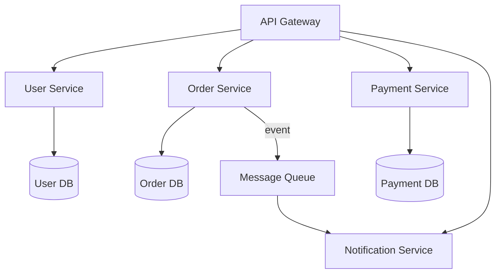
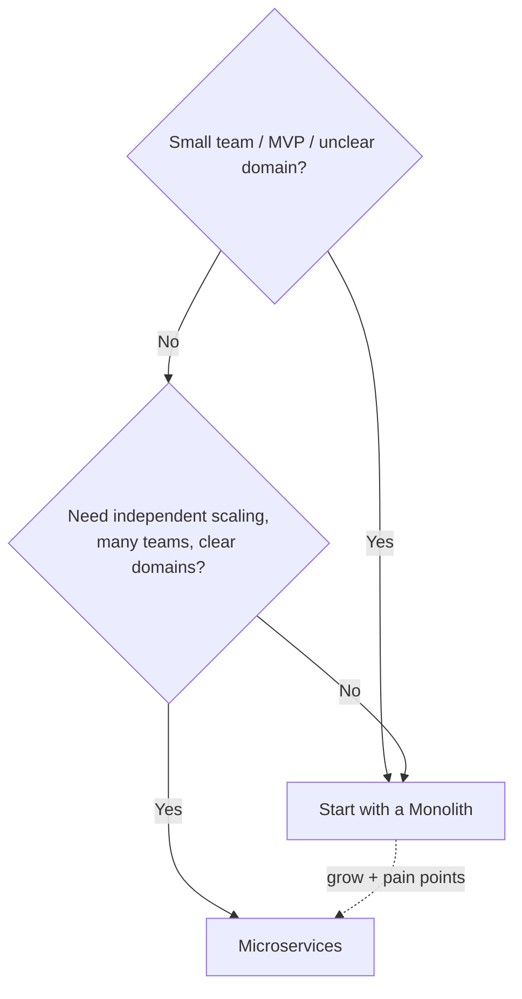

# Microservices vs Monolith

[← HLD Index](../README.md) | [Back to Hub](../../README.md)

---

## Monolithic Architecture

A **monolith** is a single deployable unit containing all functionality (UI, business logic, data access) in one codebase/process.

```
┌─────────────────────────────┐
│         Monolith            │
│  Users │ Orders │ Payments  │
│        (one process)        │
│      one shared database    │
└─────────────────────────────┘
```

| ✅ Pros | ❌ Cons |
|--------|--------|
| Simple to develop, test, deploy early | Hard to scale **selectively** (scale the whole app) |
| One codebase, easy debugging | One bug can crash everything |
| No network overhead between modules | Large codebase → slow builds, tight coupling |
| Easy transactions (one DB) | Hard to adopt new tech; whole-app redeploys |
| Great for small teams / MVPs | Doesn't scale with team size |

---

## Microservices Architecture

The app is split into **small, independent services**, each owning one business capability, its own database, and deployed independently. Services communicate over the network (REST/gRPC/messaging).



| ✅ Pros | ❌ Cons |
|--------|--------|
| **Independent scaling** per service | **Distributed-system complexity** |
| **Independent deployment** (faster releases) | Network latency & failures between services |
| **Fault isolation** (one service down ≠ whole app) | **Data consistency** across services is hard |
| **Tech diversity** (right tool per service) | Harder testing, debugging, monitoring |
| Scales with **team autonomy** | Operational overhead (CI/CD, service discovery) |

---

## Side-by-Side

| Dimension | Monolith | Microservices |
|-----------|----------|---------------|
| Deployment | One unit | Many independent units |
| Scaling | Whole app | Per service |
| Database | Shared | One per service |
| Failure blast radius | Whole app | Isolated |
| Tech stack | Uniform | Polyglot |
| Complexity | Low (early), high (late) | High |
| Transactions | Easy (ACID) | Hard (Saga/2PC) |
| Best for | MVPs, small teams | Large scale, many teams |

> **Advice for interviews:** *"Start with a monolith, extract microservices when scaling/team needs justify it."* Don't add microservices complexity prematurely — most startups don't need it on day one. This is the **"monolith-first"** principle.

---

## Key Patterns in Microservices

### Inter-Service Communication
- **Synchronous:** REST, **gRPC** (fast, typed) — caller waits.
- **Asynchronous:** **message queues / events** (Kafka) — decoupled, resilient → [Message Queues](./message-queues.md).
- Prefer async events for loose coupling; use sync for queries needing an immediate answer.

### Service Discovery
Services need to find each other's dynamic addresses. **Client-side** (Eureka) or **server-side** (load balancer / Kubernetes DNS) discovery + a service registry.

### API Gateway
Single entry point handling routing, auth, rate limiting, aggregation → [API Gateway](./api-gateway.md).

### Database per Service
Each service owns its data; **no shared DB**. Ensures loose coupling but makes cross-service queries & transactions hard.

### Data Consistency — Saga Pattern
Since you can't do a single ACID transaction across services, use a **Saga**: a sequence of local transactions with **compensating actions** on failure.
```
Order created → Payment charged → Inventory reserved → Shipping scheduled
   if Inventory fails → compensate: refund Payment, cancel Order
```
- **Choreography:** services react to each other's events (decentralized).
- **Orchestration:** a central coordinator drives the steps.

### Resilience Patterns
- **Circuit Breaker** — stop calling a failing service to prevent cascading failures.
- **Retry + backoff + jitter** — handle transient failures.
- **Bulkhead** — isolate resources so one failure doesn't sink everything.
- **Timeout** — never wait forever on a downstream call.

### CQRS & Event Sourcing
- **CQRS:** separate read and write models (scale & optimize independently).
- **Event Sourcing:** store state as a sequence of events (the log is truth) → pairs with Kafka.

### Observability (essential!)
Distributed systems are hard to debug. You need:
- **Centralized logging** (ELK / Loki).
- **Distributed tracing** (Jaeger, Zipkin, OpenTelemetry) — follow a request across services.
- **Metrics & alerting** (Prometheus + Grafana).

---

## How to Decompose into Services
- By **business capability** (Domain-Driven Design **bounded contexts**).
- One service = one cohesive responsibility.
- Avoid **chatty** services (too many cross-calls) — that signals wrong boundaries.
- Avoid the **distributed monolith** anti-pattern (services so coupled they must deploy together — worst of both worlds).

---

## When to Choose What



---

## Key Takeaways
- **Monolith** = one deployable unit: simple early, hard to scale & maintain at large size.
- **Microservices** = independent services with own DBs: scalable, fault-isolated, but **distributed-system complexity**.
- **Start monolith-first**; extract services when scale/team needs justify it.
- Master the patterns: **API gateway, async messaging, service discovery, database-per-service, Saga, circuit breaker, distributed tracing**.
- Avoid the **distributed monolith** — get service boundaries right (DDD bounded contexts).

---
[← HLD Index](../README.md) | [Back to Hub](../../README.md)
