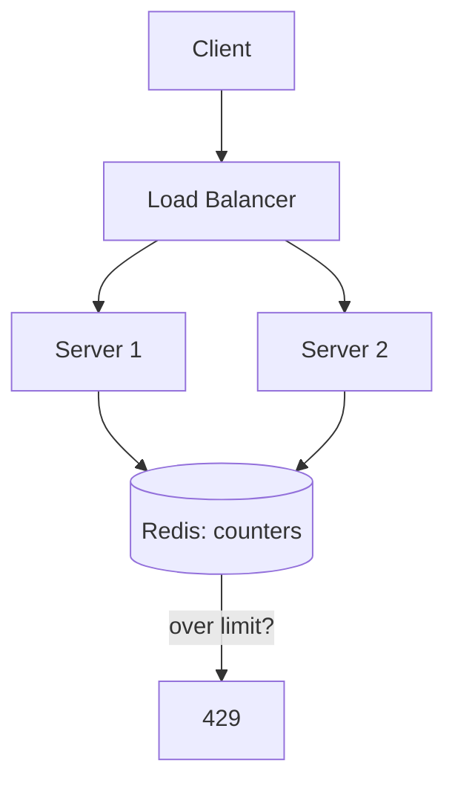

# Rate Limiting

[← HLD Index](../README.md) | [Back to Hub](../../README.md)

> This page covers rate limiting as a **building block**. For the full **"Design a Rate Limiter"** interview question, see the [case study](../case-studies/rate-limiter.md).

---

## What & Why

**Rate limiting** restricts how many requests a client can make in a time window. It protects systems from:
- **Abuse / DoS** — malicious flooding.
- **Resource exhaustion** — one client hogging capacity.
- **Cascading failures** — overload spreading downstream.
- **Cost overruns** — expensive operations (3rd-party APIs, LLM calls).
- **Fairness** — equal access across users.

Typical response when exceeded: HTTP **429 Too Many Requests** (+ `Retry-After` header).

---

## The Five Core Algorithms

### 1. Token Bucket ⭐ (most popular)
A bucket holds up to `B` tokens, refilled at `R` tokens/sec. Each request consumes one token; if empty, reject.

```
Refill R/s →  [🪙🪙🪙🪙🪙]  capacity B
Request → take 1 token → allow
Empty bucket → reject (429)
```
- ✅ Allows **bursts** up to bucket size; smooth average rate; memory-efficient.
- ❌ Two params to tune.
- **Used by:** AWS, Stripe.

### 2. Leaky Bucket
Requests enter a queue (bucket) and are processed at a **fixed** rate (leak). Overflow is dropped.
```
Requests → [ queue ] → leak at fixed rate → process
                ↑ full → drop
```
- ✅ **Smooths** bursts into a constant outflow (good for downstream protection).
- ❌ No burst allowance; queueing adds latency; recent requests dropped when full.

### 3. Fixed Window Counter
Count requests per fixed window (e.g., per minute). Reset counter each window.
```
12:00:00–12:00:59 → max 100 requests, then reset
```
- ✅ Simple, low memory.
- ❌ **Boundary burst problem:** 100 requests at 12:00:59 + 100 at 12:01:00 = 200 in ~1 second.

### 4. Sliding Window Log
Store a **timestamp** for every request; count those within the trailing window.
```
allow if count(timestamps in [now - window, now]) < limit
```
- ✅ **Accurate** — no boundary bursts.
- ❌ **Memory-heavy** (stores every request timestamp).

### 5. Sliding Window Counter (hybrid) ⭐
Approximates the sliding window using the current + previous fixed window, weighted by overlap.
```
count ≈ current_window_count
      + previous_window_count × (overlap fraction of previous window)
```
- ✅ Smooths boundary bursts **and** is memory-efficient. Best practical balance.
- **Used by:** Cloudflare.

---

## Algorithm Comparison

| Algorithm | Bursts | Accuracy | Memory | Notes |
|-----------|--------|----------|--------|-------|
| Token Bucket | Allowed (≤ B) | Good | Low | Most popular |
| Leaky Bucket | Smoothed out | Good | Low | Constant outflow |
| Fixed Window | Boundary spikes | Low | Very low | Simplest |
| Sliding Log | None | Highest | High | Exact but costly |
| Sliding Counter | Minimal | High | Low | Best practical balance |

---

## Distributed Rate Limiting

With many app servers, a per-server counter lets a client exceed the global limit (N servers × limit). Use a **centralized store** — typically **Redis** — for shared counters.



### Challenges
- **Race conditions:** concurrent increments. Fix with **atomic ops** (Redis `INCR`, `INCRBY`) or **Lua scripts** (read-modify-write atomically).
- **Latency:** each check hits Redis. Mitigate with local pre-checks / approximate counting.
- **Redis as SPOF:** replicate Redis; consider local fallback (fail-open vs fail-closed).

### Redis token-bucket sketch (atomic via Lua)
```
KEYS: bucket:{user}
1. read tokens & last_refill
2. tokens = min(B, tokens + (now - last_refill) * R)
3. if tokens >= 1: tokens -= 1; allow
   else: reject
4. save tokens, last_refill
```

---

## Where to Place the Rate Limiter
- **API Gateway / reverse proxy** (most common — central choke point) → [API Gateway](./api-gateway.md)
- **Client-side** (advisory; never trust alone)
- **Per-service middleware** (fine-grained)
- **Dedicated rate-limiter service**

---

## Identifying the Client (the "key")
- By **API key / user ID** (authenticated).
- By **IP address** (anonymous; beware shared NAT/proxies).
- By **endpoint** (different limits per route — login stricter than search).
- Often a **composite** key: `{user}:{endpoint}`.

---

## Good Practices
- Return **`429`** + headers: `Retry-After`, `X-RateLimit-Limit`, `X-RateLimit-Remaining`, `X-RateLimit-Reset`.
- **Tiered limits** — higher limits for premium users.
- **Fail open** for availability (don't block all traffic if Redis is down) — unless security-critical, then **fail closed**.
- Combine with **exponential backoff + jitter** on the client.

---

## Key Takeaways
- Rate limiting protects against **abuse, overload, cascading failure, and cost blowups**; reject with **429**.
- **Token bucket** (bursts) and **sliding window counter** (accurate + cheap) are the go-to algorithms.
- **Fixed window** is simplest but suffers **boundary bursts**; **sliding log** is exact but memory-heavy.
- For multiple servers, use a **centralized Redis** with **atomic increments / Lua scripts**.
- Place it at the **API Gateway**, key by **user/IP/endpoint**, and decide **fail-open vs fail-closed**.

---
[← HLD Index](../README.md) | [Back to Hub](../../README.md) | [Full Case Study →](../case-studies/rate-limiter.md)
