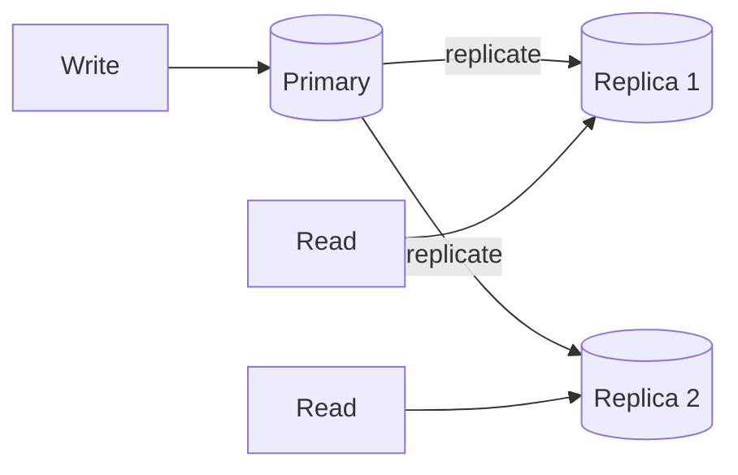
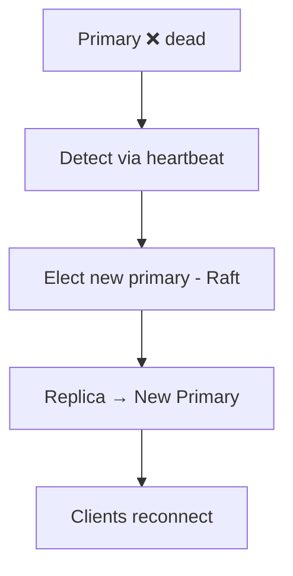
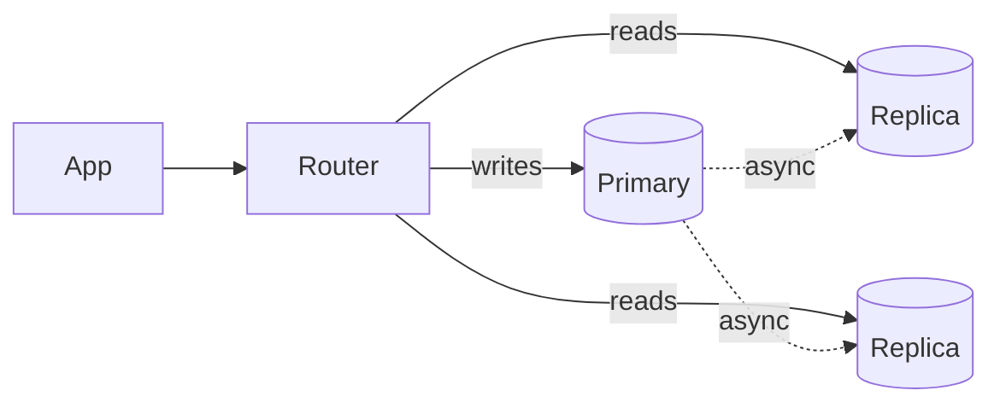

# Replication

[← HLD Index](../README.md) | [Back to Hub](../../README.md)

---

## What is Replication?

**Replication** is keeping copies of the same data on multiple machines (replicas). It provides:
- **High availability** — if one node dies, others serve.
- **Durability** — data survives hardware loss.
- **Read scalability** — spread reads across replicas.
- **Lower latency** — serve from a geographically closer replica.



> **Replication vs Sharding:** Replication = **copies** of the *same* data (availability). Sharding = **splits** *different* data (scale). They're complementary — shard, then replicate each shard.

---

## Replication Topologies

### 1. Single-Leader (Primary-Replica / Master-Slave)
One **primary** accepts writes; **replicas** are read-only copies that follow the primary's change log.

```
        writes
          │
       ┌──▼───┐
       │Primary│──┬──► Replica 1 (reads)
       └──────┘  ├──► Replica 2 (reads)
                 └──► Replica 3 (reads)
```

- ✅ Simple; no write conflicts; great for **read-heavy** workloads.
- ❌ Primary is a **write bottleneck & SPOF**; failover needed; replica lag → stale reads.
- **Examples:** MySQL/Postgres replication, MongoDB replica sets, Redis.

### 2. Multi-Leader (Multi-Master)
Multiple nodes accept writes (e.g., one leader per region), replicating to each other.

- ✅ Writes are local/low-latency per region; survives a region outage.
- ❌ **Write conflicts** (same row edited in two regions) need resolution (LWW, CRDTs, app logic).
- **Use:** multi-datacenter, offline-capable apps (calendars, collaborative editing).

### 3. Leaderless (Dynamo-style)
No leader; clients write to / read from **multiple replicas** directly, using **quorums**.

- ✅ Highly available, no failover step.
- ❌ Eventual consistency; needs conflict resolution & read repair.
- **Examples:** Cassandra, DynamoDB, Riak.
- Uses **quorum (W + R > N)** → see [Consistency](../../fundamentals/05-consistency.md).

---

## Synchronous vs Asynchronous Replication

```
Synchronous:   write → primary → wait for replica ACK → respond  (safe, slower)
Asynchronous:  write → primary → respond → replicate later        (fast, risk loss)
Semi-sync:     wait for at least ONE replica ACK, others async     (balance)
```

| | Synchronous | Asynchronous |
|---|------------|--------------|
| Write latency | Higher | Lower |
| Data loss on primary failure | None | Possible (un-replicated writes lost) |
| Consistency | Strong | Eventual (replica lag) |
| Availability | Lower (blocks if replica down) | Higher |

> Most systems use **semi-synchronous**: at least one replica is synchronous (durability) while others are async (performance).

---

## Replication Lag & Its Problems

With async replication, replicas trail the primary by some **lag** (ms to seconds). This causes anomalies:

| Problem | Symptom | Fix |
|---------|---------|-----|
| **Read-your-writes** | User updates profile, reads stale old value | Read from primary right after a write; or route a user's reads to one replica |
| **Monotonic reads** | User sees data, refreshes, sees *older* data (different replica) | Pin a user to the same replica (e.g., hash(user_id)) |
| **Consistent prefix** | Replies appear before the question | Ensure causally-related writes go to the same partition/order |

These are the **client-centric consistency guarantees** from the [Consistency chapter](../../fundamentals/05-consistency.md).

---

## Failover (Single-Leader)

When the primary dies:
1. **Detect** failure (health checks / heartbeats timeout).
2. **Elect** a new primary (most up-to-date replica; via consensus like Raft).
3. **Reconfigure** clients/replicas to point at the new primary.

### Failover pitfalls
- **Split brain:** two nodes both think they're primary → data corruption. Prevent with **quorum/fencing** (only a majority can elect a leader).
- **Data loss:** un-replicated async writes on the old primary are lost.
- **Flapping:** aggressive timeouts cause needless failovers.



---

## How Replication Works Under the Hood
- **Statement-based:** ship SQL statements (problematic for `NOW()`, randomness).
- **Write-Ahead Log (WAL) / physical:** ship the storage-engine log (Postgres).
- **Logical (row-based):** ship row changes (flexible across versions).
- **Change Data Capture (CDC):** stream changes (e.g., via Debezium/Kafka) to other systems.

---

## Read Replicas for Scaling Reads

For read-heavy systems (social media, e-commerce browsing), route writes to the primary and **reads to replicas**:

Combine with **caching** for even more read offload. Watch out for **replica lag** on read-after-write paths.

---

## Key Takeaways
- Replication = **copies of the same data** → availability, durability, read scaling, lower latency.
- Topologies: **single-leader** (simple, read scaling, SPOF on writes), **multi-leader** (multi-region, conflicts), **leaderless** (Dynamo, quorums).
- **Sync** = safe but slow; **async** = fast but risks loss & causes **replica lag**; **semi-sync** balances.
- Replica lag breaks **read-your-writes / monotonic reads** — fix by routing reads smartly.
- **Failover** needs leader election + quorum/fencing to avoid **split brain**.

---
[← HLD Index](../README.md) | [Back to Hub](../../README.md)
