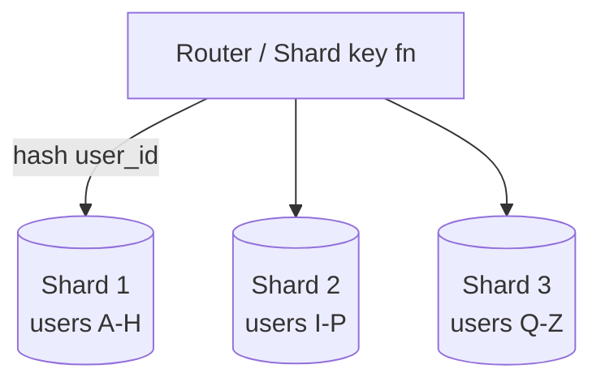

# Sharding & Partitioning

[← HLD Index](../README.md) | [Back to Hub](../../README.md)

---

## The Problem

A single database server has limits: storage, CPU, memory, connections, IOPS. When one machine can't hold or serve all your data, you must **split it across multiple machines**. That's **sharding** (horizontal partitioning).

```
Single DB (overloaded)        Sharded
┌──────────────┐         ┌──────┐ ┌──────┐ ┌──────┐
│  100% data   │   ──►   │Shard1│ │Shard2│ │Shard3│
│  all queries │         │ 33%  │ │ 33%  │ │ 33%  │
└──────────────┘         └──────┘ └──────┘ └──────┘
```

---

## Partitioning: Vertical vs Horizontal

### Vertical Partitioning
Split a table **by columns** — put different columns/features in different stores.
```
users table → [profile DB: name, bio] + [auth DB: password_hash, tokens]
```
- ✅ Separate hot vs cold columns; isolate by feature.
- ❌ Doesn't help when a single table has too many *rows*.

### Horizontal Partitioning (Sharding)
Split a table **by rows** — each shard holds a subset of rows.
```
users 1–1M → Shard 1
users 1M–2M → Shard 2
```
- ✅ Scales row volume & throughput across machines.
- This is what "sharding" usually means.

---

## Sharding Strategies

### 1. Range-Based Sharding
Partition by value ranges (e.g., user_id 1–1M, A–M).
- ✅ Simple; efficient **range queries**.
- ❌ **Hotspots** — uneven distribution (e.g., all new users in the latest range; celebrities). "Sequential keys → last shard gets all writes."

### 2. Hash-Based Sharding
`shard = hash(key) % N`. Spreads data evenly.
- ✅ Even distribution, no hotspots (for good hash).
- ❌ **Range queries break** (adjacent keys scattered); **resharding is painful** — changing N remaps almost everything → use **[consistent hashing](./consistent-hashing.md)**.

### 3. Directory / Lookup-Based Sharding
A lookup service maps key → shard, stored in a directory table.
- ✅ Flexible; can rebalance by updating the directory.
- ❌ The directory is a **SPOF/bottleneck** (must be HA + cached).

### 4. Geographic / Entity-Based Sharding
Shard by region or by tenant/entity (e.g., all of a company's data together).
- ✅ Data locality, compliance (GDPR), related data co-located.
- ❌ Uneven regions; cross-shard queries for global views.



---

## Choosing a Shard Key — The Critical Decision

The **shard (partition) key** determines which shard a row lives on. A bad key kills you. A good key is:
- **High cardinality** — many distinct values to spread across shards.
- **Evenly distributed** — avoids hotspots.
- **Aligned with query patterns** — most queries should target a single shard (avoid scatter-gather).
- **Stable** — rarely changes (changing it = moving data).

> Example: For a chat app, sharding messages by `channel_id` keeps a channel's messages together (good for reading a channel) but a hugely popular channel becomes a hotspot. Compound keys like `(channel_id, time_bucket)` help.

---

## The Hard Problems of Sharding

### 1. Cross-Shard Queries (Scatter-Gather)
A query spanning shards must hit all shards and merge results → slow and complex. **Mitigate** by choosing a shard key aligned to your access pattern.

### 2. Joins Across Shards
Joins between shards are expensive/unsupported. **Mitigate** with denormalization or co-locating related data on the same shard.

### 3. Hotspots / Celebrity Problem
One shard gets disproportionate load (a viral user). **Mitigate** with better keys, sub-sharding the hot key, or caching.

### 4. Rebalancing / Resharding
Adding shards requires moving data. Naive `hash % N` remaps everything. **Use [consistent hashing](./consistent-hashing.md)** or pre-allocate many **virtual shards** mapped onto fewer physical nodes (move whole virtual shards when scaling).

### 5. Distributed Transactions
ACID across shards needs **2-phase commit (2PC)** or **Sagas** — both complex. Prefer designs where a transaction stays within one shard.

### 6. Global Unique IDs
Auto-increment doesn't work across shards. Use **UUIDs**, **Snowflake IDs**, or a **ticket server** (see below).

---

## Distributed Unique ID Generation

| Approach | How | Pros / Cons |
|----------|-----|-------------|
| **UUID (128-bit)** | Random | ✅ No coordination ❌ Big, not sortable, index-unfriendly |
| **Database ticket server** | Central auto-increment service | ✅ Simple, sortable ❌ SPOF/bottleneck |
| **Snowflake (Twitter)** | timestamp + machine id + sequence | ✅ 64-bit, time-sortable, distributed ❌ clock sync needed |
| **Range allocation** | Each node gets a block of IDs | ✅ Simple ❌ gaps, coordination |

### Snowflake ID layout (64 bits)
```
| 1 bit | 41 bits timestamp | 10 bits machine id | 12 bits sequence |
  unused   (ms since epoch)    (1024 machines)      (4096/ms/machine)
```
→ ~4M IDs/ms, roughly time-ordered, fully distributed.

---

## Virtual Shards (Pre-sharding)

Create many logical shards (e.g., 1024) up front, map them onto few physical nodes. To scale, move whole virtual shards to new nodes — no rehashing of keys.
```
1024 virtual shards → mapped → 4 physical nodes (256 each)
add a node → move 205 virtual shards → 5 nodes (~205 each)
```

---

## Replication + Sharding (combined)
Sharding splits data; **replication** copies each shard for HA. Real systems do both: each shard is a replica set.
```
Shard 1: [Primary] → [Replica][Replica]
Shard 2: [Primary] → [Replica][Replica]
```
→ See [Replication](./replication.md).

---

## Key Takeaways
- **Sharding = horizontal partitioning** by rows across machines to scale beyond one server.
- Strategies: **range** (range queries, hotspot risk), **hash** (even, no ranges), **directory** (flexible, SPOF), **geo/entity** (locality).
- **Shard key** is the most important choice: high cardinality, even, query-aligned, stable.
- Hard parts: **cross-shard queries/joins, hotspots, resharding, distributed transactions, global IDs**.
- Use **consistent hashing + virtual shards** for easy rebalancing, and **Snowflake** for distributed IDs.

---
[← HLD Index](../README.md) | [Back to Hub](../../README.md)
