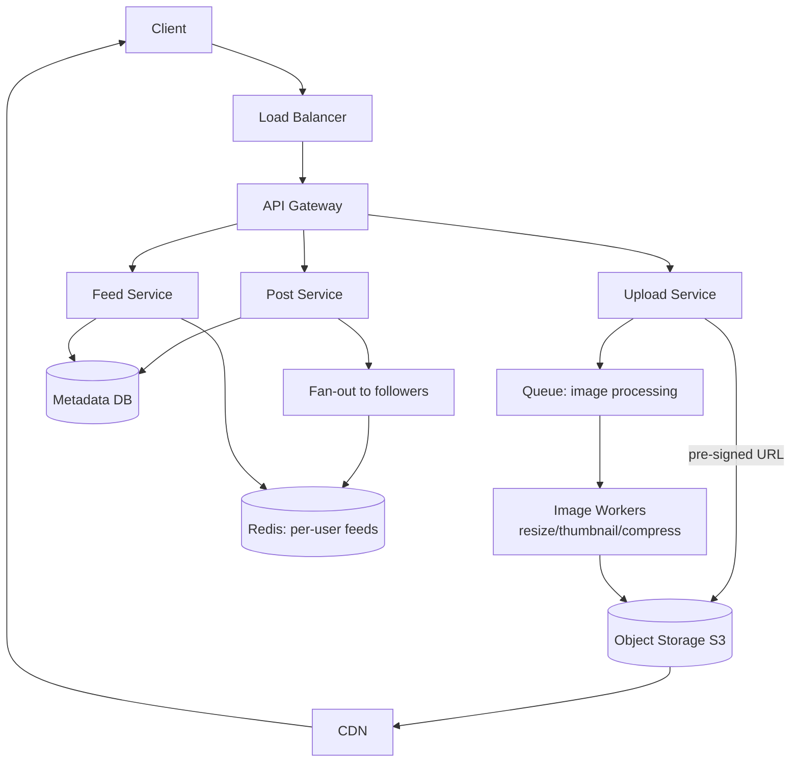

# Design Instagram / Photo Sharing

[← HLD Index](../README.md) | [Back to Hub](../../README.md)

> **Asked at:** Meta, Amazon, Pinterest. Combines **media storage**, **feed generation** (reuses [Twitter](./twitter.md) fan-out), and **CDN**.

---

## Step 1 — Requirements

### Functional
1. Upload photos/videos with captions.
2. Follow users.
3. **News feed** of posts from people you follow.
4. View a user's profile (their posts).
5. Like & comment.
6. (Optional) Stories, search, explore.

### Non-Functional
- **Read-heavy** (feed/profile views ≫ uploads), ~100:1.
- **Highly available**, low-latency feed.
- **Durable** media storage (never lose photos).
- Eventual consistency acceptable for feeds.

---

## Step 2 — Capacity Estimation

```
500M DAU. Uploads: 100M photos/day → 100M/86,400 ≈ 1,160 writes/s
Reads (feed/profile): ~100× → ~116,000 reads/s
Photo size ≈ 2 MB avg (multiple resolutions stored)
Storage/day: 100M × 2 MB = 200 TB/day  → ~73 PB/year
Metadata/day: 100M × 1 KB = 100 GB/day
```
→ **Media = petabytes** ⇒ object storage (S3) + **CDN**. Metadata is comparatively tiny.

---

## Step 3 — API Design

```
POST /media (multipart upload)         → mediaId, uploadUrl
POST /posts   { mediaId, caption }      → postId
GET  /feed?cursor=...                    → [ posts ]
GET  /users/{id}/posts?cursor=...        → [ posts ]
POST /posts/{id}/like
POST /posts/{id}/comments { text }
```
Large uploads use **pre-signed S3 URLs**: client uploads directly to S3, not through your app servers.

---

## Step 4 — Data Model

Split **media (blobs)** from **metadata**:

```
posts(post_id PK, user_id, media_url, caption, created_at, like_count, comment_count)
users(user_id PK, ...)
follows(follower_id, followee_id)
likes(post_id, user_id)
comments(comment_id, post_id, user_id, text, created_at)
```
- **Metadata:** sharded SQL or a wide-column store (by `user_id` / `post_id`).
- **Media files:** **object storage (S3/GCS)** — never in the DB. Store only the URL/key in metadata.
- IDs: **Snowflake** (time-sortable).

---

## Step 5 — Architecture



### Upload path
1. Client requests a **pre-signed URL**; uploads the photo **directly to S3**.
2. Upload Service writes post metadata to DB.
3. An async **image-processing** job generates multiple resolutions/thumbnails (via a queue) and stores them in S3 (served by CDN).
4. **Fan-out** the post to followers' feeds (push/pull hybrid — same as Twitter).

### Read path (feed)
1. Feed Service reads the precomputed feed (post IDs) from **Redis**.
2. Hydrate post metadata; media URLs point to the **CDN**.
3. Client fetches images from the **CDN edge** (fast).

---

## Step 6 — Deep Dives

### Media storage & delivery (the heart of Instagram)
- **Object storage (S3)** for durability (11 nines) + virtually infinite scale.
- Store **multiple resolutions** (thumbnail, feed, full) — generated async; serve the right one per context to save bandwidth.
- **CDN** caches images at the edge → fast global delivery, offloads origin. → [CDN](../building-blocks/cdn.md)
- **Direct-to-S3 upload** (pre-signed URLs) keeps heavy bytes off app servers.

### Feed generation (reuse Twitter's pattern)
- **Fan-out on write (push)** for normal users → precomputed Redis feeds (fast reads).
- **Fan-out on read (pull)** for celebrities (millions of followers) → merge at read time.
- **Hybrid** based on follower count. → [Twitter deep dive](./twitter.md)

### Caching
- Hot posts, feeds, and counts in **Redis**.
- Like/comment counts updated async; displayed counts are eventually consistent.

### Sharding
- Metadata sharded by `user_id` or `post_id` (consistent hashing). → [Sharding](../building-blocks/sharding.md)
- Media naturally distributed by the object store.

### Counts at scale (likes)
A viral post gets millions of likes → don't `UPDATE` a row per like (hot row). Use **sharded counters** / async aggregation / approximate counts.

---

## Step 7 — Trade-offs
- **Consistency:** feeds & counts eventually consistent (AP); fine for social.
- **Storage cost:** multiple resolutions cost storage but save bandwidth & improve UX — worth it.
- **Push vs pull:** classic feed trade-off; hybrid wins.
- **Thumbnails async:** slight delay before all sizes ready; show a placeholder/blur.

---

## Follow-up Questions
- *Stories (24h expiry)?* → TTL on objects + separate stories feed.
- *Explore/recommendations?* → separate ML ranking pipeline over engagement signals.
- *Search?* → index captions/hashtags in Elasticsearch.
- *Video?* → transcoding pipeline + adaptive streaming → [YouTube](./youtube.md).

---

## Key Takeaways
- **Separate media (S3) from metadata (DB)**; store only URLs in the DB.
- Upload **directly to S3 via pre-signed URLs**; **process images async** into multiple resolutions.
- Serve media through a **CDN** for low-latency global delivery.
- Feed = **push/pull hybrid** (Twitter pattern); cache hot feeds/posts in **Redis**.
- Handle viral **counts** with sharded/async counters, not hot-row updates.

---
[← HLD Index](../README.md) | [Back to Hub](../../README.md)
