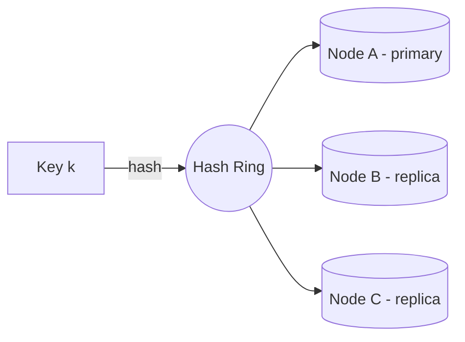
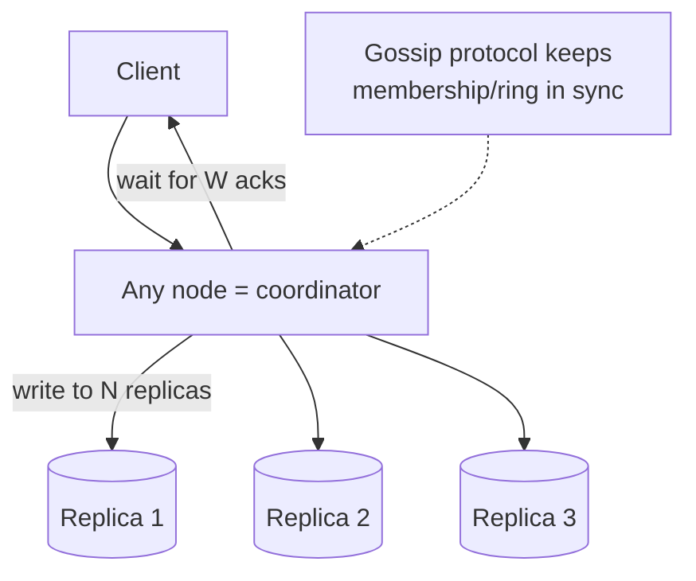

# Design a Distributed Key-Value Store (DynamoDB-style)

[← HLD Index](../README.md) | [Back to Hub](../../README.md)

> **Asked at:** Amazon, Google, Microsoft. The "boss level" — ties together **consistent hashing**, **replication**, **quorums**, and **conflict resolution**. Based on the Amazon Dynamo paper.

---

## Step 1 — Requirements

### Functional
1. `put(key, value)` and `get(key)`.
2. Store large data (beyond one machine).
3. Configurable consistency.

### Non-Functional
- **Highly available** ("always writeable" — Amazon's shopping cart must never reject a write).
- **Scalable** — add nodes seamlessly.
- **Fault tolerant** — survive node/datacenter failures.
- **Tunable consistency** — trade consistency for latency/availability.
- **Low latency** at scale.

> This is an **AP** system ([CAP](../../fundamentals/04-cap-theorem.md)): availability + partition tolerance, eventual consistency.

---

## Step 2 — Data Partitioning (Consistent Hashing)

To spread keys across nodes and add/remove nodes with minimal data movement, use **[consistent hashing](../building-blocks/consistent-hashing.md)** with **virtual nodes** for even distribution.

```
hash(key) → position on ring → first node clockwise owns it
Add a node → only ~K/N keys move (not all).
Virtual nodes → balanced load + heterogeneous capacity.
```

---

## Step 3 — Replication

Each key is replicated to the **next N nodes clockwise** on the ring (the "preference list"), skipping virtual nodes of the same physical machine. For multi-DC durability, ensure replicas span datacenters.


→ N=3 replicas is typical. → [Replication](../building-blocks/replication.md)

---

## Step 4 — Tunable Consistency: Quorums (N, W, R)

- **N** = replicas per key.
- **W** = nodes that must ack a **write**.
- **R** = nodes that must respond to a **read**.

> **If W + R > N → strong consistency** (read & write sets overlap). Otherwise eventual.

| Config | Behavior |
|--------|----------|
| `W=1` | Fast writes, weak consistency |
| `R=1` | Fast reads, may be stale |
| `W=R=2, N=3` | `2+2>3` → strong consistency, tolerates 1 failure |
| `W=N, R=1` | Read-optimized, strong |

This lets callers **tune per operation** (Cassandra: `ONE`, `QUORUM`, `ALL`). → [Consistency](../../fundamentals/05-consistency.md)

---

## Step 5 — Architecture & Decentralization

Dynamo-style stores are **leaderless and fully decentralized** — every node is identical (no master). Any node can receive any request and **coordinate** it (forward to the preference list).



### Membership & failure detection — Gossip Protocol
Nodes periodically exchange state with random peers (**gossip**), spreading membership/ring info and detecting failures in a decentralized, scalable way (no central registry).

---

## Step 6 — Handling Failures

### Temporary failures → Hinted Handoff
If a replica node is **temporarily down** during a write, the coordinator stores the write on **another node with a "hint"**. When the down node recovers, the hint is **handed off** (replayed) to it. Keeps the system **always-writeable**.

### Permanent failures → Anti-Entropy with Merkle Trees
To sync divergent replicas efficiently, each node builds a **Merkle tree** (hash tree) of its key ranges. Two replicas compare tree roots; if equal, they're in sync; if not, they descend only into differing branches — transferring **only the keys that differ**, not the whole dataset.

```
Merkle tree: compare roots → differ → compare children → ... → find exact divergent keys
→ minimal data transfer to repair replicas
```

### Read Repair
On a read, if the coordinator sees replicas with **stale versions**, it updates them in the background.

---

## Step 7 — Conflict Resolution (concurrent writes)

In an AP system, two clients may write the same key concurrently on different replicas → conflicting versions. Resolve with:

| Method | How |
|--------|-----|
| **Last-Write-Wins (LWW)** | Keep the version with the latest timestamp (simple, can lose data) |
| **Vector Clocks** ⭐ | Track causality `[(nodeA,2),(nodeB,1)]`; detect concurrent vs causal updates; surface true conflicts to the client to merge (e.g., merge two shopping carts) |
| **CRDTs** | Data types that merge automatically (counters, sets) |

> Amazon's cart uses **vector clocks** + application-level merge (union of carts) so no item is "lost."

---

## Full Picture (Dynamo techniques mapped)

| Problem | Technique |
|---------|-----------|
| Partition data | **Consistent hashing** (+ vnodes) |
| High availability writes | **Hinted handoff** + leaderless |
| Tunable consistency | **Quorum (N, W, R)** |
| Replica sync | **Merkle trees** (anti-entropy) + **read repair** |
| Membership/failure detection | **Gossip protocol** |
| Concurrent write conflicts | **Vector clocks** / CRDTs |
| Durability | **Replication** across N nodes/DCs |

---

## Trade-offs
- **Availability over consistency** (AP) — always writeable, eventual reads.
- **Decentralized** (no master) → no SPOF, but more complex coordination.
- **Tunable** (N,W,R) lets each app pick its spot on the consistency/latency curve.
- **Conflict resolution** pushed to the app (vector clocks) — powerful but complex.

---

## Key Takeaways
- A distributed KV store partitions with **consistent hashing + virtual nodes** and replicates each key to **N** nodes.
- **Quorum (W + R > N)** gives tunable strong-or-eventual consistency per operation.
- It's **leaderless & decentralized**; **gossip** spreads membership, any node can coordinate.
- Stay available via **hinted handoff** (temp failures) and repair replicas via **Merkle trees + read repair** (permanent failures).
- Resolve concurrent writes with **vector clocks / CRDTs** (or LWW) — this is the Amazon Dynamo toolbox.

---
[← HLD Index](../README.md) | [Back to Hub](../../README.md)
