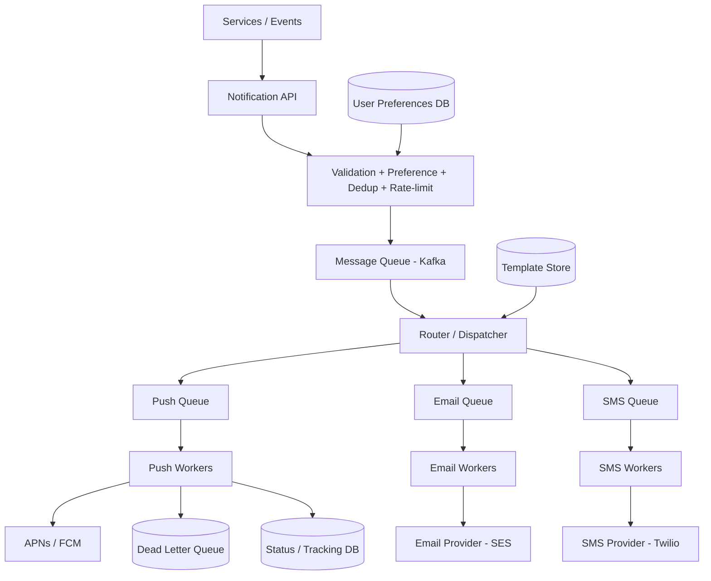

# Design a Notification System

[← HLD Index](../README.md) | [Back to Hub](../../README.md)

> **Asked at:** Amazon, Meta, Uber, LinkedIn. Teaches **fan-out**, **queues**, **multi-channel delivery**, and **retries**.

---

## Step 1 — Requirements

### Functional
1. Send notifications via multiple **channels**: **push** (APNs/FCM), **SMS**, **email**, **in-app**.
2. Support **triggered** (event-based) and **scheduled** notifications.
3. **User preferences** (opt-in/out per channel/type) & **do-not-disturb**.
4. **Templates** (personalized content).
5. Track delivery status.

### Non-Functional
- **High throughput** (millions of notifications).
- **Reliable delivery** (at-least-once; retries).
- **Low latency** for urgent notifications.
- **No spam** (rate limiting, dedup).
- **Scalable & decoupled** (a slow email provider shouldn't block push).

---

## Step 2 — Capacity Estimation

```
100M users, avg 5 notifications/user/day → 500M/day
  → 500M / 86,400 ≈ 5,800 notifications/s (peak much higher during events)
Multiple channels multiply provider calls.
```
→ Must be **async, queue-based, and horizontally scalable**, with isolation per channel.

---

## Step 3 — API Design

```
POST /notifications
  { userId(s), type, templateId, data, channels:[push,email,sms], priority }
  → notificationId (accepted, queued)

GET /notifications/{id}/status   → { perChannel: {push:delivered, email:sent} }
PUT /users/{id}/preferences      → channel/type opt-in settings
```
The API **accepts and queues** (returns 202) — it doesn't send synchronously.

---

## Step 4 — Architecture



### Flow
1. A service triggers a notification via the **API**.
2. **Validation layer:** check user **preferences** (did they opt out? DND hours?), **dedup** (don't send the same thing twice), **rate-limit** (anti-spam).
3. Enqueue into a central **Kafka** topic.
4. A **router/dispatcher** picks the channels and routes to **per-channel queues** (push/email/SMS) — this **isolates** channels so one slow provider doesn't block others.
5. **Channel workers** render the **template**, call the external **provider** (APNs, FCM, SES, Twilio), and record **status**.
6. Failures → **retry with backoff**; after N attempts → **Dead Letter Queue**.

---

## Step 5 — Deep Dives

### Why queues / async (the central idea)
External providers are **slow and unreliable**. Queues decouple producers from delivery, absorb spikes, and let each channel scale independently. → [Message Queues](../building-blocks/message-queues.md)

### Per-channel isolation
Separate queues + worker pools per channel (push vs email vs SMS). If Twilio is degraded, SMS backs up but push/email flow normally (**bulkhead** pattern).

### Reliability: at-least-once + idempotency
- **At-least-once** delivery with retries (exponential backoff + jitter).
- Workers must be **idempotent** — dedupe by `notificationId` so retries/duplicates don't double-send. → [Delivery guarantees](../building-blocks/message-queues.md)
- **DLQ** captures poison messages for inspection.

### Preferences & opt-out (compliance)
Central **preference service** enforces per-user/per-type/per-channel settings, quiet hours, and legal unsubscribes (CAN-SPAM/GDPR). Checked **before** queuing.

### Rate limiting / anti-spam
Cap notifications per user per time window; **collapse/batch** similar ones ("5 people liked your post" instead of 5 pushes). → [Rate Limiting](../building-blocks/rate-limiting.md)

### Templates & personalization
A **template service** with placeholders; workers render per-user content + localization.

### Priority
High-priority (OTP, security) use a fast/priority queue; bulk marketing uses a lower-priority path.

### Fan-out (broadcast)
"Notify all followers/users" → fan-out workers expand the recipient list and enqueue per-recipient jobs (same pattern as [Twitter](./twitter.md) fan-out).

### Tracking
Status DB records per-channel state (`queued → sent → delivered → failed/opened`) via provider webhooks/callbacks.

---

## Step 6 — Trade-offs
- **At-least-once vs exactly-once:** at-least-once + idempotency is the pragmatic choice.
- **Latency vs batching:** batch/collapse to reduce spam & cost, at the cost of immediacy (fine for non-urgent).
- **Push vs poll for in-app:** WebSocket/SSE push vs client polling.
- **Build vs buy:** many use providers (SNS, OneSignal) for channel delivery.

---

## Follow-up Questions
- *Guarantee no duplicate notifications?* → idempotency key + dedup store.
- *Handle a provider outage?* → retries + DLQ + failover to a secondary provider.
- *Scheduled notifications?* → a scheduler service (delay queue / cron) enqueues at the right time.
- *Track opens/clicks?* → tracking pixels / deep links → analytics pipeline.

---

## Key Takeaways
- Make it **async & queue-based**: API accepts and enqueues; **workers** deliver to providers.
- **Per-channel queues + worker pools** isolate failures (bulkhead) so one slow provider doesn't block others.
- Enforce **preferences, dedup, and rate limits before** sending; use **templates** for personalization.
- **At-least-once + idempotent workers + retries (backoff) + DLQ** for reliability.
- Use **fan-out** for broadcasts and a **priority path** for urgent notifications.

---
[← HLD Index](../README.md) | [Back to Hub](../../README.md)
