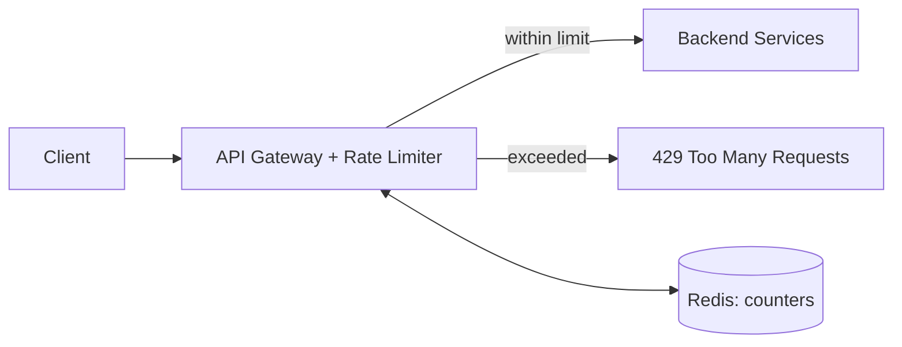
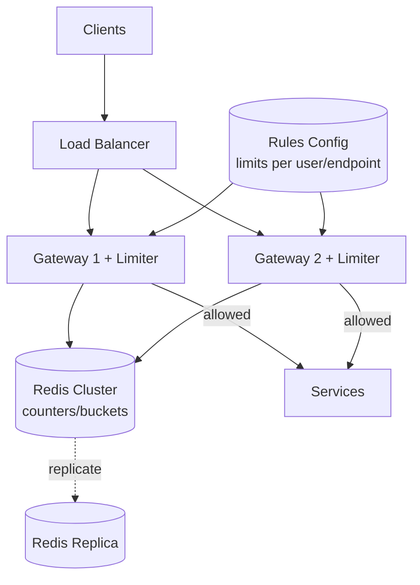

# Design a Rate Limiter

[← HLD Index](../README.md) | [Back to Hub](../../README.md)

> **Asked at:** Stripe, Amazon, Google, Cloudflare. See also the [Rate Limiting building block](../building-blocks/rate-limiting.md) for algorithm details.

---

## Step 1 — Requirements

### Functional
1. Limit requests per client to **N per time window**.
2. Reject excess requests with **HTTP 429 Too Many Requests** + informative headers.
3. Configurable rules (per user, per IP, per endpoint, per API tier).

### Non-Functional
- **Low latency** — adds minimal overhead to each request.
- **High availability** — must not become a SPOF; **fail-open** preferred.
- **Accurate** — limits enforced even across many app servers (distributed).
- **Scalable** — handle the full request volume.

---

## Step 2 — Where Does It Live?

Most commonly at the **API Gateway** / edge, as middleware before requests reach services.



---

## Step 3 — Choose the Algorithm

(Full comparison in [Rate Limiting](../building-blocks/rate-limiting.md).) Quick recap:

| Algorithm | Bursts | Accuracy | Memory | Pick when |
|-----------|--------|----------|--------|-----------|
| **Token Bucket** ⭐ | Allowed | Good | Low | Want bursts + smooth rate |
| Leaky Bucket | Smoothed | Good | Low | Need constant outflow |
| Fixed Window | Boundary spikes | Low | Tiny | Simplicity |
| Sliding Log | None | Exact | High | Need perfect accuracy |
| **Sliding Window Counter** ⭐ | Minimal | High | Low | Best balance |

> **Recommended:** Token Bucket (flexible, allows bursts) or Sliding Window Counter (accurate + cheap).

### Token Bucket logic
```
bucket: { tokens, last_refill }
on request:
  now = currentTime()
  tokens = min(capacity, tokens + (now - last_refill) * refill_rate)
  last_refill = now
  if tokens >= 1:
     tokens -= 1 ; ALLOW
  else:
     REJECT (429)
```

---

## Step 4 — Distributed Rate Limiting (the hard part)

With many gateway/app instances, a **per-instance counter** lets a client exceed the global limit (N instances × limit). Solution: a **shared, centralized counter** in **Redis**.

### Race conditions
Concurrent `read → compute → write` can over-count. Fix with **atomic operations**:
- Redis `INCR` / `INCRBY` (atomic) for window counters.
- **Lua script** for token bucket (atomic read-modify-write in one round trip).

```
-- Redis Lua (atomic): fixed/sliding window
local current = redis.call("INCR", key)
if current == 1 then redis.call("EXPIRE", key, window) end
if current > limit then return 0 else return 1 end
```

### Latency
Every request hitting Redis adds a round trip. Mitigate:
- Co-locate Redis with gateways (same region).
- **Local + global hybrid:** each instance keeps a small local allowance, syncs to Redis periodically (approximate, lower latency).

### Redis as SPOF
- **Replicate** Redis (primary + replicas, Sentinel/Cluster).
- Decide **fail-open** (allow traffic if Redis is down — availability) vs **fail-closed** (block — security). Most APIs fail open.

---

## Step 5 — Architecture



Components:
- **Rules engine / config:** limits per user tier, endpoint, IP (hot-reloaded).
- **Counter store:** Redis (atomic, fast, TTL-based windows).
- **Limiter middleware:** runs the algorithm per request.

---

## Step 6 — The Client Key & Rules
- **Key** = what we limit on: `user_id`, `api_key`, `ip`, or composite `{user}:{endpoint}`.
- **Tiered limits:** free = 100/min, premium = 10,000/min.
- **Per-endpoint:** `/login` stricter (prevent brute force) than `/search`.

---

## Step 7 — Response & Client Experience

On rejection, return:
```
HTTP 429 Too Many Requests
Retry-After: 30
X-RateLimit-Limit: 100
X-RateLimit-Remaining: 0
X-RateLimit-Reset: 1718900000
```
Clients should honor `Retry-After` and use **exponential backoff + jitter**.

---

## Trade-offs Summary
- **Accuracy vs performance:** sliding log (exact, costly) vs sliding counter (approx, cheap).
- **Centralized (Redis, accurate, latency + SPOF) vs local (fast, less accurate).**
- **Fail-open (availability) vs fail-closed (security).**

---

## Key Takeaways
- Rate limiter lives at the **API Gateway**; rejects with **429 + Retry-After/X-RateLimit headers**.
- **Token bucket** (bursts) or **sliding window counter** (accurate + cheap) are the best algorithms.
- For multiple instances, use a **centralized Redis** counter with **atomic INCR / Lua scripts** to avoid races.
- Replicate Redis; choose **fail-open vs fail-closed**; reduce latency with local+global hybrids.
- Key by **user/IP/endpoint** with **tiered** limits.

---
[← HLD Index](../README.md) | [Back to Hub](../../README.md)
