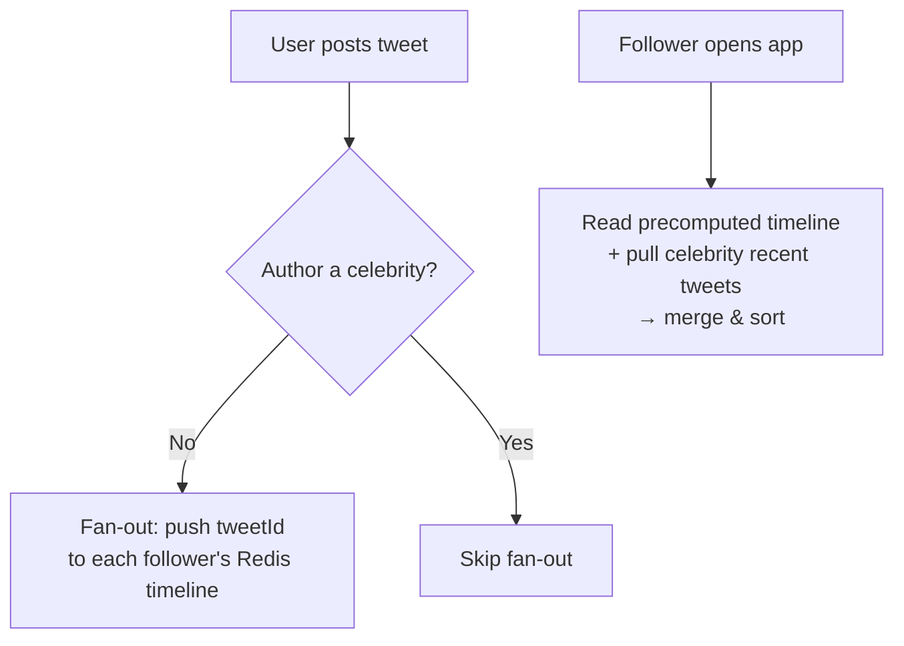
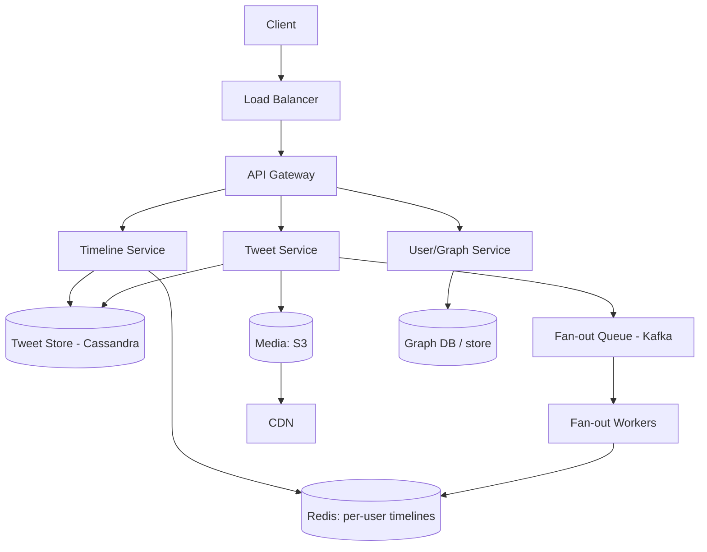

# Design Twitter / X

[← HLD Index](../README.md) | [Back to Hub](../../README.md)

> **Asked at:** Twitter/X, Meta, Amazon, LinkedIn. Teaches the **feed fan-out** problem — push vs pull — the most important pattern in social-media design.

---

## Step 1 — Requirements

### Functional
1. Post a tweet (text, optionally media).
2. **Home timeline** — see tweets from people you follow (reverse-chronological).
3. Follow / unfollow users.
4. (Optional) Likes, retweets, replies, search, trends.

### Non-Functional
- **Highly available**, low latency timeline (< 200 ms).
- **Read-heavy** — timeline reads ≫ tweet writes (~100:1+).
- **Eventual consistency** acceptable (a tweet appearing a few seconds late is fine → AP, see [CAP](../../fundamentals/04-cap-theorem.md)).
- Scale to **hundreds of millions** of users.

---

## Step 2 — Capacity Estimation

```
300M MAU, 150M DAU
Tweets: 150M users × 2 tweets/day = 300M tweets/day
  → 300M / 86,400 ≈ 3,500 writes/s (peak ~10,000/s)
Timeline reads: each user refreshes ~ a few times/day
  → hundreds of thousands of reads/s, peak ~1M/s
Storage (text): 300M × 300 B ≈ 90 GB/day → ~33 TB/year
Media → object storage + CDN (petabytes)
```
→ **Massively read-heavy** ⇒ optimize the read (timeline) path aggressively.

---

## Step 3 — API Design

```
POST /tweets                  { text, mediaIds? }        → tweetId
GET  /timeline?cursor=...      → [ tweets ] (paginated)
POST /follow                   { targetUserId }
DELETE /follow/{targetUserId}
POST /tweets/{id}/like
```
Use **cursor-based pagination** (not offset) for infinite scroll efficiency.

---

## Step 4 — Data Model

```
users(user_id PK, name, handle, ...)
tweets(tweet_id PK, user_id, text, media_url, created_at)   -- Snowflake IDs (time-sortable)
follows(follower_id, followee_id)                            -- the social graph
likes(user_id, tweet_id)
```
- **Tweet IDs:** use **Snowflake** (time-sortable, distributed) → [IDs](../building-blocks/sharding.md).
- **Storage:** tweets in a wide-column store (Cassandra) or sharded SQL; social graph in its own store; media in **S3 + CDN**.

---

## Step 5 — The Core Problem: Building the Home Timeline

When user X opens the app, we need the latest tweets from everyone X follows, merged and sorted. Two strategies:

### Approach A — Pull / Fan-out on Read
At read time, fetch recent tweets from each followee, merge, sort, return.
```
timeline(X) = merge_sort( tweets of each user X follows )[:N]
```
- ✅ No work on write; no storage overhead; great for users who follow many.
- ❌ **Slow reads** (query N followees, merge at request time) — bad for the hot path.
- ❌ Expensive for active users with many follows.

### Approach B — Push / Fan-out on Write ⭐
When X tweets, **immediately push** the tweet ID into the precomputed timeline (a list in Redis) of **every follower**.
```
on tweet by X:
  for each follower F of X:
    redis.lpush("timeline:F", tweetId)
read timeline(F) = redis.lrange("timeline:F", 0, N)   ← O(1), super fast
```
- ✅ **Blazing-fast reads** (timeline is precomputed in memory).
- ❌ Expensive writes — a user with 50M followers = 50M writes per tweet ("fan-out storm").
- ❌ Wasted work for inactive followers.

### The Celebrity Problem & the Hybrid Solution ⭐⭐
Pure push breaks for celebrities (millions of followers → write amplification). Pure pull is slow for everyone. **Real Twitter uses a hybrid:**

- **Push** for normal users (most accounts) — precompute followers' timelines.
- **Pull** for **celebrities / high-follower accounts** — do NOT fan out; instead, **merge their recent tweets at read time** into the requester's timeline.

```
timeline(F) =
   precomputed_push_timeline(F)         ← from normal followees (Redis)
 ⨄ recent_tweets(celebrities F follows) ← pulled & merged at read time
   → sort by time, return top N
```



> This hybrid is **the** key insight interviewers look for. State the push/pull trade-off, then propose the hybrid keyed on follower count.

---

## Step 6 — High-Level Architecture



### Write path (post a tweet)
1. Tweet Service stores the tweet (Cassandra) + media (S3).
2. Publishes a fan-out event to **Kafka**.
3. **Fan-out workers** push the tweet ID into followers' Redis timelines (skipping celebrities).

### Read path (load timeline)
1. Timeline Service reads the precomputed list from **Redis** (fast).
2. Merges in recent tweets from **celebrity** followees (pulled live).
3. Hydrates tweet IDs → full tweet objects (from cache/DB).
4. Returns sorted page.

---

## Step 7 — Deep Dives & Trade-offs

### Caching
Timelines and hot tweets live in **Redis**. Tweet objects cached too (hydration). → [Caching](../building-blocks/caching.md)

### Storage choices
- Tweets: **Cassandra** (write-heavy, scalable, time-series friendly).
- Social graph: dedicated graph service / adjacency lists (sharded).
- Media: **S3 + CDN**.

### Sharding
- Shard tweets by `tweet_id` (Snowflake) or `user_id`.
- Shard timelines by `user_id` (consistent hashing). → [Sharding](../building-blocks/sharding.md)

### Fan-out via queue
Decouple posting from fan-out using **Kafka** so a viral tweet doesn't block the poster; workers process asynchronously. → [Message Queues](../building-blocks/message-queues.md)

### Trending / Search
Separate pipelines: stream tweets to a **search index (Elasticsearch)** and a **trends** aggregation (count hashtags in sliding windows).

### Eventual consistency
A follower may see a tweet a few seconds late — acceptable (AP system). Read-your-writes for the author's own tweet (show immediately).

---

## Follow-up Questions
- *How to handle a tweet by someone with 100M followers?* → hybrid pull (don't fan out).
- *How to keep timelines fresh without storing infinitely?* → cap timeline length (e.g., latest 800), regenerate on demand.
- *How to rank (not just chrono) the feed?* → ML ranking service scoring candidate tweets.
- *Deleting a tweet?* → tombstone; lazily filter from timelines on read.

---

## Key Takeaways
- The crux is **home-timeline fan-out**: **push (fan-out on write)** = fast reads, costly writes; **pull (fan-out on read)** = cheap writes, slow reads.
- Use a **hybrid**: push for normal users, **pull for celebrities** — solves the fan-out storm.
- It's **read-heavy** → precompute timelines in **Redis**, store tweets in **Cassandra**, media in **S3 + CDN**.
- Decouple fan-out with **Kafka workers**; use **Snowflake IDs**; accept **eventual consistency** (AP).

---
[← HLD Index](../README.md) | [Back to Hub](../../README.md)
