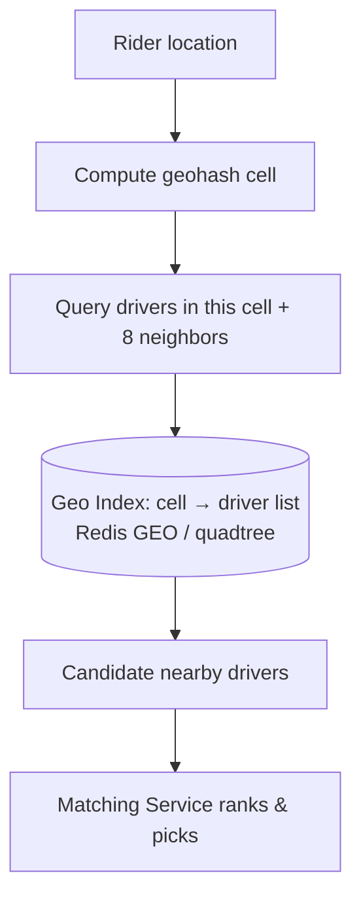
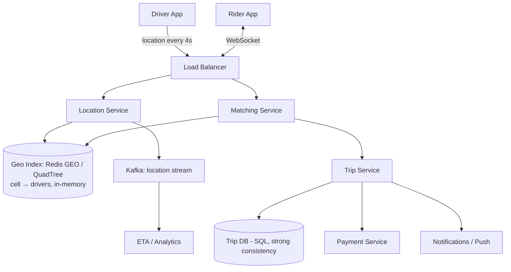

# Design Uber / Lyft (Ride-Hailing)

[← HLD Index](../README.md) | [Back to Hub](../../README.md)

> **Asked at:** Uber, Lyft, Amazon, Google. Teaches **geospatial indexing**, real-time location, and **matching**.

---

## Step 1 — Requirements

### Functional
1. Riders **request a ride** (pickup + destination).
2. **Match** rider with a nearby available driver.
3. Drivers **stream their location** in real time.
4. Show driver's live location & ETA to the rider; trip tracking.
5. Fare calculation & payment.

### Non-Functional
- **Low latency** matching (riders want a car fast).
- **High availability**.
- **Real-time** location updates (millions of drivers).
- **Geospatial scale** — efficiently find "drivers near me".
- Consistency for trip state; eventual ok for location.

---

## Step 2 — Capacity Estimation

```
10M active drivers; each sends location every ~4 s
  → 10M / 4 ≈ 2.5M location writes/s  (write-heavy on location!)
Ride requests: ~ hundreds of thousands/min at peak
Location payload tiny (lat/lng/driverId) but volume is enormous
```
→ Two hot problems: **ingesting millions of location updates/s** and **fast nearest-driver queries**.

---

## Step 3 — API Design

```
Driver:
  POST /drivers/location { driverId, lat, lng, ts }   (every few seconds)
  POST /drivers/status   { available | busy }

Rider:
  POST /rides/request   { riderId, pickup, destination } → rideId, matched driver
  GET  /rides/{id}      → status, driver location, ETA
WebSocket: live driver location & trip updates pushed to rider
```

---

## Step 4 — The Core Problem: Geospatial Indexing

"Find available drivers within 2 km of the rider" — a naive `WHERE distance < 2km` scans all drivers (impossible at scale). We need a **geospatial index** that partitions the map into cells so we only check nearby cells.

### Options

| Technique | Idea |
|-----------|------|
| **Geohash** ⭐ | Encode lat/lng into a short string; nearby points share prefixes. Query = same/adjacent geohash cells. |
| **Quadtree** | Recursively subdivide map into 4 quadrants until each cell has few points; dense areas → deeper tree. |
| **S2 (Google)** / **H3 (Uber)** | Hierarchical cell systems on a sphere; Uber built **H3** (hexagonal grid) for exactly this. |

```
Geohash: San Francisco ≈ "9q8yy"
  Drivers in "9q8yy" + 8 neighbor cells → candidates within ~range
  Longer prefix = smaller cell = finer precision
```



> **Redis** has built-in `GEOADD` / `GEORADIUS` (geohash-based) — a clean answer for storing live driver locations and querying by radius.

---

## Step 5 — Architecture



### Location update path (write-heavy)
1. Driver app sends location every few seconds.
2. **Location Service** updates the **in-memory geo index** (Redis GEO) — current positions only (not every point persisted to a SQL DB).
3. Optionally streams to **Kafka** for analytics/ETA/history.

### Matching path
1. Rider requests a ride.
2. **Matching Service** queries the geo index for available drivers in nearby cells.
3. Ranks candidates (distance, ETA, rating, driver acceptance likelihood).
4. Offers the ride to the best driver; on accept → create a **Trip** (strongly consistent state).
5. Pushes live updates to the rider over **WebSocket**.

---

## Step 6 — Deep Dives

### Storing live locations
- **Don't** write every location to a relational DB (2.5M writes/s would crush it). Keep **current location in memory** (Redis GEO) — it's ephemeral and constantly overwritten.
- Stream to **Kafka** if you need history/analytics (separate path).

### Sharding the geo index
- Partition by **geographic region / city** (data locality — see [Sharding](../building-blocks/sharding.md)).
- A city's drivers handled by that region's servers → bounded query scope.

### Trip state (needs strong consistency)
- A trip's lifecycle (`requested → matched → ongoing → completed`) and payment require **strong consistency** → store in **SQL (ACID)**. → [CAP](../../fundamentals/04-cap-theorem.md)
- Avoid double-matching a driver: use locks / atomic state transitions.

### Matching: avoiding race conditions
Two riders shouldn't get the same driver. Use atomic "claim" operations (e.g., compare-and-set driver status to `reserved`).

### ETA & routing
Separate service using road-network graphs + real-time traffic (precomputed/cached routes).

### Surge pricing
Computed per region based on supply/demand ratios in each geo cell (stream-processed).

---

## Step 7 — Trade-offs
- **Location = AP/eventual** (a slightly stale dot on the map is fine); **trip/payment = CP/strong**.
- **In-memory geo index** (fast, volatile) vs durable store (slow). Locations are volatile → memory wins.
- **Geohash vs quadtree:** geohash simpler & Redis-native; quadtree/H3 adapt better to density.
- Region sharding gives locality but needs handling for cross-border trips.

---

## Follow-up Questions
- *Driver disappears (no updates)?* → TTL on location; mark offline after N missed updates.
- *Pool/shared rides?* → matching optimizes multiple riders on one route.
- *Scale location ingestion?* → many stateless Location Service nodes + region-sharded Redis + Kafka buffer.
- *Map a huge city?* → finer geohash precision / deeper quadtree in dense areas.

---

## Key Takeaways
- Core problem = **geospatial "nearby" queries** → use **geohash / quadtree / H3** (Redis GEO is a ready tool).
- **Location updates** are write-heavy and **volatile** → keep current positions **in memory**, stream history to **Kafka**; don't hammer SQL.
- **Shard the geo index by city/region** for locality and bounded queries.
- **Trip & payment state** need **strong consistency (SQL)**; location can be **eventually consistent**.
- Match with atomic **claim** operations to avoid double-booking drivers; push live updates via **WebSocket**.

---
[← HLD Index](../README.md) | [Back to Hub](../../README.md)
