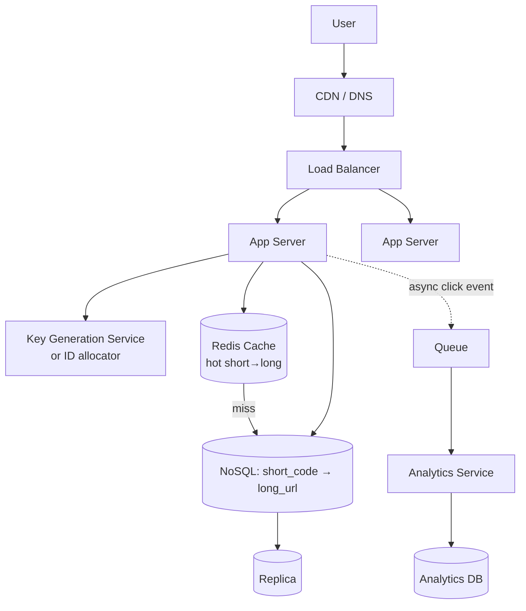

# Design a URL Shortener (TinyURL / Bit.ly)

[← HLD Index](../README.md) | [Back to Hub](../../README.md)

> **Asked at:** Amazon, Microsoft, Google, Adobe, Twitter. The "Hello World" of system design — master this template first.

---

## Step 1 — Requirements

### Functional
1. Given a long URL, return a **short URL**.
2. Accessing the short URL **redirects** to the original long URL.
3. (Optional) **Custom alias** (e.g., `short.ly/myname`).
4. (Optional) **Expiration** of links.
5. (Optional) **Analytics** (click counts).

### Non-Functional
- **High availability** — redirection must always work (broken links = bad UX).
- **Low latency** — redirects in < 100 ms.
- **Scalable** — billions of URLs.
- **Not easily guessable** short codes.
- **Read-heavy** — redirects (reads) ≫ creations (writes), ~100:1.

---

## Step 2 — Capacity Estimation

(See [estimation method](../../fundamentals/08-estimation.md).)

```
Writes: 100M new URLs/day → 100M / 86,400 ≈ 1,160 writes/s
Reads:  100:1 ratio → ~116,000 reads/s
Storage (5 yrs): 100M × 365 × 5 ≈ 182 billion URLs
  Per record ≈ 500 bytes → 182B × 500 B ≈ 91 TB
```

### Short code length (base-62: a–z, A–Z, 0–9)
```
62^6 ≈ 56.8 billion   → too few
62^7 ≈ 3.5 trillion   → enough ✅
```
→ Use **7-character** base-62 codes.

---

## Step 3 — API Design

```
POST /api/v1/shorten
  body: { longUrl, customAlias?, expiryDate?, userId? }
  → 200 { shortUrl: "https://short.ly/abc1234" }

GET /{shortCode}
  → 301 Redirect to longUrl    (or 404 if not found / expired)

GET /api/v1/analytics/{shortCode}
  → { clicks, createdAt, ... }
```

> **301 vs 302:** `301 Moved Permanently` is cached by the browser → fewer server hits but you lose per-click analytics. `302 Found` (temporary) hits your server every time → enables analytics. **Use 302 if you need click tracking; 301 to minimize load.**

---

## Step 4 — Data Model

A simple key-value mapping. **NoSQL (key-value)** fits perfectly (huge scale, simple lookups), though SQL also works.

```
Table: urls
  short_code   VARCHAR(7)  PRIMARY KEY   ← indexed for O(1)-ish lookup
  long_url     VARCHAR(2048)
  user_id      BIGINT
  created_at   TIMESTAMP
  expiry_at    TIMESTAMP
  click_count  BIGINT
```
- **Key:** `short_code`; **Value:** the row. Lookups are by short_code → use as primary key / hash key.
- **Store choice:** DynamoDB / Cassandra (scale) or sharded MySQL.

---

## Step 5 — The Core Problem: Generating Short Codes

### Approach A — Hashing (MD5/SHA + truncate)
`hash(longUrl)` → take first 7 chars (base-62 encode).
- ✅ Deterministic (same URL → same code, dedup).
- ❌ **Collisions** when truncating → must check & rehash (append salt, retry).

### Approach B — Counter + Base-62 Encoding ⭐ (clean)
Maintain a global auto-incrementing counter; **base-62 encode** the integer to get the short code.
```
counter = 1,000,000,000 → base62 → "15ftgG"  (always unique, no collisions)
```
- ✅ **No collisions** (each counter value is unique); short codes get longer gradually.
- ❌ **Predictable/sequential** (security: people can enumerate). Mitigate by encoding with a shuffled alphabet or skipping values.
- ❌ The counter is a **bottleneck/SPOF** at scale.

### Scaling the counter (the real interview depth)
- **Ticket Server** — a single DB doling out IDs (SPOF, bottleneck).
- **Range allocation / Zookeeper** — each app server reserves a **block** of IDs (e.g., 1–1000, 1001–2000) and hands them out locally; refills when low. No per-request coordination.
- **Snowflake-style IDs** — distributed unique IDs without a central counter → [Sharding/IDs](../building-blocks/sharding.md).
- **Pre-generated keys (KGS — Key Generation Service)** — generate billions of unique 7-char keys offline, store them in a DB, and hand them out. Servers grab keys in batches. Removes generation from the request path entirely.

> **Best answer:** Counter + base-62 with **range-based ID allocation** (each server reserves a block via Zookeeper), *or* a **Key Generation Service** with pre-generated keys. Mention both and the trade-off.

---

## Step 6 — High-Level Architecture



### Write path (create short URL)
1. App gets a unique key (from KGS / ID allocator).
2. Store `short_code → long_url` in DB.
3. Return short URL.

### Read path (redirect) — the hot path
1. Extract `short_code`.
2. **Check Redis cache** (hot URLs). On hit → redirect.
3. On miss → query DB, populate cache (cache-aside), redirect.
4. Emit a click event **asynchronously** to a queue for analytics (don't block the redirect).

---

## Step 7 — Deep Dives & Trade-offs

### Caching
Redirects are massively read-heavy → cache hot mappings in **Redis** (cache-aside + LRU). With the 80/20 rule, a modest cache absorbs most reads. → [Caching](../building-blocks/caching.md)

### Scaling the database
- **Sharding** by `short_code` (hash-based) → [Sharding](../building-blocks/sharding.md).
- **Read replicas** for the read-heavy load.
- **Consistent hashing** to add shards with minimal reshuffle.

### Handling expiration
A background job (or TTL in the DB) removes expired links; redirect returns 404.

### Custom aliases
Check availability (unique constraint); reject if taken.

### Analytics without slowing redirects
Fire-and-forget click events to **Kafka** → processed offline → aggregated counts. Keeps the redirect path fast.

### Availability
- Stateless app servers behind an LB; multiple replicas; multi-AZ DB. No SPOF.

---

## Follow-up Questions You Might Get
- *How to prevent abuse?* → rate limiting per user/IP → [Rate Limiting](../building-blocks/rate-limiting.md).
- *How to dedupe identical long URLs?* → hash-based codes or a lookup index (trade-off: extra read on write).
- *301 vs 302?* → caching vs analytics (see above).
- *How to make codes unguessable?* → shuffle the base-62 alphabet / random KGS keys.
- *Single point of failure in counter?* → range allocation / KGS / Snowflake.

---

## Key Takeaways
- Core problem = **unique short-code generation**: prefer **counter + base-62** with **range-based ID allocation** or a **Key Generation Service**.
- **7-char base-62** (62⁷ ≈ 3.5T) covers the scale.
- It's **read-heavy** → **cache (Redis) + read replicas + sharding**.
- Redirect path must be **fast**; push analytics **async** via a queue.
- Discuss **301 vs 302**, dedup, expiration, abuse prevention, and counter SPOF.

---
[← HLD Index](../README.md) | [Back to Hub](../../README.md)
