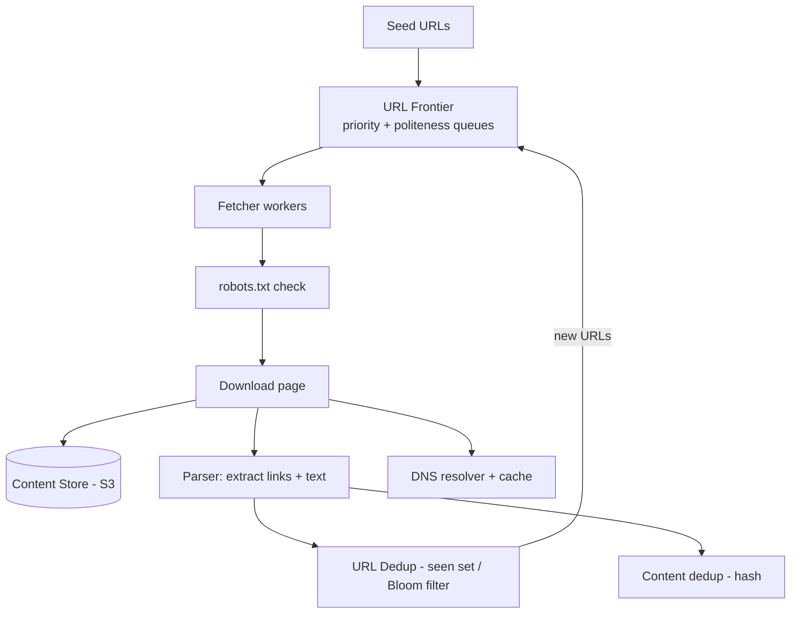

# Design a Web Crawler

[← HLD Index](../README.md) | [Back to Hub](../../README.md)

> **Asked at:** Google, Amazon, Microsoft. Teaches **BFS at scale**, **politeness**, **deduplication**, and distributed coordination.

---

## Step 1 — Requirements

### Functional
1. Given seed URLs, **crawl** the web — download pages and extract links.
2. Follow discovered links (graph traversal).
3. Store page content (for indexing/search).
4. Re-crawl periodically (freshness).

### Non-Functional
- **Scalable** — billions of pages.
- **Politeness** — don't overload any single site (respect `robots.txt`, rate limits).
- **Robust** — handle bad HTML, traps, timeouts, duplicates.
- **Extensible** — add new content types/parsers.
- **Freshness** — re-crawl changing pages.

---

## Step 2 — Capacity Estimation

```
Crawl 1B pages/month → 1B / (30×86,400) ≈ 400 pages/s (sustained)
Page size ≈ 500 KB avg → 1B × 500 KB = 500 TB/month of raw content
Need dedup for billions of URLs (URL seen-set) and content hashes
```
→ Storage and **distributed coordination** dominate; URL frontier management is the core.

---

## Step 3 — Core Components & Flow

A crawler is essentially a **distributed BFS** over the web graph.



### Step-by-step
1. **URL Frontier** holds URLs to crawl (a smart priority queue).
2. **Fetcher** workers pull URLs, check **`robots.txt`** (politeness), resolve **DNS** (cached), download the page.
3. **Content store** saves raw HTML (S3).
4. **Parser** extracts links and text.
5. New links pass through **URL dedup** (have we seen this URL?) → added back to the frontier.
6. **Content dedup** (hash the page) skips near-duplicate pages.

---

## Step 4 — Deep Dives

### The URL Frontier (the heart)
Must balance two things:
- **Priority** — crawl important/fresh pages first (PageRank, update frequency). → priority queues.
- **Politeness** — never hammer one host; bound requests per domain.

Design: a set of queues, where each **host maps to one queue**, and a worker handles a host with a delay between requests (e.g., Mercator design: front queues for priority, back queues per host for politeness).

```
Front queues (priority) → router → Back queues (one per host) → worker waits politely per host
```

### Politeness
- Obey **`robots.txt`** (cache per domain).
- **Crawl-delay** / rate limit per host.
- One connection per host at a time (or a small bound).
- Identify via a proper `User-Agent`.

### URL Deduplication (avoid re-crawling)
Billions of URLs → can't store all in memory naively. Use:
- **Bloom filter** — space-efficient probabilistic "have we seen this URL?" (allows false positives = occasionally skip a new URL; never false negatives that matter).
- Backed by a persistent **seen-set** store (e.g., a distributed KV).
- **URL normalization** first (lowercase host, strip fragments, sort params) so equivalent URLs dedupe.

### Content Deduplication
Many URLs serve identical/near-identical content. Hash content (MD5/SHA or **SimHash** for near-dups) and skip duplicates.

### Crawler Traps & Robustness
- **Traps:** infinite calendars, dynamically generated infinite links → cap depth, detect patterns, limit URLs per domain.
- **Timeouts**, malformed HTML, redirects loops, huge files → guard rails.

### DNS
DNS lookups are slow and repeated → **cache** DNS results; can be a bottleneck at scale.

### Distributed coordination
- Partition the frontier across machines by **hash(host)** so each host is owned by one node (preserves politeness + locality). → [Consistent hashing](../building-blocks/consistent-hashing.md)
- Workers are stateless and scale horizontally.

### Freshness / Re-crawl
Track last-crawled time & change frequency; schedule re-crawls (frequently-changing news daily, static pages rarely). Adaptive based on observed change rate.

---

## Step 5 — Storage
- **Raw pages:** object storage (S3) — petabytes.
- **Metadata** (URL, status, last-crawled, hash): a KV / wide-column store.
- **Link graph:** for ranking (PageRank) — graph/adjacency store.
- Downstream: feed parsed text to an **indexing pipeline** (Elasticsearch / inverted index) for search.

---

## Step 6 — Trade-offs
- **Politeness vs throughput:** being polite limits per-host speed → parallelize across many hosts.
- **Bloom filter:** saves memory but allows occasional false positives (rare missed pages) — acceptable.
- **BFS vs priority:** pure BFS is simple; priority crawling needs ranking but improves quality/freshness.
- **Storage cost:** dedup and compression reduce the petabyte footprint.

---

## Follow-up Questions
- *How to avoid crawling the same page from two workers?* → host-partitioned frontier (one owner per host).
- *How to handle a malicious infinite site?* → per-domain URL caps + depth limits + trap detection.
- *How to keep the index fresh?* → adaptive re-crawl scheduling by change frequency.
- *How big is the Bloom filter?* → sized for billions of URLs at a low false-positive rate (a few GB).

---

## Key Takeaways
- A web crawler = **distributed BFS** with a smart **URL Frontier** balancing **priority** and **politeness**.
- **Politeness:** obey `robots.txt`, rate-limit per host, partition the frontier by **hash(host)**.
- **Dedup** URLs with a **Bloom filter** (+ normalization) and content with **hashing/SimHash**.
- Guard against **crawler traps** (depth/URL caps), cache **DNS**, store raw pages in **S3**.
- Schedule **adaptive re-crawls** for freshness; feed parsed content to an **indexing/search** pipeline.

---
[← HLD Index](../README.md) | [Back to Hub](../../README.md)
