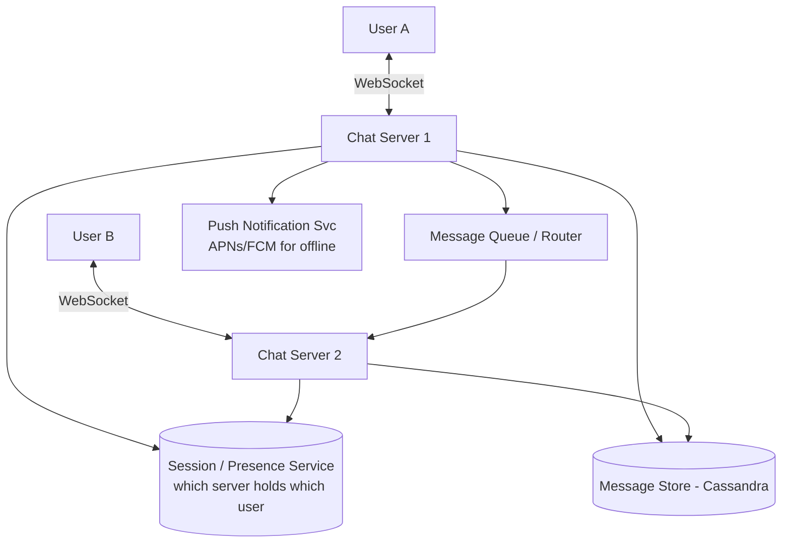

# Design a Chat System (WhatsApp / Messenger)

[← HLD Index](../README.md) | [Back to Hub](../../README.md)

> **Asked at:** Meta, Amazon, Microsoft, Uber. Teaches **WebSockets**, real-time delivery, presence, and message storage.

---

## Step 1 — Requirements

### Functional
1. **1:1 messaging** (real-time).
2. **Group messaging**.
3. **Online/last-seen presence**.
4. **Delivery & read receipts** (sent ✓, delivered ✓✓, read ✓✓ blue).
5. **Message persistence** (history) + offline delivery.
6. (Optional) media sharing, E2E encryption.

### Non-Functional
- **Low latency** real-time delivery.
- **High availability**; messages must not be lost.
- **Consistency** of message ordering within a conversation.
- Scale to **billions** of messages/day.

---

## Step 2 — Capacity Estimation

```
500M DAU, 40 messages/user/day → 20B messages/day
  → 20B / 86,400 ≈ 230,000 messages/s (peak ~500k/s)
Storage: 20B × 100 B ≈ 2 TB/day (text)  → media far more (S3)
Concurrent connections: tens of millions of long-lived WebSocket connections
```
→ The hard parts: **millions of persistent connections** + **real-time routing**.

---

## Step 3 — The Connection Problem: HTTP vs WebSocket

Chat needs the **server to push** to the client instantly. Plain HTTP is request/response (client must ask). Options ([Networking](../../fundamentals/07-networking.md)):

| Method | Real-time? | Cost |
|--------|-----------|------|
| Short polling | ❌ laggy | wasteful |
| Long polling | ~ok | holds connections |
| **WebSocket** ⭐ | ✅ full-duplex | persistent connection |

**Use WebSockets:** a persistent, bidirectional TCP connection between client and a **WebSocket / Chat server**. The server can push messages the instant they arrive.

---

## Step 4 — API / Protocol

```
WebSocket events:
  → sendMessage   { to, conversationId, text, clientMsgId }
  ← messageReceived { from, messageId, text, timestamp }
  ← deliveryReceipt { messageId, status: delivered|read }
  → presenceUpdate  { status: online|offline }

REST (non-real-time):
  GET /conversations/{id}/messages?cursor=...   (history)
  POST /media (upload → returns URL)
```

---

## Step 5 — Architecture



### How a message flows (A → B)
1. A sends message over its WebSocket to **Chat Server 1**.
2. Server 1 **persists** the message (message store) and assigns it an ID + timestamp.
3. Server 1 looks up B in the **Session/Presence service** → finds B is connected to **Chat Server 2**.
4. Server 1 routes the message (via an internal queue / pub-sub like Redis or Kafka) to **Server 2**.
5. Server 2 pushes it down B's WebSocket → delivered (✓✓).
6. If **B is offline**, store as undelivered and send a **push notification (APNs/FCM)**; deliver when B reconnects.

---

## Step 6 — Deep Dives

### Connection routing (which server holds a user?)
With millions of connections across thousands of servers, you need a **session registry** mapping `userId → serverId` (in Redis). To send to B, look up B's server and forward. Servers connect to each other via an internal **pub/sub** (Redis/Kafka) or a service mesh.

### Message storage & ordering
- **Wide-column store (Cassandra/HBase)** fits: huge write volume, time-series per conversation.
- **Schema:** partition by `conversation_id`, clustering key `message_id` (or timestamp) for ordered retrieval.
```
messages( conversation_id (partition key),
          message_id  (clustering key, time-sortable / Snowflake),
          sender_id, content, created_at, status )
```
- Use **per-conversation sequence numbers / Snowflake IDs** for **ordering** (don't rely on wall-clock across servers).

### Offline delivery
Maintain a per-user **inbox / undelivered queue**. On reconnect, the client syncs missed messages since its last-seen message ID.

### Group messaging
A message to a group of N → server fans out to all N members' connections (and stores once or per-member depending on design). Small groups: fan-out on write. Large groups: similar **fan-out** considerations as [Twitter](./twitter.md).

### Presence & last-seen
- Client sends **heartbeats**; server marks online. Missing heartbeats → offline (with a grace period to avoid flapping).
- Store presence in **Redis** (TTL keys). Broadcast presence changes only to relevant contacts (avoid storms — don't notify everyone).

### Delivery & read receipts
Status state machine: `sent → delivered → read`. Each transition sends a small receipt event back to the sender's connection.

### Media
Upload to **object storage (S3)**; send only the **URL/reference** in the message; serve via **CDN**. Don't push large blobs through the chat path.

### Scaling WebSocket servers
- Stateless-ish chat servers behind an L4 LB; **session affinity** for the duration of a connection.
- Each server holds a slice of connections; scale horizontally; use **consistent hashing** for routing.

---

## Step 7 — Trade-offs & Extras
- **Consistency:** strong ordering **within a conversation**; across conversations, eventual is fine.
- **Reliability:** persist before acking; client retries with a `clientMsgId` for **idempotency / dedup**.
- **E2E encryption (WhatsApp):** messages encrypted on device (Signal protocol); server only routes ciphertext and can't read content (changes how search/features work).
- **Availability:** multi-region; replicate message store; reconnect logic on the client.

---

## Follow-up Questions
- *How to guarantee ordering?* → per-conversation sequence IDs / Snowflake.
- *How to handle a user on multiple devices?* → fan-out to all device sessions; sync state per device.
- *What if a chat server dies?* → client reconnects to another server; session registry updates; missed messages synced from store.
- *How to scale presence to billions?* → Redis TTL keys + selective broadcast to contacts only.

---

## Key Takeaways
- Use **WebSockets** for real-time, full-duplex, server-push messaging.
- A **session/presence registry (Redis)** maps users → chat servers; servers forward via internal **pub/sub (Kafka/Redis)**.
- **Persist messages** (Cassandra, partition by conversation) before acking; use **Snowflake/sequence IDs** for ordering.
- **Offline users** → store undelivered + **push notification (APNs/FCM)**, sync on reconnect.
- Media via **S3 + CDN**; presence via **heartbeats**; ensure **idempotency** with client message IDs.

---
[← HLD Index](../README.md) | [Back to Hub](../../README.md)
