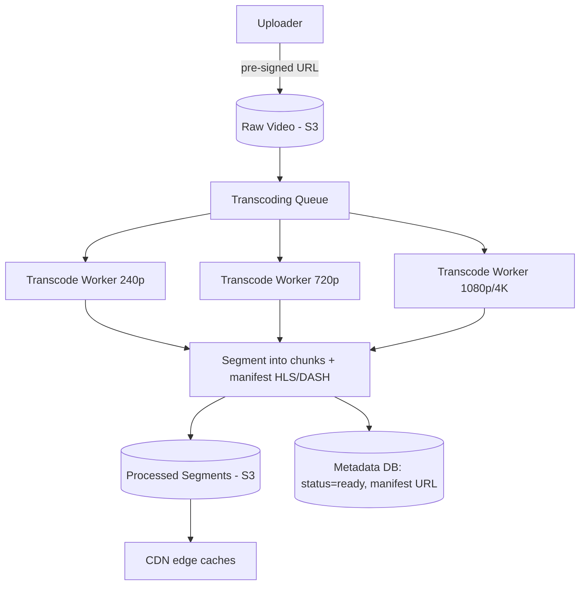
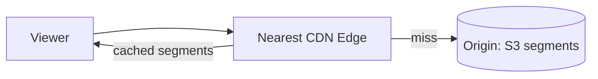
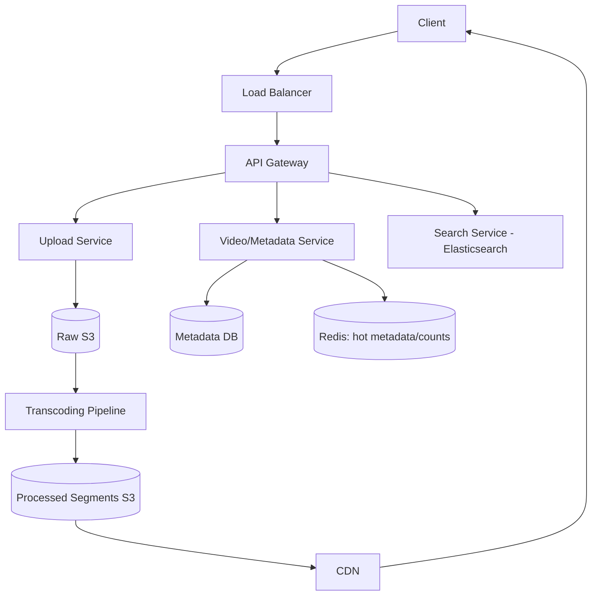

# Design YouTube / Netflix (Video Streaming)

[← HLD Index](../README.md) | [Back to Hub](../../README.md)

> **Asked at:** Google, Netflix, Amazon, Meta. Teaches **video transcoding**, **adaptive streaming**, and heavy **CDN** usage.

---

## Step 1 — Requirements

### Functional
1. **Upload** videos.
2. **Stream / watch** videos (smooth playback, multiple qualities).
3. Search videos.
4. Likes, comments, views, subscriptions.
5. (Optional) recommendations.

### Non-Functional
- **Highly available**; smooth, low-buffering playback.
- **Scalable** to billions of views.
- **Read-heavy** (views ≫ uploads, ~1000:1+).
- Handle videos from KB to many GB.

---

## Step 2 — Capacity Estimation

```
Uploads: 500 hours of video/min (YouTube-scale)
Views: billions/day. Read:write ≈ 1000:1+ → extremely read-heavy
Storage: raw + multiple transcoded resolutions (240p…4K)
  1 min 1080p ≈ 50 MB → multiply by resolutions → petabytes/exabytes
Bandwidth: the dominant cost — Tbps of egress globally → CDN is mandatory
```
→ Two giant problems: **storage/transcoding** (write path) and **streaming delivery** (read path, CDN).

---

## Step 3 — API Design

```
POST /videos (initiate upload)         → uploadUrl (pre-signed), videoId
POST /videos/{id}/complete             → triggers transcoding
GET  /videos/{id}                       → metadata + manifest URL
GET  /watch/{id}                        → streaming manifest (HLS/DASH)
GET  /search?q=...                      → results
```

---

## Step 4 — Data Model

```
videos(video_id PK, uploader_id, title, description, status,
       duration, thumbnail_url, manifest_url, created_at, view_count)
video_files(video_id, resolution, codec, url, size)   -- per-rendition
users, subscriptions, comments, likes ...
```
- Metadata: sharded SQL / NoSQL.
- Video files (raw + renditions): **object storage (S3/GCS)** → served via **CDN**.

---

## Step 5 — The Upload & Transcoding Pipeline (write path)

Raw uploads must be converted into many **resolutions** (240p, 360p, 480p, 720p, 1080p, 4K) and **formats/codecs**, then segmented for adaptive streaming.



1. Client uploads raw video directly to **S3** (pre-signed URL, chunked/resumable for large files).
2. A message goes to a **transcoding queue** (Kafka).
3. **Transcoding workers** (often a DAG of parallel jobs) produce each resolution/codec.
4. Each rendition is **segmented** into small chunks (2–10s) + a **manifest** (HLS `.m3u8` / DASH `.mpd`).
5. Segments are pushed to **object storage** and distributed to **CDN** edges.
6. Metadata status → `ready`; video becomes watchable.

> Transcoding is CPU-intensive and **massively parallel** — split the video into chunks, transcode chunks concurrently across a worker fleet, then stitch.

---

## Step 6 — Streaming (read path) & Adaptive Bitrate

### Adaptive Bitrate Streaming (ABR) — HLS / DASH
The video is delivered as a **manifest** listing chunked segments at multiple bitrates. The **player** monitors bandwidth and **switches quality per segment** — higher quality on fast networks, lower on congestion — avoiding buffering.

```
manifest.m3u8
 ├── 240p/segment_0.ts, segment_1.ts ...
 ├── 720p/segment_0.ts, segment_1.ts ...
 └── 1080p/segment_0.ts, segment_1.ts ...
Player picks the rendition per segment based on current bandwidth.
```

### CDN is everything for delivery
- Segments are cached at **CDN edges** worldwide → users stream from the nearest edge.
- Hugely reduces origin load and latency/buffering. → [CDN](../building-blocks/cdn.md)
- Popular videos are widely replicated; the **long tail** may be pulled on demand.



---

## Full Architecture



---

## Step 7 — Deep Dives & Trade-offs

### View counts at scale
Billions of views → don't update a row per view (hot row). Use **async aggregation** (stream view events to Kafka → batch update) and show **approximate** counts.

### Thumbnails
Generated during processing; small images served via CDN.

### Search & recommendations
- Search: index titles/descriptions/tags in **Elasticsearch**.
- Recommendations: separate ML pipeline over watch history/engagement.

### Resumable uploads
Large files → chunked, resumable uploads (tus/multipart) to survive network drops.

### Netflix specifics
- Pre-encodes a fixed catalog (not user uploads) → can optimize encodes heavily (per-title encoding).
- **Open Connect**: Netflix places its own CDN appliances inside ISPs for efficiency.

### Storage tiering
Hot (popular) content on fast storage/CDN; cold (long tail) on cheaper storage, pulled on demand.

---

## Follow-up Questions
- *Live streaming?* → low-latency HLS/WebRTC, real-time transcoding, segment delivery with tiny chunks.
- *DRM / piracy?* → encrypted segments + license server (Widevine/FairPlay).
- *How to reduce buffering?* → ABR + edge caching + prefetching next segments.
- *Cost?* → bandwidth dominates → CDN strategy, per-title encoding, P2P (in some designs).

---

## Key Takeaways
- Two big problems: **transcoding pipeline** (write) and **CDN streaming** (read).
- Upload raw to **S3**, then **transcode in parallel** into many **resolutions/codecs**, **segment** into chunks + **manifest**.
- Deliver via **adaptive bitrate streaming (HLS/DASH)** — player switches quality per segment to avoid buffering.
- **CDN** is mandatory — bandwidth is the dominant cost; cache segments at the edge worldwide.
- Handle **view counts** async/approximate; offload **search** to Elasticsearch.

---
[← HLD Index](../README.md) | [Back to Hub](../../README.md)
