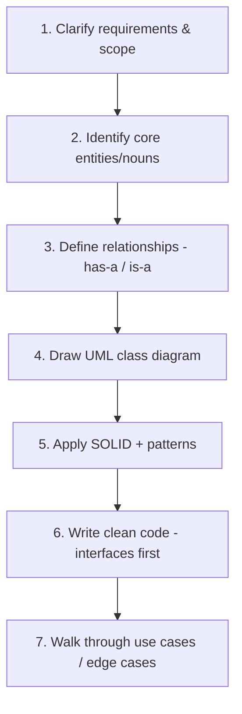

# 🧱 Low-Level Design (LLD)

[← Back to Hub](../README.md)

Low-Level Design (a.k.a. **machine coding** / **object-oriented design**) zooms into a **single component** and designs its **classes, objects, interfaces, and interactions** with clean, extensible, maintainable code. It tests your grasp of **OOP, SOLID, and design patterns**.

> HLD asks *"how do services fit together?"* — LLD asks *"how do classes fit together?"*

---

## 📂 Contents

### Foundations
- [OOP Principles](./oop-principles.md) — Encapsulation, Abstraction, Inheritance, Polymorphism
- [SOLID Principles](./solid-principles.md) — the 5 rules of good OO design
- [UML Diagrams Cheat Sheet](./uml-diagrams.md) — class diagrams & relationships

### Design Patterns — [`/design-patterns`](./design-patterns)
- [Creational](./design-patterns/creational.md) — Singleton, Factory, Abstract Factory, Builder, Prototype
- [Structural](./design-patterns/structural.md) — Adapter, Decorator, Facade, Proxy, Composite, Bridge
- [Behavioral](./design-patterns/behavioral.md) — Strategy, Observer, State, Command, Template Method

### Problems — [`/problems`](./problems)
| Problem | Patterns practiced |
|---------|--------------------|
| [Parking Lot](./problems/parking-lot.md) | Strategy, Factory, Singleton |
| [Elevator System](./problems/elevator-system.md) | State, Strategy, scheduling |
| [Tic-Tac-Toe](./problems/tic-tac-toe.md) | State, Strategy, clean modeling |
| [Library Management](./problems/library-management.md) | Entity modeling, Observer |
| [Splitwise](./problems/splitwise.md) | Strategy (split types), graph settle |
| [Vending Machine](./problems/vending-machine.md) | State pattern |

---

## 🎯 How to Approach an LLD / Machine-Coding Problem

### The recipe
1. **Clarify requirements** — list features and scope; ask about edge cases. Narrow it.
2. **Identify entities** — pull the **nouns** from requirements (Car, Slot, Ticket → classes). Pull **verbs** → methods.
3. **Relationships** — `has-a` (composition/aggregation) vs `is-a` (inheritance). Prefer composition.
4. **Define interfaces / abstractions** first (program to interfaces).
5. **Apply [SOLID](./solid-principles.md)** and the right **[design pattern](./design-patterns)** — but don't over-pattern.
6. **Write code** — enums, classes, methods; show key logic.
7. **Demonstrate usage** — a `main`/driver exercising the design; discuss extensibility.

### What interviewers reward
- ✅ Clean separation of concerns (each class one job).
- ✅ Extensible design (add features without rewriting — Open/Closed).
- ✅ Right abstractions & patterns (used, not forced).
- ✅ Handling edge cases & concurrency where relevant.
- ❌ God classes, deep inheritance, hard-coded logic, premature optimization.

---

## Common Pitfalls
- **Over-engineering** — don't apply 5 patterns to a 3-class problem.
- **God object** — one class doing everything (violates SRP).
- **Inheritance abuse** — favor composition over deep hierarchies.
- **Ignoring extensibility** — interviewers love asking "now add feature X."
- **Skipping the diagram** — model before you code.

[← Back to Hub](../README.md)
