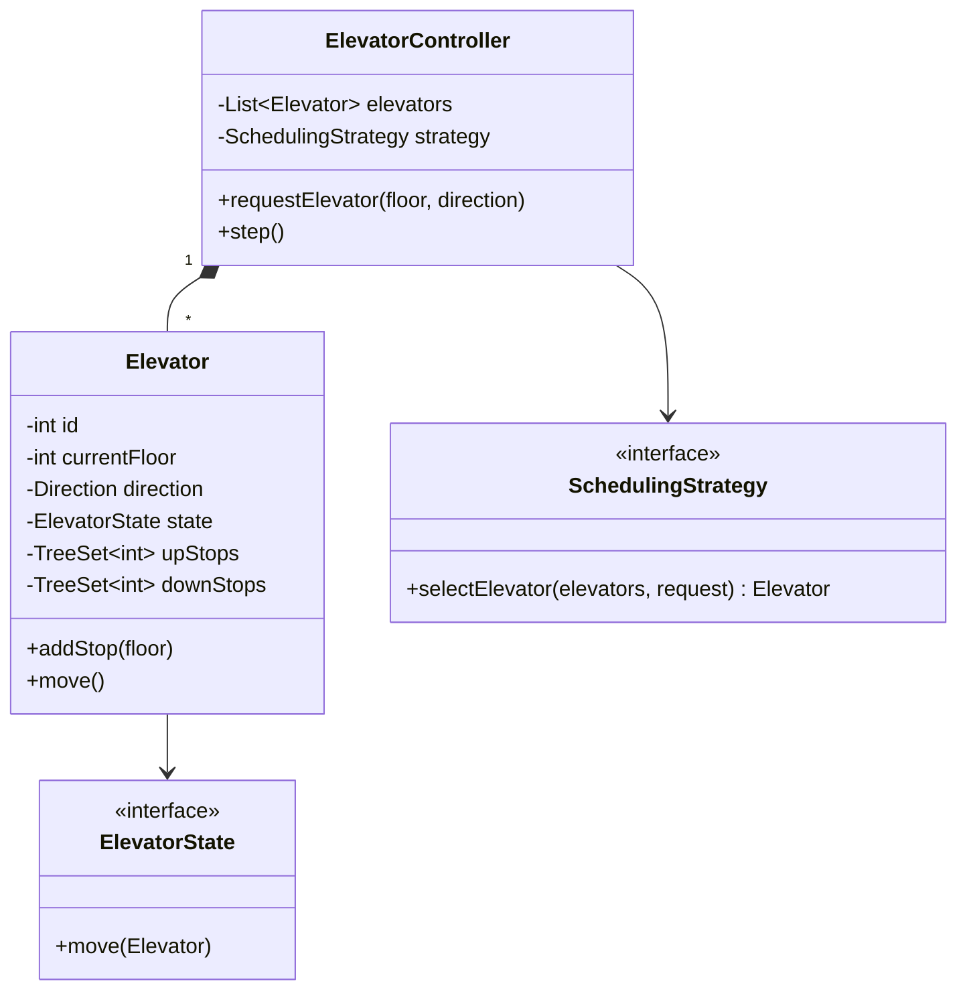

# LLD: Design an Elevator System

[← LLD Index](../README.md) | [Back to Hub](../../README.md)

> **Asked at:** Amazon, Google, Uber, Qualcomm. Tests the **State** pattern and scheduling logic.

---

## Step 1 — Requirements

### Functional
1. A building with **N floors** and **M elevators**.
2. **External requests** (hall call: up/down button on a floor).
3. **Internal requests** (panel inside elevator: target floor).
4. Elevator moves up/down, opens doors, serves requests efficiently.
5. A **scheduler/dispatcher** assigns the best elevator to a hall call.

### Non-Functional
- Minimize wait time & travel.
- Extensible scheduling algorithm.
- Thread-safe (concurrent button presses).

---

## Step 2 — Entities
`Building`, `Elevator`, `ElevatorController` (dispatcher), `Request` (internal/external), `Direction` (UP/DOWN/IDLE), `ElevatorState`, `Door`, `Button/Panel`.

---

## Step 3 — Class Diagram



---

## Step 4 — Core Code (Java)

```java
enum Direction { UP, DOWN, IDLE }

// --- State pattern for elevator behavior ---
interface ElevatorState { void move(Elevator e); }

class IdleState implements ElevatorState {
    public void move(Elevator e){ /* waits; transitions when a stop is added */ }
}
class MovingUpState implements ElevatorState {
    public void move(Elevator e){
        e.setCurrentFloor(e.getCurrentFloor() + 1);
        e.serveIfStop();
    }
}
class MovingDownState implements ElevatorState {
    public void move(Elevator e){
        e.setCurrentFloor(e.getCurrentFloor() - 1);
        e.serveIfStop();
    }
}

class Elevator {
    private int id;
    private int currentFloor = 0;
    private Direction direction = Direction.IDLE;
    private ElevatorState state = new IdleState();
    // Use sorted sets so we serve stops in travel order (SCAN/elevator algorithm)
    private TreeSet<Integer> upStops = new TreeSet<>();
    private TreeSet<Integer> downStops = new TreeSet<>(Collections.reverseOrder());

    Elevator(int id){ this.id = id; }

    synchronized void addStop(int floor){
        if (floor > currentFloor) upStops.add(floor);
        else if (floor < currentFloor) downStops.add(floor);
        updateStateFromDirection();
    }

    void serveIfStop(){
        if (direction == Direction.UP && !upStops.isEmpty() && currentFloor == upStops.first()){
            upStops.pollFirst(); openDoors();
        } else if (direction == Direction.DOWN && !downStops.isEmpty() && currentFloor == downStops.first()){
            downStops.pollFirst(); openDoors();
        }
        if (upStops.isEmpty() && downStops.isEmpty()) { direction = Direction.IDLE; state = new IdleState(); }
    }

    private void updateStateFromDirection(){
        if (direction == Direction.IDLE){
            if (!upStops.isEmpty()){ direction = Direction.UP; state = new MovingUpState(); }
            else if (!downStops.isEmpty()){ direction = Direction.DOWN; state = new MovingDownState(); }
        }
    }
    void move(){ state.move(this); }
    void openDoors(){ /* open/close door sequence */ }

    int getCurrentFloor(){ return currentFloor; }
    void setCurrentFloor(int f){ this.currentFloor = f; }
    Direction getDirection(){ return direction; }
}

// --- Strategy pattern for dispatching ---
interface SchedulingStrategy { Elevator selectElevator(List<Elevator> es, int floor, Direction dir); }

class NearestElevatorStrategy implements SchedulingStrategy {
    public Elevator selectElevator(List<Elevator> es, int floor, Direction dir){
        Elevator best = null; int minDist = Integer.MAX_VALUE;
        for (Elevator e : es){
            // prefer idle elevators or ones already heading toward the floor
            int dist = Math.abs(e.getCurrentFloor() - floor);
            boolean suitable = e.getDirection() == Direction.IDLE || e.getDirection() == dir;
            if (suitable && dist < minDist){ minDist = dist; best = e; }
        }
        return best != null ? best : es.get(0);
    }
}

class ElevatorController {
    private List<Elevator> elevators;
    private SchedulingStrategy strategy;
    ElevatorController(List<Elevator> e, SchedulingStrategy s){ this.elevators = e; this.strategy = s; }

    void externalRequest(int floor, Direction dir){          // hall call
        Elevator e = strategy.selectElevator(elevators, floor, dir);
        e.addStop(floor);
    }
    void internalRequest(Elevator e, int targetFloor){       // panel press
        e.addStop(targetFloor);
    }
    void step(){ for (Elevator e : elevators) e.move(); }     // simulation tick
}
```

---

## Step 5 — Scheduling Algorithms
- **SCAN / Elevator algorithm** ⭐ — keep moving in one direction serving all stops, then reverse (like the code's sorted up/down stop sets). Minimizes direction changes.
- **Nearest car / FCFS** — simplest; assign closest idle elevator.
- **LOOK** — like SCAN but reverse as soon as no more stops ahead.
- Make it a **Strategy** so the algorithm is swappable.

---

## Step 6 — Patterns & Principles

| Pattern | Where |
|---------|-------|
| **State** | `ElevatorState` (Idle/MovingUp/MovingDown) — behavior changes by state |
| **Strategy** | `SchedulingStrategy` — swap dispatching algorithm |
| **Observer** (optional) | Floor displays subscribe to elevator position |
| **SRP** | Controller dispatches, Elevator moves/serves, Strategy decides |
| **OCP** | New scheduling algorithm = new Strategy class |

---

## Follow-up Questions
- *Multiple elevators, optimize globally?* → strategy considers load, direction, future requests.
- *Express/VIP elevators?* → elevator capability flags + strategy.
- *Weight/capacity limits?* → reject internal requests when full.
- *Concurrency?* → synchronize stop-set mutations; controller runs a simulation loop/thread per elevator.

---

## Key Takeaways
- Model `ElevatorController (dispatcher) → Elevators`, each with internal/external requests.
- Use the **State pattern** for elevator behavior (Idle / MovingUp / MovingDown) — cleaner than state `if/else`.
- Use the **Strategy pattern** for the **scheduling/dispatch** algorithm (SCAN/LOOK/nearest), swappable.
- Serve stops in travel order with **sorted sets** (the SCAN/elevator algorithm) to minimize direction changes.

---
[← Parking Lot](./parking-lot.md) | [Next: Tic-Tac-Toe →](./tic-tac-toe.md)
