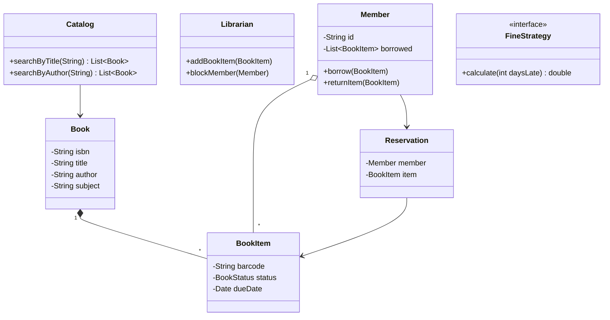

# LLD: Design a Library Management System

[← LLD Index](../README.md) | [Back to Hub](../../README.md)

> **Asked at:** Amazon, Oracle, Microsoft. Tests entity modeling, relationships, and the Observer pattern.

---

## Step 1 — Requirements

### Functional
1. **Books** with multiple physical **copies** (`BookItem`).
2. **Members** search by title/author/subject and **borrow/return/reserve** books.
3. Borrowing limits (e.g., max 5 books) and **due dates**; **fines** for late returns.
4. **Librarians** add/remove books, manage members.
5. Notify members on availability of a reserved book and on overdue items.

### Non-Functional
- Extensible (e-books, new fine policies, notification channels).
- Clear separation of catalog, accounts, lending.

---

## Step 2 — Entities
`Library`, `Book` (logical), `BookItem` (physical copy), `Member`, `Librarian`, `Account`, `Catalog/Search`, `Lending/Loan`, `Reservation`, `Fine`, `Notification`.

> Key modeling insight: separate **`Book`** (title/author/ISBN — the abstract work) from **`BookItem`** (a specific copy with a barcode that can be lent).

---

## Step 3 — Class Diagram



---

## Step 4 — Core Code (Java)

```java
enum BookStatus { AVAILABLE, LOANED, RESERVED, LOST }

class Book {
    String isbn, title, author, subject;
    List<BookItem> items = new ArrayList<>();
    Book(String isbn, String title, String author, String subject){
        this.isbn=isbn; this.title=title; this.author=author; this.subject=subject;
    }
}

class BookItem {
    String barcode;
    BookStatus status = BookStatus.AVAILABLE;
    Date dueDate;
    Book book;
    BookItem(String barcode, Book book){ this.barcode=barcode; this.book=book; }
}

// --- Strategy for fines (extensible policy) ---
interface FineStrategy { double calculate(int daysLate); }
class FlatPerDayFine implements FineStrategy {
    public double calculate(int daysLate){ return Math.max(0, daysLate) * 1.0; }
}

class Member {
    String id; String name;
    private List<BookItem> borrowed = new ArrayList<>();
    private static final int MAX_BOOKS = 5;
    private static final int LOAN_DAYS = 14;

    boolean borrow(BookItem item){
        if (borrowed.size() >= MAX_BOOKS) throw new RuntimeException("Borrow limit reached");
        if (item.status != BookStatus.AVAILABLE) throw new RuntimeException("Not available");
        item.status = BookStatus.LOANED;
        item.dueDate = addDays(new Date(), LOAN_DAYS);
        borrowed.add(item);
        return true;
    }
    double returnItem(BookItem item, FineStrategy fineStrategy){
        borrowed.remove(item);
        int daysLate = daysBetween(item.dueDate, new Date());
        item.status = BookStatus.AVAILABLE;
        // notify reservers via Observer (see below)
        return fineStrategy.calculate(daysLate);
    }
    private Date addDays(Date d, int n){ /* ... */ return d; }
    private int daysBetween(Date a, Date b){ /* ... */ return 0; }
}

// --- Observer pattern for reservation notifications ---
interface Observer { void notify(String msg); }
class EmailObserver implements Observer { public void notify(String m){ /* send email */ } }

class ReservationService {                 // subject
    private Map<String, List<Observer>> waitlist = new HashMap<>();  // barcode -> observers
    void reserve(String barcode, Observer member){
        waitlist.computeIfAbsent(barcode, k -> new ArrayList<>()).add(member);
    }
    void onBookReturned(String barcode){
        List<Observer> list = waitlist.getOrDefault(barcode, List.of());
        if (!list.isEmpty()) list.get(0).notify("Your reserved book is available!");
    }
}

class Catalog {                            // search
    private List<Book> books = new ArrayList<>();
    List<Book> searchByTitle(String t){
        return books.stream().filter(b -> b.title.contains(t)).collect(Collectors.toList());
    }
    List<Book> searchByAuthor(String a){
        return books.stream().filter(b -> b.author.contains(a)).collect(Collectors.toList());
    }
}
```

---

## Step 5 — Patterns & Principles

| Pattern / Principle | Where |
|---------------------|-------|
| **Strategy** | `FineStrategy` — swap fine policies |
| **Observer** | `ReservationService` notifies waitlisted members when a copy returns |
| **Book vs BookItem** | Separate logical work from physical copy (critical modeling) |
| **SRP** | `Catalog` searches, `Member` borrows, `ReservationService` reserves/notifies |
| **OCP** | New fine policy / notification channel = new class |
| **Factory** (optional) | Create members/librarians or book items |

---

## Follow-up Questions
- *E-books / audiobooks?* → subtype `BookItem` or add a `format`; e-books have unlimited copies.
- *Different fine rules per member tier?* → swap `FineStrategy`.
- *Notify via SMS too?* → add an `SmsObserver` (Observer + [notification system](../../hld/case-studies/notification-system.md)).
- *Search at scale?* → externalize to an index (Elasticsearch) — bridges to HLD.

---

## Key Takeaways
- Separate **`Book` (logical work)** from **`BookItem` (physical, lendable copy)** — the key modeling decision.
- Use **Strategy** for fine policies and **Observer** for reservation/availability notifications.
- Keep responsibilities split: **Catalog** (search), **Member** (borrow/return), **ReservationService** (reserve/notify).
- Apply **OCP** so new formats, fine rules, and channels are added without modifying existing code.

---
[← Tic-Tac-Toe](./tic-tac-toe.md) | [Next: Splitwise →](./splitwise.md)
