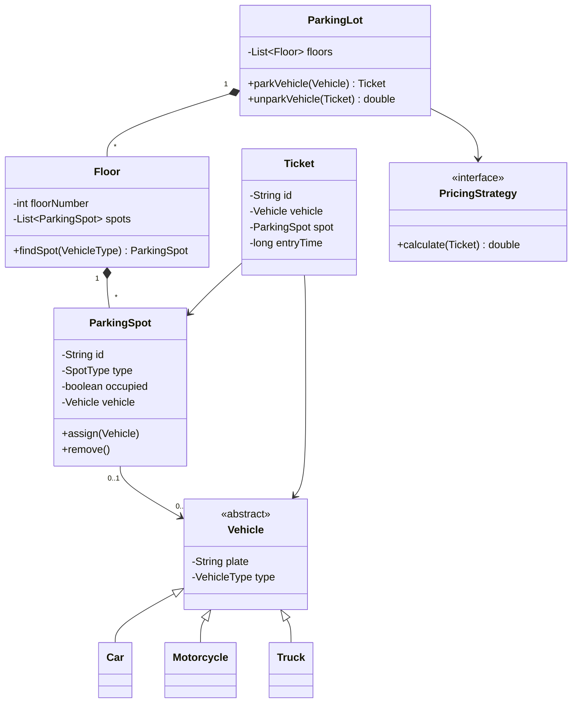

# LLD: Design a Parking Lot

[← LLD Index](../README.md) | [Back to Hub](../../README.md)

> **Asked at:** Amazon, Google, Microsoft, Qualcomm. The most classic LLD/machine-coding problem.

---

## Step 1 — Requirements

### Functional
1. A parking lot with **multiple floors**, each with multiple **spots**.
2. **Spot types**: Motorcycle, Compact (car), Large (truck) — vehicles fit appropriate spots.
3. **Park** a vehicle → assign nearest available spot, issue a **ticket**.
4. **Unpark** → free the spot, **calculate fee** based on duration.
5. Multiple **entry/exit** gates.
6. Track availability; reject when full.

### Non-Functional
- Extensible (new vehicle types, pricing strategies).
- Thread-safe (concurrent parking from multiple gates).

---

## Step 2 — Identify Entities (nouns)

`ParkingLot`, `Floor`, `ParkingSpot`, `Vehicle`, `Ticket`, `EntryGate`, `ExitGate`, `Payment`, `PricingStrategy`.

---

## Step 3 — Class Diagram



---

## Step 4 — Core Code (Java)

```java
enum VehicleType { MOTORCYCLE, CAR, TRUCK }
enum SpotType    { MOTORCYCLE, COMPACT, LARGE }

abstract class Vehicle {
    protected String plate;
    protected VehicleType type;
    Vehicle(String plate, VehicleType type){ this.plate = plate; this.type = type; }
    public VehicleType getType(){ return type; }
}
class Car extends Vehicle { Car(String p){ super(p, VehicleType.CAR); } }
class Motorcycle extends Vehicle { Motorcycle(String p){ super(p, VehicleType.MOTORCYCLE); } }
class Truck extends Vehicle { Truck(String p){ super(p, VehicleType.TRUCK); } }

class ParkingSpot {
    private String id;
    private SpotType type;
    private boolean occupied;
    private Vehicle vehicle;

    ParkingSpot(String id, SpotType type){ this.id = id; this.type = type; }

    boolean canFit(Vehicle v){
        if (occupied) return false;
        // simple fit rule: motorcycle→any, car→compact/large, truck→large
        switch (v.getType()) {
            case MOTORCYCLE: return true;
            case CAR:        return type == SpotType.COMPACT || type == SpotType.LARGE;
            case TRUCK:      return type == SpotType.LARGE;
        }
        return false;
    }
    synchronized boolean assign(Vehicle v){
        if (!canFit(v)) return false;
        this.vehicle = v; this.occupied = true; return true;
    }
    synchronized void remove(){ this.vehicle = null; this.occupied = false; }
    boolean isOccupied(){ return occupied; }
}

class Floor {
    private int number;
    private List<ParkingSpot> spots = new ArrayList<>();
    Floor(int n){ this.number = n; }
    void addSpot(ParkingSpot s){ spots.add(s); }
    ParkingSpot findSpot(Vehicle v){
        for (ParkingSpot s : spots) if (s.canFit(v)) return s;
        return null;
    }
}

class Ticket {
    String id; Vehicle vehicle; ParkingSpot spot; long entryTime;
    Ticket(Vehicle v, ParkingSpot s){
        this.id = UUID.randomUUID().toString();
        this.vehicle = v; this.spot = s; this.entryTime = System.currentTimeMillis();
    }
}

// --- Strategy pattern for pricing (extensible) ---
interface PricingStrategy { double calculate(Ticket t); }
class HourlyPricing implements PricingStrategy {
    public double calculate(Ticket t){
        long hours = Math.max(1, (System.currentTimeMillis() - t.entryTime) / 3600000);
        return hours * 10.0;
    }
}

class ParkingLot {
    private List<Floor> floors;
    private PricingStrategy pricing;
    private Map<String, Ticket> activeTickets = new ConcurrentHashMap<>();

    ParkingLot(List<Floor> floors, PricingStrategy pricing){
        this.floors = floors; this.pricing = pricing;
    }

    synchronized Ticket park(Vehicle v){
        for (Floor f : floors){
            ParkingSpot spot = f.findSpot(v);
            if (spot != null && spot.assign(v)){
                Ticket t = new Ticket(v, spot);
                activeTickets.put(t.id, t);
                return t;
            }
        }
        throw new RuntimeException("Parking full for " + v.getType());
    }

    synchronized double unpark(String ticketId){
        Ticket t = activeTickets.remove(ticketId);
        if (t == null) throw new RuntimeException("Invalid ticket");
        double fee = pricing.calculate(t);
        t.spot.remove();
        return fee;
    }
}
```

---

## Step 5 — Patterns & Principles Used

| Pattern / Principle | Where |
|---------------------|-------|
| **Strategy** | `PricingStrategy` — swap hourly/daily/flat pricing without touching `ParkingLot` |
| **Factory** (optional) | A `VehicleFactory` to create vehicles from type |
| **Singleton** (optional) | One `ParkingLot` instance |
| **SRP** | `Floor` finds spots, `ParkingSpot` manages its state, `ParkingLot` orchestrates |
| **OCP** | Add a new `SpotType`/pricing without modifying existing logic |
| **Encapsulation** | Spot state hidden behind `assign()/remove()` |

---

## Step 6 — Concurrency
Multiple gates park simultaneously → race for the same spot. Guard spot assignment with **synchronization** (`synchronized assign()` / locks) or atomic CAS so two vehicles never get the same spot.

---

## Follow-up Questions
- *Add electric-charging spots?* → new `SpotType` + fit rule (OCP).
- *Different pricing on weekends?* → new `PricingStrategy`.
- *Find nearest spot to entrance?* → store distance/priority per spot; use a priority queue per floor.
- *Real-time availability display?* → maintain per-type free counts; **Observer** to update displays.
- *Reservations?* → add a `reserved` state to spots.

---

## Key Takeaways
- Model the **nouns** as classes: `ParkingLot → Floor → ParkingSpot`, `Vehicle` hierarchy, `Ticket`.
- Use **Strategy** for pricing (extensible) and optionally **Factory** for vehicle creation.
- Apply **SRP** (each class one job) and **OCP** (new spot/vehicle/pricing types without edits).
- Handle **concurrency** when assigning spots across multiple gates.

---
[← LLD Index](../README.md) | [Next: Elevator System →](./elevator-system.md)
