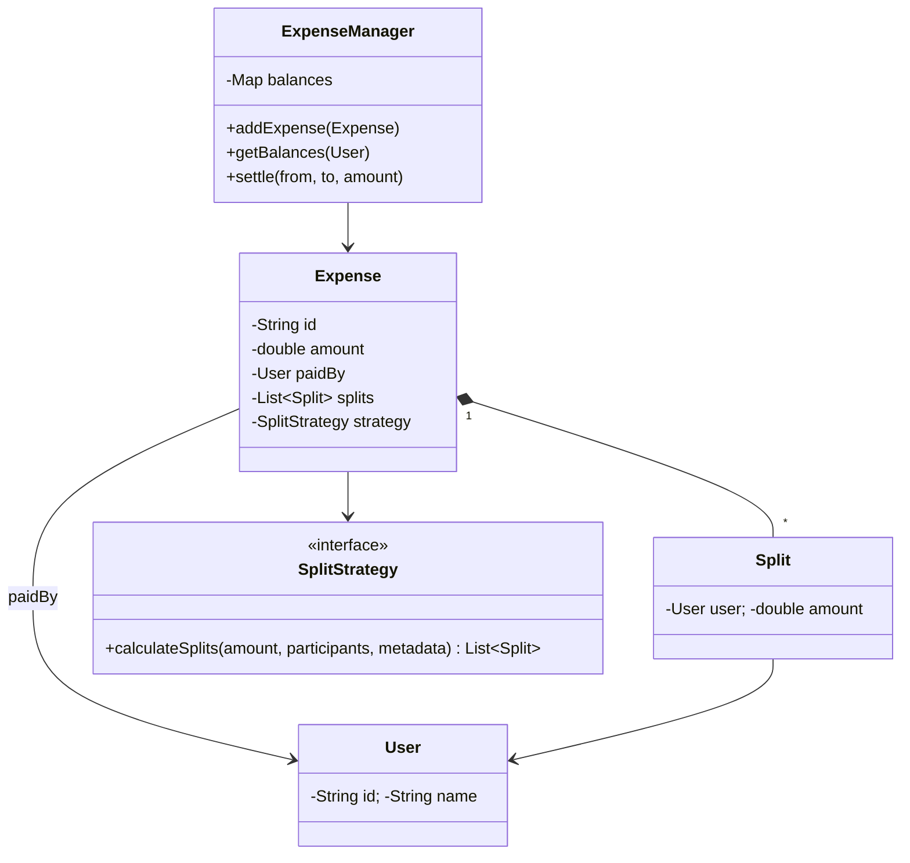

# LLD: Design Splitwise (Expense Sharing)

[← LLD Index](../README.md) | [Back to Hub](../../README.md)

> **Asked at:** Amazon, Google, Uber, Splitwise. Tests Strategy pattern (split types) and a graph-based settlement algorithm.

---

## Step 1 — Requirements

### Functional
1. Users create **groups** and add **expenses**.
2. Split an expense **equally**, by **exact amounts**, or by **percentage**.
3. Track **who owes whom** (balances).
4. **Settle up** — record payments; minimize the number of transactions.
5. Show a user's overall balance.

### Non-Functional
- Extensible split types.
- Accurate money math (avoid rounding leaks).

---

## Step 2 — Entities
`User`, `Group`, `Expense`, `Split` (User + amount), `SplitStrategy` (Equal/Exact/Percent), `BalanceSheet` (who owes whom), `Transaction`.

---

## Step 3 — Class Diagram



---

## Step 4 — Core Code (Java)

```java
class User { String id, name; User(String id, String name){ this.id=id; this.name=name; } }

class Split { User user; double amount; Split(User u, double a){ user=u; amount=a; } }

// --- Strategy pattern: split types ---
interface SplitStrategy {
    List<Split> calculateSplits(double amount, List<User> participants, double[] values);
}
class EqualSplit implements SplitStrategy {
    public List<Split> calculateSplits(double amount, List<User> users, double[] v){
        List<Split> splits = new ArrayList<>();
        double share = round(amount / users.size());
        double total = 0;
        for (int i = 0; i < users.size(); i++){
            double s = (i == users.size()-1) ? round(amount - total) : share; // last absorbs rounding
            total += s;
            splits.add(new Split(users.get(i), s));
        }
        return splits;
    }
    private double round(double x){ return Math.round(x*100.0)/100.0; }
}
class ExactSplit implements SplitStrategy {
    public List<Split> calculateSplits(double amount, List<User> users, double[] amts){
        double sum = Arrays.stream(amts).sum();
        if (Math.abs(sum - amount) > 1e-6) throw new IllegalArgumentException("Exact splits must sum to total");
        List<Split> splits = new ArrayList<>();
        for (int i = 0; i < users.size(); i++) splits.add(new Split(users.get(i), amts[i]));
        return splits;
    }
}
class PercentSplit implements SplitStrategy {
    public List<Split> calculateSplits(double amount, List<User> users, double[] pcts){
        if (Math.abs(Arrays.stream(pcts).sum() - 100.0) > 1e-6) throw new IllegalArgumentException("Percentages must sum to 100");
        List<Split> splits = new ArrayList<>();
        for (int i = 0; i < users.size(); i++) splits.add(new Split(users.get(i), amount * pcts[i] / 100.0));
        return splits;
    }
}

class Expense {
    String id; double amount; User paidBy; List<Split> splits;
    Expense(double amount, User paidBy, List<User> participants, SplitStrategy strategy, double[] values){
        this.id = UUID.randomUUID().toString();
        this.amount = amount; this.paidBy = paidBy;
        this.splits = strategy.calculateSplits(amount, participants, values);
    }
}

class ExpenseManager {
    // balances[a][b] = how much a owes b
    private Map<String, Map<String, Double>> balances = new HashMap<>();

    void addExpense(Expense e){
        for (Split split : e.splits){
            if (split.user.id.equals(e.paidBy.id)) continue;        // payer doesn't owe self
            // split.user owes paidBy 'split.amount'
            adjust(split.user.id, e.paidBy.id, split.amount);
        }
    }
    private void adjust(String debtor, String creditor, double amt){
        balances.computeIfAbsent(debtor, k -> new HashMap<>())
                .merge(creditor, amt, Double::sum);
        // net against the reverse direction
        double reverse = balances.getOrDefault(creditor, Map.of()).getOrDefault(debtor, 0.0);
        if (reverse > 0){
            double net = balances.get(debtor).get(creditor) - reverse;
            balances.get(creditor).remove(debtor);
            balances.get(debtor).remove(creditor);
            if (net > 0) balances.get(debtor).put(creditor, net);
            else if (net < 0) balances.computeIfAbsent(creditor, k->new HashMap<>()).put(debtor, -net);
        }
    }
    double getBalance(String userId){
        double owedToThem = 0, theyOwe = 0;
        for (var entry : balances.getOrDefault(userId, Map.of()).entrySet()) theyOwe += entry.getValue();
        for (var m : balances.entrySet())
            owedToThem += m.getValue().getOrDefault(userId, 0.0);
        return owedToThem - theyOwe;   // net: positive = others owe you
    }
}
```

---

## Step 5 — Debt Simplification (settlement algorithm)

To **minimize transactions**, compute each person's **net balance** (total owed − total owing), then greedily match the biggest **creditor** with the biggest **debtor**:

```
1. net[user] = sum(received) - sum(paid)
2. Separate into creditors (net > 0) and debtors (net < 0).
3. Greedily: take max creditor & max debtor, settle min(|amounts|),
   push remainder back. Repeat until all zero.
→ Reduces N×N pairwise debts to ≤ N-1 transactions.
```
This turns a tangled web of debts into the fewest payments (a classic greedy / min-cash-flow problem).

---

## Step 6 — Patterns & Principles

| Pattern / Principle | Where |
|---------------------|-------|
| **Strategy** | `SplitStrategy` (Equal/Exact/Percent) — add new split types without edits |
| **SRP** | `Expense` models one expense; `ExpenseManager` tracks balances |
| **OCP** | New split type / settlement algo = new class |
| **Money correctness** | Round carefully; last split absorbs rounding remainder |

---

## Follow-up Questions
- *New split type (by shares)?* → add a `ShareSplit` strategy.
- *Currencies?* → store currency per expense; convert on display.
- *Groups vs friends?* → group holds members; expenses scoped to a group.
- *Concurrency / persistence?* → bridges to HLD (DB for balances, transactions).
- *Floating-point errors?* → use integer cents or `BigDecimal`.

---

## Key Takeaways
- Use the **Strategy pattern** for split types (**Equal / Exact / Percent**) — the central design choice.
- Track balances as a **who-owes-whom map**, netting reverse debts as you go.
- **Simplify debts** with a greedy net-balance algorithm to minimize the number of settlement transactions (≤ N−1).
- Handle **money rounding** carefully (last split absorbs the remainder; prefer integer cents/`BigDecimal`).

---
[← Library Management](./library-management.md) | [Next: Vending Machine →](./vending-machine.md)
