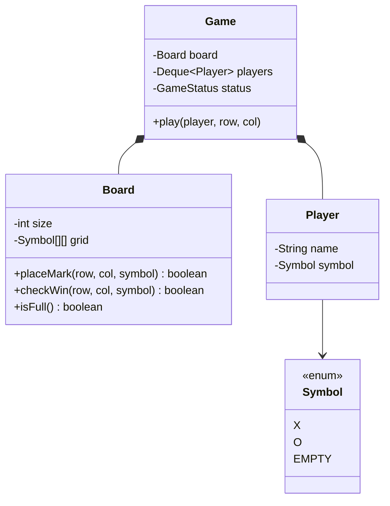

# LLD: Design Tic-Tac-Toe

[← LLD Index](../README.md) | [Back to Hub](../../README.md)

> **Asked at:** Amazon, Microsoft, Adobe. A small problem that rewards clean modeling and extensibility (generalize to N×N).

---

## Step 1 — Requirements

### Functional
1. Two players alternate marking cells on a **3×3** (generalize to **N×N**) board.
2. A player wins with N-in-a-row (row, column, or diagonal).
3. Detect **win** and **draw** (board full, no winner).
4. Reject invalid moves (occupied cell, out of bounds, out of turn).

### Non-Functional
- Extensible to N×N and possibly more players/symbols.
- Clean separation: board, game rules, players.

---

## Step 2 — Entities
`Game`, `Board`, `Cell`, `Player`, `Symbol/Piece` (X/O), `GameStatus`.

---

## Step 3 — Class Diagram



---

## Step 4 — Core Code (Java)

```java
enum Symbol { X, O, EMPTY }
enum GameStatus { IN_PROGRESS, WIN, DRAW }

class Player {
    private final String name;
    private final Symbol symbol;
    Player(String name, Symbol symbol){ this.name = name; this.symbol = symbol; }
    public Symbol getSymbol(){ return symbol; }
    public String getName(){ return name; }
}

class Board {
    private final int size;
    private final Symbol[][] grid;
    private int filledCount = 0;

    Board(int size){
        this.size = size;
        grid = new Symbol[size][size];
        for (Symbol[] row : grid) Arrays.fill(row, Symbol.EMPTY);
    }

    boolean placeMark(int r, int c, Symbol s){
        if (r < 0 || r >= size || c < 0 || c >= size) return false;  // bounds
        if (grid[r][c] != Symbol.EMPTY) return false;                // occupied
        grid[r][c] = s; filledCount++;
        return true;
    }

    boolean isFull(){ return filledCount == size * size; }

    // Only need to check the row/col/diagonals through the last move (efficient)
    boolean checkWin(int r, int c, Symbol s){
        boolean row = true, col = true, diag = true, anti = true;
        for (int i = 0; i < size; i++){
            if (grid[r][i] != s) row = false;
            if (grid[i][c] != s) col = false;
            if (grid[i][i] != s) diag = false;
            if (grid[i][size - 1 - i] != s) anti = false;
        }
        return row || col || (r == c && diag) || (r + c == size - 1 && anti);
    }
}

class Game {
    private final Board board;
    private final Deque<Player> players = new ArrayDeque<>();
    private GameStatus status = GameStatus.IN_PROGRESS;

    Game(int size, Player p1, Player p2){
        board = new Board(size);
        players.add(p1); players.add(p2);
    }

    public GameStatus play(int r, int c){
        if (status != GameStatus.IN_PROGRESS) throw new IllegalStateException("Game over");
        Player current = players.peekFirst();
        if (!board.placeMark(r, c, current.getSymbol()))
            throw new IllegalArgumentException("Invalid move");

        if (board.checkWin(r, c, current.getSymbol())){
            status = GameStatus.WIN;
            System.out.println(current.getName() + " wins!");
        } else if (board.isFull()){
            status = GameStatus.DRAW;
            System.out.println("Draw!");
        } else {
            players.addLast(players.pollFirst());   // rotate turn
        }
        return status;
    }
}

// Driver
// Game g = new Game(3, new Player("Alice", Symbol.X), new Player("Bob", Symbol.O));
// g.play(0,0); g.play(1,1); ...
```

---

## Step 5 — Design Notes

- **Turn rotation** via a deque (`pollFirst` → play → `addLast`) — clean and extends to >2 players.
- **Win check optimization:** only examine the **last move's** row, column, and (if applicable) diagonals → O(N) instead of scanning the whole board.
- **Generalized to N×N** by parameterizing `size`.
- **Encapsulation:** `Board` owns the grid and win logic; `Game` orchestrates turns/status; `Player` is immutable.

### Optional patterns
- **Strategy** for win-checking or AI move selection (human vs computer player).
- **State** pattern for `GameStatus` transitions if logic grows.
- **Factory** for creating players (human/AI).

---

## Follow-up Questions
- *Generalize to N×N / K-in-a-row?* → parameterize board size and win length.
- *Add an AI opponent?* → `Player` interface with `HumanPlayer` / `AIPlayer` (Minimax) — **Strategy/polymorphism**.
- *Undo a move?* → **Command** pattern storing moves; or keep a move stack.
- *Connect Four / larger games?* → same structure, different placement & win rules.

---

## Key Takeaways
- Keep responsibilities separate: **`Board`** (grid + win/draw logic), **`Game`** (turns + status), **`Player`** (immutable).
- Optimize win-check to the **last move's lines** — O(N), not O(N²).
- Parameterize **size** to generalize to N×N; rotate turns with a **deque** (supports >2 players).
- Extend with **Strategy** (AI/win rules), **Command** (undo), and **Factory** (player types).

---
[← Elevator System](./elevator-system.md) | [Next: Library Management →](./library-management.md)
