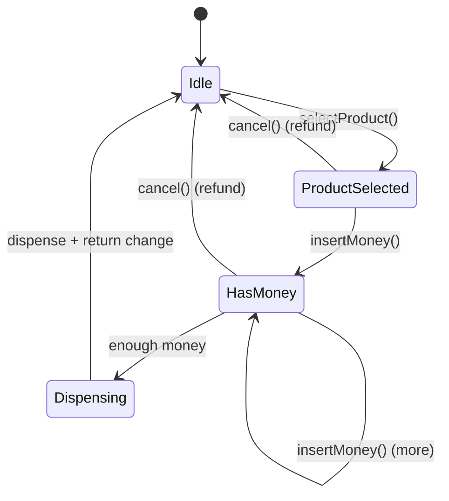
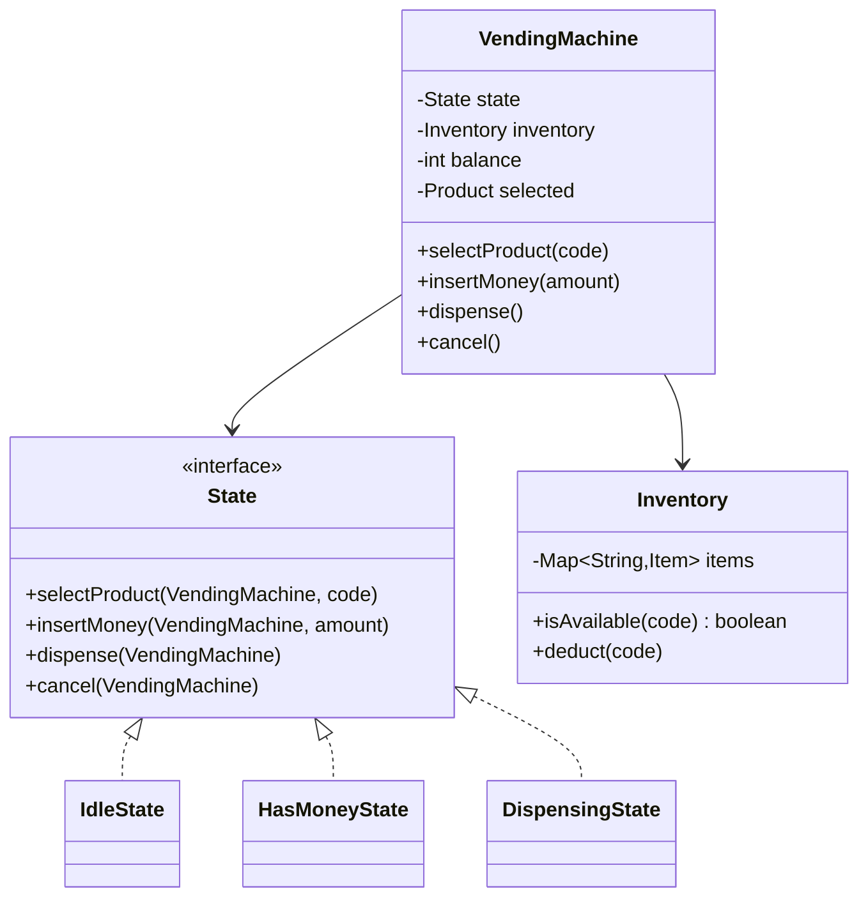

# LLD: Design a Vending Machine

[← LLD Index](../README.md) | [Back to Hub](../../README.md)

> **Asked at:** Amazon, Google, Qualcomm, PayPal. The canonical **State pattern** problem.

---

## Step 1 — Requirements

### Functional
1. Display products with prices; track **inventory**.
2. User **selects a product**, **inserts money** (coins/notes), machine **dispenses** the item and **returns change**.
3. Handle: insufficient money, out of stock, **cancel** (refund), exact-change availability.
4. Admin can **refill** inventory and collect cash.

### Non-Functional
- Clean handling of the machine's **states** and transitions.
- Extensible (new payment types, products).

---

## Step 2 — The State Machine

A vending machine is naturally a **finite state machine**. The **State pattern** models each state as a class, avoiding a giant `switch(currentState)`.



| State | Allowed actions |
|-------|-----------------|
| **Idle** | select product |
| **ProductSelected** | insert money, cancel |
| **HasMoney** | insert more, dispense (when enough), cancel |
| **Dispensing** | dispense item + change → back to Idle |

---

## Step 3 — Class Diagram



---

## Step 4 — Core Code (Java)

```java
class Product { String code; String name; int price; Product(String c,String n,int p){code=c;name=n;price=p;} }

class Inventory {
    private Map<String, Product> products = new HashMap<>();
    private Map<String, Integer> stock = new HashMap<>();
    void add(Product p, int qty){ products.put(p.code, p); stock.merge(p.code, qty, Integer::sum); }
    boolean isAvailable(String code){ return stock.getOrDefault(code, 0) > 0; }
    Product get(String code){ return products.get(code); }
    void deduct(String code){ stock.merge(code, -1, Integer::sum); }
}

// --- State pattern ---
interface State {
    void selectProduct(VendingMachine m, String code);
    void insertMoney(VendingMachine m, int amount);
    void dispense(VendingMachine m);
    void cancel(VendingMachine m);
}

class IdleState implements State {
    public void selectProduct(VendingMachine m, String code){
        if (!m.getInventory().isAvailable(code)) { System.out.println("Out of stock"); return; }
        m.setSelected(m.getInventory().get(code));
        m.setState(m.getHasMoneyState());   // move to collecting money
        System.out.println("Insert " + m.getSelected().price);
    }
    public void insertMoney(VendingMachine m, int a){ System.out.println("Select a product first"); }
    public void dispense(VendingMachine m){ System.out.println("Select & pay first"); }
    public void cancel(VendingMachine m){ /* nothing to cancel */ }
}

class HasMoneyState implements State {
    public void selectProduct(VendingMachine m, String c){ System.out.println("Already selecting"); }
    public void insertMoney(VendingMachine m, int amount){
        m.addBalance(amount);
        if (m.getBalance() >= m.getSelected().price){
            m.setState(m.getDispensingState());
            m.dispense();                    // auto-dispense when enough
        }
    }
    public void dispense(VendingMachine m){ System.out.println("Insufficient funds"); }
    public void cancel(VendingMachine m){ m.refund(); m.reset(); }
}

class DispensingState implements State {
    public void selectProduct(VendingMachine m, String c){ System.out.println("Dispensing, wait"); }
    public void insertMoney(VendingMachine m, int a){ System.out.println("Dispensing, wait"); }
    public void dispense(VendingMachine m){
        Product p = m.getSelected();
        m.getInventory().deduct(p.code);
        int change = m.getBalance() - p.price;
        if (change > 0) System.out.println("Change: " + change);
        System.out.println("Dispensed: " + p.name);
        m.reset();                            // back to Idle
    }
    public void cancel(VendingMachine m){ System.out.println("Cannot cancel now"); }
}

class VendingMachine {
    private final State idle = new IdleState();
    private final State hasMoney = new HasMoneyState();
    private final State dispensing = new DispensingState();
    private State state = idle;
    private Inventory inventory = new Inventory();
    private int balance = 0;
    private Product selected;

    // delegate actions to current state
    public void selectProduct(String code){ state.selectProduct(this, code); }
    public void insertMoney(int amount){ state.insertMoney(this, amount); }
    public void dispense(){ state.dispense(this); }
    public void cancel(){ state.cancel(this); }

    void reset(){ balance = 0; selected = null; state = idle; }
    void refund(){ if (balance > 0) System.out.println("Refunded: " + balance); }
    void addBalance(int a){ balance += a; }

    // getters/setters
    State getHasMoneyState(){ return hasMoney; }
    State getDispensingState(){ return dispensing; }
    void setState(State s){ this.state = s; }
    Inventory getInventory(){ return inventory; }
    int getBalance(){ return balance; }
    Product getSelected(){ return selected; }
    void setSelected(Product p){ this.selected = p; }
}
```

---

## Step 5 — Patterns & Principles

| Pattern / Principle | Where |
|---------------------|-------|
| **State** ⭐ | Each state is a class; the machine delegates to `state` — no giant switch |
| **Strategy** (optional) | Payment method (coins/card/UPI) as a strategy |
| **Singleton** (optional) | One machine instance |
| **SRP** | `Inventory` manages stock; states manage transitions; machine holds context |
| **OCP** | Add a new state/payment without modifying others |

> **Why State pattern wins here:** without it, every method becomes `if (state == IDLE) ... else if (state == HAS_MONEY) ...` — unreadable and error-prone. State pattern isolates each state's rules.

---

## Follow-up Questions
- *Card/UPI payments?* → **Strategy** for payment processing.
- *Exact-change problem?* → coin-inventory + greedy change-making; reject if change can't be made.
- *Concurrency (two users)?* → lock per machine; states guard transitions.
- *Multiple item dispensing / cart?* → extend states or add a cart concept.

---

## Key Takeaways
- A vending machine is a **finite state machine** → use the **State pattern** (Idle / HasMoney / Dispensing), each state a class.
- The machine **delegates** each action to the current state, which decides the transition — eliminating sprawling `if/else`.
- Add **Strategy** for payment methods and handle the **change-making/exact-change** edge case.
- Apply **SRP** (Inventory vs states vs context) and **OCP** (new states/payments without edits).

---
[← Splitwise](./splitwise.md) | [LLD Index →](../README.md)
