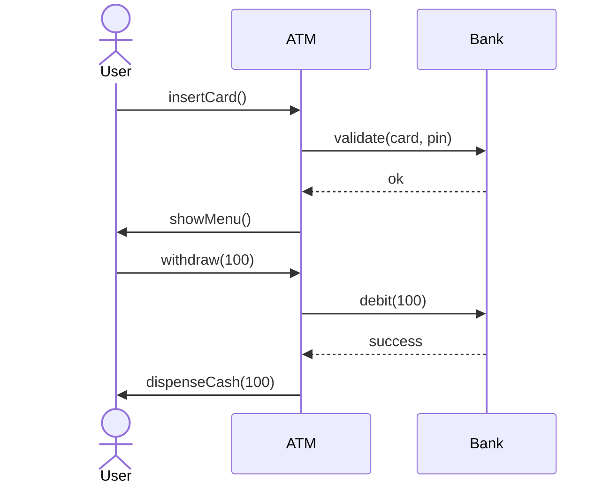

# UML Diagrams Cheat Sheet

[← LLD Index](./README.md) | [Back to Hub](../README.md)

UML (Unified Modeling Language) is how you **communicate a design visually** in LLD interviews. The **class diagram** is the one you'll draw most.

---

## Class Notation

```
┌────────────────────────┐
│       ClassName        │   ← name
├────────────────────────┤
│ - privateField: Type   │   ← attributes (fields)
│ + publicField: Type    │
├────────────────────────┤
│ + method(arg): Return   │  ← operations (methods)
│ - helper(): void       │
└────────────────────────┘
```

### Visibility modifiers
| Symbol | Meaning |
|--------|---------|
| `+` | public |
| `-` | private |
| `#` | protected |
| `~` | package |
| `_underline_` | static |
| *italics* | abstract |

---

## Relationships (the important part)

```
Inheritance (is-a):        Child ──────▷ Parent      (hollow triangle)
Realization (implements):  Class ┈┈┈┈┈▷ Interface   (dashed + triangle)
Association (uses):        A ───────── B              (plain line)
Aggregation (has-a, weak): Whole ◇───── Part          (hollow diamond)
Composition (has-a, strong): Whole ◆──── Part          (filled diamond)
Dependency (depends-on):   A ┈┈┈┈┈┈> B               (dashed arrow)
```

| Relationship | Meaning | Lifetime | Example |
|--------------|---------|----------|---------|
| **Inheritance** | "is-a" | — | `Car ▷ Vehicle` |
| **Realization** | implements interface | — | `Circle ┈▷ Shape` |
| **Association** | one uses/knows another | independent | `Teacher — Student` |
| **Aggregation** | "has-a", parts survive whole | independent | `Team ◇— Player` (player exists without team) |
| **Composition** | "has-a", parts die with whole | dependent | `House ◆— Room` (room gone if house demolished) |
| **Dependency** | temporary use (param/local) | transient | `Order ┈> PaymentService` |

> **Aggregation vs Composition** is a favorite question: **composition = ownership** (part can't exist without the whole, filled diamond); **aggregation = shared/weak** (part exists independently, hollow diamond).

---

## Multiplicity
```
1        exactly one
0..1     zero or one (optional)
*  / 0..* zero or many
1..*     one or many

Order "1" ────── "*" OrderItem    (one order has many items)
```

---

## Example: Mermaid Class Diagram

```mermaid
classDiagram
    class Vehicle {
        <<abstract>>
        #String plate
        +start() void
        +stop() void
    }
    class Car {
        +int doors
        +openTrunk() void
    }
    class Engine {
        +ignite() void
    }
    interface Drivable {
        +drive() void
    }
    Vehicle <|-- Car : inheritance
    Drivable <|.. Car : realization
    Car *-- Engine : composition
    Car --> FuelStation : dependency
```

---

## Other UML Diagrams (know they exist)

| Diagram | Shows | When used |
|---------|-------|-----------|
| **Class diagram** | Static structure (classes + relationships) | Main LLD tool |
| **Sequence diagram** | Object interactions over time (messages) | Show a use-case flow |
| **Use case diagram** | Actors & system features | Requirements |
| **State diagram** | States & transitions | State pattern / lifecycles |
| **Activity diagram** | Workflow / flowchart | Process logic |
| **Component diagram** | High-level components | Architecture |

### Sequence diagram mini-example


---

## How to Use UML in an Interview
1. After identifying entities, **draw a class diagram** — boxes for classes, lines for relationships.
2. Mark **interfaces/abstract classes** (your abstractions).
3. Show **composition vs aggregation** correctly (diamonds).
4. Optionally a **sequence diagram** for a tricky use case (e.g., "process payment").
5. Keep it readable — don't draw every getter/setter.

---

## Key Takeaways
- The **class diagram** is the core LLD artifact: classes (name/fields/methods) + relationships.
- Master the relationships: **inheritance (▷), realization (┈▷), association (—), aggregation (◇), composition (◆), dependency (┈>)**.
- **Composition (filled diamond)** = strong ownership; **aggregation (hollow)** = weak/shared.
- Use **multiplicity** (1, *, 0..1) to express cardinality.
- Add a **sequence diagram** to illustrate a key flow.

---
[← LLD Index](./README.md) | [Back to Hub](../README.md)
